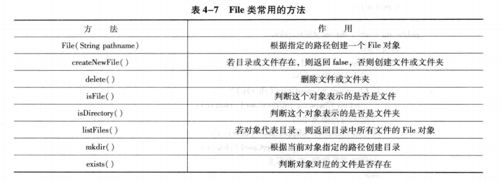
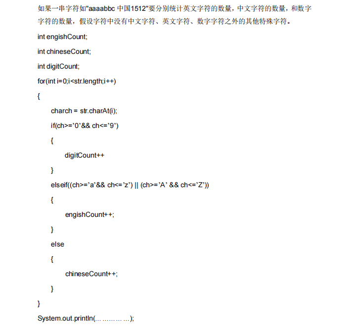

## 假设目录”C:\\testDir1“下有两个文件夹（dir1和dir2）和一个文件file1.txt,列出这个目录下的所有目录和文件


在 Java 中，可以使用 `java.io.File` 类或者 `java.nio.file` 包下的类来列出指定目录下的所有目录和文件。下面分别给出这两种实现方式的示例代码。

### 使用 `java.io.File` 类


```java
import java.io.File;

public class ListFilesAndDirectories {
    public static void main(String[] args) {
        // 指定目录路径
        String directoryPath = "C:\\testDir1";
        File directory = new File(directoryPath);

        // 检查目录是否存在
        if (directory.exists() && directory.isDirectory()) {
            // 获取目录下的所有文件和文件夹
            File[] filesAndDirs = directory.listFiles();
            if (filesAndDirs != null) {
                for (File file : filesAndDirs) {
                    if (file.isDirectory()) {
                        System.out.println("目录: " + file.getName());
                    } else if (file.isFile()) {
                        System.out.println("文件: " + file.getName());
                    }
                }
            }
        } else {
            System.out.println("指定的目录不存在。");
        }
    }
}
```

### 代码解释


1. **创建 `File` 对象**：使用指定的目录路径创建一个 `File` 对象。
2. **检查目录是否存在**：通过 `exists()` 和 `isDirectory()` 方法检查指定的目录是否存在且为目录。
3. **获取目录下的所有文件和文件夹**：使用 `listFiles()` 方法获取目录下的所有文件和文件夹，返回一个 `File` 数组。
4. **遍历数组并输出信息**：遍历 `File` 数组，通过 `isDirectory()` 和 `isFile()` 方法判断每个元素是目录还是文件，并输出相应的信息。

### 使用 `java.nio.file` 包


```java
import java.io.IOException;
import java.nio.file.DirectoryStream;
import java.nio.file.Files;
import java.nio.file.Path;
import java.nio.file.Paths;

public class ListFilesAndDirectoriesNIO {
    public static void main(String[] args) {
        // 指定目录路径
        String directoryPath = "C:\\testDir1";
        Path directory = Paths.get(directoryPath);

        // 检查目录是否存在
        if (Files.exists(directory) && Files.isDirectory(directory)) {
            try (DirectoryStream<Path> stream = Files.newDirectoryStream(directory)) {
                for (Path path : stream) {
                    if (Files.isDirectory(path)) {
                        System.out.println("目录: " + path.getFileName());
                    } else if (Files.isRegularFile(path)) {
                        System.out.println("文件: " + path.getFileName());
                    }
                }
            } catch (IOException e) {
                e.printStackTrace();
            }
        } else {
            System.out.println("指定的目录不存在。");
        }
    }
}
```


### 代码解释


1. **创建 `Path` 对象**：使用 `Paths.get()` 方法根据指定的目录路径创建一个 `Path` 对象。
2. **检查目录是否存在**：通过 `Files.exists()` 和 `Files.isDirectory()` 方法检查指定的目录是否存在且为目录。
3. **获取目录下的所有文件和文件夹**：使用 `Files.newDirectoryStream()` 方法获取目录下的所有文件和文件夹的 `DirectoryStream` 对象。
4. **遍历流并输出信息**：遍历 `DirectoryStream` 对象，通过 `Files.isDirectory()` 和 `Files.isRegularFile()` 方法判断每个元素是目录还是文件，并输出相应的信息。

### 注意事项


- 在使用 `File` 类的 `listFiles()` 方法时，需要注意该方法可能返回 `null`，因此在使用返回的数组之前需要进行空值检查。
- 在使用 `java.nio.file` 包时，使用 `try-with-resources` 语句确保 `DirectoryStream` 正确关闭，避免资源泄漏。


## 1、编写一个程序,将 a.txt 文件中的单词与 b.txt 文件中的单词交替合并到 c.txt文件中,a.txt 文件中的单词用回车符分隔,b.txt 文件中用回车或空格进行分隔。


以下是使用 Java 实现将 `a.txt` 文件中的单词与 `b.txt` 文件中的单词交替合并到 `c.txt` 文件中的代码：


```java
import java.io.*;
import java.util.ArrayList;
import java.util.List;

public class MergeFiles {
    public static void main(String[] args) {
        String fileAPath = "a.txt";
        String fileBPath = "b.txt";
        String fileCPath = "c.txt";

        // 读取 a.txt 文件中的单词
        List<String> wordsA = readWordsFromFile(fileAPath, "\n");
        // 读取 b.txt 文件中的单词
        List<String> wordsB = readWordsFromFile(fileBPath, "\n| ");
        // 交替合并单词
        List<String> mergedWords = mergeWords(wordsA, wordsB);
        // 将合并后的单词写入 c.txt 文件
        writeWordsToFile(mergedWords, fileCPath);
    }

    /**
     * 从文件中读取单词
     * @param filePath 文件路径
     * @param delimiter 分隔符
     * @return 单词列表
     */
    private static List<String> readWordsFromFile(String filePath, String delimiter) {
        List<String> words = new ArrayList<>();
        try (BufferedReader reader = new BufferedReader(new FileReader(filePath))) {
            String line;
            while ((line = reader.readLine()) != null) {
                String[] lineWords = line.split(delimiter);
                for (String word : lineWords) {
                    if (!word.trim().isEmpty()) {
                        words.add(word.trim());
                    }
                }
            }
        } catch (IOException e) {
            System.err.println("读取文件 " + filePath + " 时出错: " + e.getMessage());
        }
        return words;
    }

    /**
     * 交替合并两个单词列表
     * @param wordsA 第一个单词列表
     * @param wordsB 第二个单词列表
     * @return 合并后的单词列表
     */
    private static List<String> mergeWords(List<String> wordsA, List<String> wordsB) {
        List<String> mergedWords = new ArrayList<>();
        int maxSize = Math.max(wordsA.size(), wordsB.size());
        for (int i = 0; i < maxSize; i++) {
            if (i < wordsA.size()) {
                mergedWords.add(wordsA.get(i));
            }
            if (i < wordsB.size()) {
                mergedWords.add(wordsB.get(i));
            }
        }
        return mergedWords;
    }

    /**
     * 将单词列表写入文件
     * @param words 单词列表
     * @param filePath 文件路径
     */
    private static void writeWordsToFile(List<String> words, String filePath) {
        try (BufferedWriter writer = new BufferedWriter(new FileWriter(filePath))) {
            for (String word : words) {
                writer.write(word);
                writer.newLine();
            }
        } catch (IOException e) {
            System.err.println("写入文件 " + filePath + " 时出错: " + e.getMessage());
        }
    }
}
```

### 代码解释：


1. `readWordsFromFile` 方法

   ：

    - 此方法接收文件路径和分隔符作为参数，用于从指定文件中读取单词。
    - 使用 `BufferedReader` 逐行读取文件内容，对每行内容使用指定的分隔符进行分割。
    - 将分割后的非空单词添加到 `List` 中，最后返回该 `List`。若读取文件过程中出现 `IOException`，会输出错误信息。

2. `mergeWords` 方法

   ：

    - 该方法接收两个单词列表作为参数，将它们交替合并到一个新的 `List` 中。
    - 找出两个列表中的最大长度，遍历该长度范围，依次将两个列表中的单词添加到合并列表中，最终返回合并后的 `List`。

3. `writeWordsToFile` 方法

   ：

    - 此方法接收单词列表和文件路径作为参数，将单词列表中的每个单词逐行写入指定文件。
    - 使用 `BufferedWriter` 进行文件写入操作，若写入过程中出现 `IOException`，会输出错误信息。

4. `main` 方法

   ：

    - 定义了三个文件的路径：`a.txt`、`b.txt` 和 `c.txt`。
    - 调用 `readWordsFromFile` 方法分别读取 `a.txt` 和 `b.txt` 中的单词。
    - 调用 `mergeWords` 方法将两个单词列表交替合并。
    - 调用 `writeWordsToFile` 方法将合并后的单词列表写入 `c.txt` 文件。

### 注意事项：


- 请确保 `a.txt` 和 `b.txt` 文件存在于程序运行的目录下，或者根据实际情况修改文件路径。
- 代码中处理了文件读取和写入时可能出现的 `IOException`，但如果文件路径错误或文件权限不足，仍会输出相应的错误信息。


## 2、编写一个程序，将 d:\java目录下的所有.java 文件复制到 d:\jad 目录下，并将原来文件的扩展名从.java改为.jad

以下是一个使用 Java 编写的程序，用于将 `d:\java` 目录下的所有 `.java` 文件复制到 `d:\jad` 目录下，并将文件扩展名从 `.java` 改为 `.jad`。


```java
import java.io.*;

public class FileCopyAndRename {
    public static void main(String[] args) {
        // 源目录
        File sourceDir = new File("d:\\java");
        // 目标目录
        File targetDir = new File("d:\\jad");

        // 检查源目录是否存在
        if (!sourceDir.exists() ||!sourceDir.isDirectory()) {
            System.out.println("源目录不存在或不是一个有效的目录。");
            return;
        }

        // 检查目标目录是否存在，如果不存在则创建
        if (!targetDir.exists()) {
            if (!targetDir.mkdirs()) {
                System.out.println("无法创建目标目录。");
                return;
            }
        }

        // 获取源目录下的所有文件
        File[] files = sourceDir.listFiles();
        if (files != null) {
            for (File file : files) {
                if (file.isFile() && file.getName().endsWith(".java")) {
                    // 构建目标文件的路径
                    String targetFileName = file.getName().replace(".java", ".jad");
                    File targetFile = new File(targetDir, targetFileName);

                    try {
                        // 复制文件
                        copyFile(file, targetFile);
                        System.out.println("成功复制并重命名文件: " + file.getName() + " -> " + targetFileName);
                    } catch (IOException e) {
                        System.err.println("复制文件 " + file.getName() + " 时出错: " + e.getMessage());
                    }
                }
            }
        }
    }

    /**
     * 复制文件的方法
     * @param source 源文件
     * @param target 目标文件
     * @throws IOException 复制过程中可能出现的 IO 异常
     */
    private static void copyFile(File source, File target) throws IOException {
        try (InputStream in = new FileInputStream(source);
             OutputStream out = new FileOutputStream(target)) {
            byte[] buffer = new byte[1024];
            int length;
            while ((length = in.read(buffer)) > 0) {
                out.write(buffer, 0, length);
            }
        }
    }
}
```

### 代码解释：


1. 目录检查与创建

   ：

    - 首先定义了源目录 `d:\java` 和目标目录 `d:\jad`。
    - 检查源目录是否存在且为有效的目录，如果不是则输出错误信息并终止程序。
    - 检查目标目录是否存在，如果不存在则尝试创建该目录，若创建失败则输出错误信息并终止程序。

2. 文件遍历与筛选

   ：

    - 使用 `listFiles()` 方法获取源目录下的所有文件和文件夹。
    - 遍历这些文件，筛选出扩展名为 `.java` 的文件。

3. 文件复制与重命名

   ：

    - 对于每个 `.java` 文件，构建目标文件的路径，将扩展名从 `.java` 改为 `.jad`。
    - 调用 `copyFile()` 方法将源文件复制到目标文件。
    - 如果复制成功，输出成功信息；如果复制过程中出现 `IOException`，则输出错误信息。

4. 文件复制方法 `copyFile()`

   ：

    - 使用 `FileInputStream` 读取源文件的内容，使用 `FileOutputStream` 将内容写入目标文件。
    - 使用一个字节数组 `buffer` 作为缓冲区，每次读取一定量的数据并写入目标文件，直到读取完整个文件。
    - 使用 `try-with-resources` 语句确保输入流和输出流在使用完毕后自动关闭。

### 注意事项：


- 请确保程序有足够的权限访问源目录和目标目录。
- 如果目标目录下已经存在同名的 `.jad` 文件，会被覆盖。
- 代码中假设 `d:\java` 和 `d:\jad` 是合法的 Windows 目录路径，如果在其他操作系统上运行，需要根据实际情况修改路径分隔符。
## 3、编写一个截取字符串的函数，输入为一个字符串和字节数，输出为按字节截取的字符串，但要保证汉字不被截取半个，如“我 ABC"，4，应该截取“我 AB”,输入“我 ABC 汉 DEF”，6，应该输出“我 ABC"，而不是“我 ABC+汉的半个”


### Java 实现


java


```java
public class StringCutter {
    public static String cutString(String s, int byteNum) {
        StringBuilder result = new StringBuilder();
        int currentBytes = 0;
        for (int i = 0; i < s.length(); i++) {
            char c = s.charAt(i);
            // 获取字符的字节长度
            int charBytes = String.valueOf(c).getBytes().length;
            if (currentBytes + charBytes <= byteNum) {
                result.append(c);
                currentBytes += charBytes;
            } else {
                break;
            }
        }
        return result.toString();
    }

    public static void main(String[] args) {
        System.out.println(cutString("我 ABC", 4));
        System.out.println(cutString("我 ABC 汉 DEF", 6));
    }
}
```

#### 代码解释


- `cutString` 方法接收字符串和字节数作为参数。
- 使用 `StringBuilder` 来构建截取后的字符串。
- 遍历字符串，获取每个字符的字节长度，若加上该字符不超过指定字节数，则将其添加到 `StringBuilder` 中并更新字节数；否则终止循环。
- 最后将 `StringBuilder` 转换为字符串返回。

### JavaScript 实现


```javascript
function cutString(s, byteNum) {
    let result = '';
    let currentBytes = 0;
    for (let i = 0; i < s.length; i++) {
        const char = s[i];
        // 获取字符的字节长度
        const charBytes = encodeURIComponent(char).replace(/%[A-F\d]{2}/g, 'U').length;
        if (currentBytes + charBytes <= byteNum) {
            result += char;
            currentBytes += charBytes;
        } else {
            break;
        }
    }
    return result;
}

// 测试示例
console.log(cutString("我 ABC", 4));
console.log(cutString("我 ABC 汉 DEF", 6));
```


#### 代码解释


- `cutString` 函数接收字符串和字节数作为参数。
- 通过 `encodeURIComponent` 对字符进行编码，然后将编码后的百分号及后续两位字符替换为 `U`，从而得到字符的字节长度。
- 若加上当前字符的字节长度不超过指定字节数，则将该字符添加到结果字符串中并更新字节数；否则停止遍历。
- 最终返回截取后的字符串。


