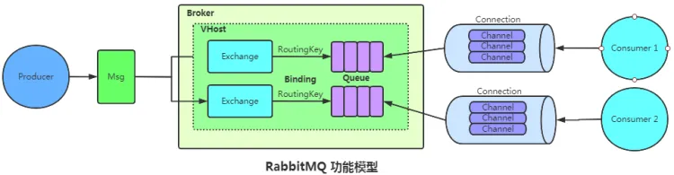

## RabbitMQ的基本结构

1. Broker：简单来说就是消息队列服务器实体
2. Exchange：消息交换机，它指定消息按什么规则，路由到哪个队列。
3. Queue：消息队列载体，每个消息都会被投?到?个或多个队列。
4. Binding：它的作?就是把 exchange 和 queue 按照路由规则绑定起来
5. Routing Key：路由关键字，exchange 根据这个关键字进?消息投递。
6. VHost：vhost 可以理解为虚拟 broker ，即 mini-RabbitMQ server。其内部均含有独?的queue、exchange 和 binding 等，但最最重要的是，其拥有独?的权限系统，可以做到vhost 范围的?户控制。当然，从 RabbitMQ 的全局?度，vhost 可以作为不同权限隔离的?段（?个典型的例?就是不同的应?可以跑在不同的 vhost 中）。
7. Producer：消息?产者，就是投递消息的程序
8. Consumer：消息消费者，就是接受消息的程序
9. Channel：消息通道，在客户端的每个连接?，可建?多个 channel，每个 channel 代表?个
   会话任务
   由 Exchange、Queue、RoutingKey 三个才能决定?个从 Exchange 到 Queue 的唯?的线路。
## RabbitMQ ?作模式

### simple模式

?产者产?消息，将消息放?队列，消费者监听消息队列，如果队列中有消息就消费掉，消息被拿
?后会?动从队列中删除，存在隐患需要消费者设置 ACK 确认，消费者处理完后要及时发送
ACK 给队列，否则会造成内存溢出。

简单队列的不?：耦合性过?，?产者??对应消费者，如果有多个消费者想消费队列中信息就?
法实现了。

### work工作模式

?产者将消息放?队列，消费者可以有多个。?般有两种模式：

1. 轮询分发(round-robin)：MQ 不管两个消费者谁忙，数据总是你?个我?个，MQ 给两个消
费发数据的时候是不知道消费者性能的，默认就是?露均沾。此时 autoAck = true。
2. 公平分发：要让消费者消费完毕?条数据后就告知 MQ，再让 MQ 发数据即可。?动应答要
关闭，实现按照消费者性能消费。
### fanout publish/subscribe 发布订阅模式

类似公众号的订阅跟发布，属于 fanout 模式，不处理路由键。不需要指定 routingKey，我们只
需要把队列绑定到交换机， 消息就会被发送到所有队列中：
- ?个?产者多个消费者
- 每?个消费者都有?个??的队列
- ?产者没有把消息直接发送到队列?是发送到了交换机转化器(exchange)。
- 每?个队列都要绑定到交换机上。
- ?产者发送的消息经过交换机到达队列，从?实现?个消息被多个消费者消费。
### direct routing 路由模式

direct：处理路由键，需要指定 routingKey，此时?产者发送数据到 MQ 的时候会指定key，任务
队列也会指定 key，只有 key ?样消息才会被传送到队列中。如下图

缺点：路由key必须要明确，?法实现规则性模糊匹配。

### topic 主题模式

将路由键跟某个模式匹配，?产者会带 routingKey，但是消费者的MQ会带模糊routingKey

1. \# 表示匹配 >=1 个字符
2. \* 表示匹配?个
3. 路由功能添加模糊匹配
4. 消息产?者产?消息，把消息交给交换机
5. 交换机根据 key 的规则模糊匹配到对应的队列，由队列的监听消费者接收消息消费

### 总结

## 消息怎么路由的

?成者?产消息后消息带有 routing Key，通过routing Key 消费者队列被绑定到交换器上，消息
到达交换器根据交换器规则匹配，常?交换器如下：

1. fanout：如果交换器收到消息，将会?播到所有绑定的队列上
2. direct：如果路由键完全匹配，消息就被投递到相应的队列
3. topic：可以使来?不同源头的消息能够到达同?个队列。使? topic 交换器时，可以使?通
配符
## RabbitMQ 消息基于什么传输

信道是?产消费者与 RabbitMQ 通信的渠道，?产者 publish 或是消费者 subscribe ?个队列都
是通过信道来通信的。

信道是建?在TCP连接上的虚拟连接，就是说 RabbitMQ 在?条 TCP 上建?成百上千个信道来达
到多个线程处理。这个 TCP 被多个线程共享，每个线程对应?个信道。

信道在 RabbitMQ 都有唯?的 ID 来保证信道私有性，对应唯?的线程使?。?信道?不? TCP
的原因是由于 TCP 连接的创建和销毁开销较?，且并发数受系统资源限制，会造成性能瓶颈。

## 如何保证 RabbitMQ 消息不丢失

消息丢失主要分为 ?产者丢失消息、消息列表丢失消息、消费者丢失消息。
### 消息丢失的情况

1. ?产者丢消息：?产者将数据发送到RabbitMQ的时候，可能在传输过程中因为?络等问题?将数据弄丢
   了。
2. RabbitMQ??丢消息：如果没有开启RabbitMQ的持久化，那么RabbitMQ?旦重启数据就丢了。所以必须
   开启持久化将消息持久化到磁盘，这样就算RabbitMQ挂了，恢复之后会?动读取之前存储的数据，?般数
   据不会丢失。除?极其罕?的情况，RabbitMQ还没来得及持久化??就挂了，这样可能导致?部分数据丢
   失。
3. 消费端丢消息：主要是因为消费者消费时，刚消费到还没有处理，结果消费者就挂了，这样你重启之后，
   RabbitMQ就认为你已经消费过了，然后就丢了数据。

### 生产者

RabbitMQ 提供 transaction 和 confirm 模式来确保?产者不丢消息。

transaction 机制就是说：发送消息前，开启事务(channel.txSelect)，然后发送消息，如果发送过
程中出现什么异常，主要是指RabbitMQ没有收到消息，，事务就会回滚（channel.txRollback()），然后尝试重新发送，如果发送成功则提交事务
channel.txCommit()。事务卡顿会导致后??法发送，官?说加?事务机制MQ会降速250倍。这种?式有明显的缺点，即RabbitMQ事务开启后，就
会变为同步阻塞操作，?产者会阻塞等待是否发送成功，太耗性能会造成吞吐量的下降。

confirm(发送?确认模式)模式?的居多：?旦 channel 进? confirm 模式，所有在该信道上发布
的消息都将会被指派?个从1开始的唯?的ID，?旦消息被投递到所有匹配的队列之后，
RabbitMQ 就会发送?个包含消息的唯?ID 的 ACK给?产者，这就使得?产者知道消息已经正确
到达?的队列了，如果 RabbitMQ 没能处理该消息，则会发送?个 Nack (not acknowledged) 消
息给你，你可以进?重试操作。?且你可以结合这个机制知道??在内存?维护每个消息的id，如果超过?定时间还没接收到
这个消息的回调，那么你可以进?重发。

事务机制是同步的，你提交了?个事物之后会阻塞住，但是confirm机制是异步的，发送消息之后可以接着
发送下?个消息，然后RabbitMQ会回调告知成功与否。 ?般在?产者这块避免丢失，都是?confirm机制。

发送?确认模式是异步的，?产者应?程序在等待确认的同时，可以继续发送消息。当确认消息到
达?产者应?程序，?产者应?程序的回调?法就会被触发来处理确认消息。

### 消息列表（RabbitMQ自己）

处理消息队列丢数据的情况，?般是开启持久化磁盘的配置。这个持久化配置可以和 confirm 机
制配合使?，你可以在消息持久化磁盘后，再给?产者发送?个 Ack 信号。这样，如果消息持久
化磁盘之前，RabbitMQ 挂了后?产者收不到Ack信号，?产者会?动重发。

通过如下持久化设置，即使 RabbitMQ 挂了重启后也能恢复数据。

1. durable = true, 将 queue 的持久化设置为 true，则代表是?个持久的队列
2. 发送消息的时候将 deliveryMode=2

?且持久化可以跟?产的confirm机制配合起来，只有消息持久化到了磁盘之后，才会通知?产者ack，这样就算是在持久化之前RabbitMQ挂了，数据丢了，?产者收不到ack回调也会进?消息重发
    
关于持久化其实是个权衡问题，持久化可能会导致系统 QPS 下降，所以?般仅对关键消息作持久
化处理（根据业务重要程度），且应该保证关键消息的持久化不会导致系统性能瓶颈。

### 消费者丢失消息

消费者丢失消息：消费者丢数据?般是因为采?了?动确认消息模式，改为?动确认消息即可！
消费者在收到消息之后，处理消息之前，会?动回复 RabbitMQ 已收到消息；如果这时处理消息
失败，就会丢失该消息。

解决?案：处理消息成功后，?动回复确认消息。消费者跟消息队列的连接不中断，RabbitMQ 给
了 Consumer ?够?的时间来处理消息，保证数据的最终?致性。

注意点

1. 消费者接收到消息却没有确认消息，连接也未断开，则 RabbitMQ 认为该消费者繁忙，将不
会给该消费者分发更多的消息。
2. 如果消费者接收到消息，在确认之前断开了连接或取消订阅，RabbitMQ 会认为消息没有被分
发，然后重新分发给下?个订阅的消费者，这时可能存在消息重复消费的隐患，需要去重！

## 如何避免消息重复投递或重复消费

消息重复消费是各个 MQ 都会发?的常?问题之?，在?些?较敏感的场景下，重复消费会造成
?较严重的后果，?如重复扣款等。

消息重复消费的场景?概可以分为?产者端重复消费 和 消费者端重复消费，解决办法是是通过幂
等性来保证重复消费的消息不对结果产?影响即可。

1. 消息?成时 RabbitMQ 内部 对每个?产的消息?成个 inner-msg-id，作为去重和幂等的依
据（消息投递失败并重传），避免重复的消息进?队列。

2. 消息消费时 要求消息体中必须要有?个 bizId（对于同?业务全局唯?，如?付 ID、订单
ID、帖? ID 等）作为去重的依据，避免同?条消息被重复消费。
3. 在 RocketMQ 中?产者发送消息前询问 RocketMQ 信息是否已发送过，或者通过 Redis 记
录已查询记录。不过最好的还是直接在消费端去重消费。

其实重复消费不可怕，可怕的是你没考虑到重复消费之后，怎么保证幂等性。举个例?,假设你有个系统，消费
?条往数据库?插??条，要是你?个消息重复两次，你不就插?了两条，这数据不就错了？但是你要是消费到第?次的时候，??判断?下已经消费过了，直接扔了，不就保留了?条数据？
?条数据重复出现两次，数据库?就只有?条数据，这就保证了系统的幂等性幂等性。通俗点说，就?个数据，   或者?个请求，给你重复来多次，你得确保对应的数据是不会改变的，不能出错

想要保证不重复消费，其实还要结合业务来思考，这?给?个思路：
1. ?如你拿个数据要写库，你先根据主键查?下，如果这数据都有了，你就别插?了，update?下。
2. ?如你是写redis，那没问题了，反正每次都是set，天然幂等性。
3. ?如你不是上?两个场景，那做的稍微复杂?点，你需要让?产者发送每条数据的时候，??加?个全局唯
   ?的id，类似订单id之类的东?，然后你这?消费到了之后，先根据这个id去?如redis?查?下，之前消费
   过吗？如果没有消费过，你就处理，然后这个id写redis。如果消费过了，那你就别处理了，保证别重复处
   理相同的消息即可。

## MQ处理消息失败了怎么办？

?般?产环境中，都会在使?MQ的时候设计两个队列：?个是核?业务队列，?个是死信队列。核?业务队
列，就是?如专??来让订单系统发送订单消息的，然后另外?个死信队列就是?来处理异常情况的。
?如说要是第三?物流系统故障了，此时?法请求，那么仓储系统每次消费到?条订单消息，尝试通知发货和配
送，都会遇到对?的接?报错。此时仓储系统就可以把这条消息拒绝访问，或者标志位处理失败！注意，这个步
骤很重要。

?旦标志这条消息处理失败了之后，MQ就会把这条消息转?提前设置好的?个死信队列中。然后你会看到的就
是，在第三?物流系统故障期间，所有订单消息全部处理失败，全部会转?死信队列。然后你的仓储系统得专?
有?个后台线程，监控第三?物流系统是否正常，能否请求的，不停的监视。?旦发现对?恢复正常，这个后台
线程就从死信队列消费出来处理失败的订单，重新执?发货和配送的通知逻辑。死信队列的使?，其实就是MQ
在?产实践中?常重要的?环，也就是架构设计必须要考虑的

## RabbitMQ 如何保证消息顺序执?

顺序性、必要性：?产者的信息是[插?、更新、删除]，消费者执?顺序是[删除、插?、更新]，
这是跟预期不?致的。

### 乱序情况

1. ?个 queue，有多个 consumer 去消费，每个 consumer 的执?时间是不固定的，?法保证先读到消息的 consumer ?定先完成操作。

2. ?个 queue 对应?个 consumer，但是 consumer ??进?了多线程消费，这样也会造成消息消费顺序错误。

### 解决乱序

1. 拆分多个 queue，每个 queue ?个 consumer，将三个有先后顺序的消息根据?户订单 id 哈
   希后发送到同?个 queue 中，来保证消息的先后性。当然这样会造成吞吐量下降。

2. ?个 queue 对应?个 consumer，在 consumer 内部根据ID映射到不同内存队列，然后?内存
   队列做排队 分发给底层不同的 worker 来处理。

## RabbitMQ 的集群

RabbitMQ 是基于主从（?分布式）做?可?性的。RabbitMQ 有三种模式：单机模式、普通集群
模式、镜像集群模式。

### 单机模式

单机版的就是 Demo 级别，?产系统?般没??单机模式。

### 普通集群模式

在 N 台机器上启动 N 个 RabbitMQ 实例。创建的 queue 只会放在?个 RabbitMQ 实例上，但每
个 MQ 实例都 同步 queue 的元数据（元数据可以认为是 queue 的?些配置信息，通过元数据，
可以找到 queue 所在实例）。消费时如果连接到了另外?个实例，那么那个实例会从 queue 所在
实例上拉取数据过来。让集群中多个节点来服务某个 queue 的读写操作来提?吞吐量。

### 镜像集群模式

RabbitMQ 的?可?模式，在镜像集群模式下，你创建的 queue?论元数据还是 queue ?的消息
都会存在于多个实例上，每个 RabbitMQ 节点都有这个 queue 的全部数据的。写消息到 queue
的时候都会?动把消息同步到多个实例的 queue 上。RabbitMQ 有很好的管理控制台，就是在后
台新增?个策略，这个策略是镜像集群模式的策略，指定的时候是可以要求数据同步到所有节点
的，也可以要求同步到指定数量的节点，再次创建 queue 的时候，应?这个策略，就会?动将数
据同步到其他的节点上去了。
优点在于任何?个机器宕机了其它节点还包含了这个 queue 的完整数据，别的 consumer 都
可以到其它节点上去消费数据。
缺点在于消息需要同步到所有机器上，导致?络带宽压?和消耗很重。也是每个节点都放这
个 queue 的完整数据。

## 死信队列

死信 Dead Letter 是 RabbitMQ 中的?种消息机制，当消费消息时队列?的消息出现以下情况那
么该消息将成为死信。死信消息会被 RabbitMQ 进?特殊处理，如果配置了死信队列信息，那么
该消息将会被丢进死信队列中，如果没有配置，则该消息将会被丢弃：

1. 消息被否定确认，使? channel.basicNack 或 channel.basicReject ，并且此时 default?requeue-rejected（由于监听器抛出异常?拒绝的消息是否被重新放回队列）属性被设置为
false。
2. 消息在队列的存活时间超过设置的 TTL 时间。
3. 消息队列的消息数量已经超过最?队列?度。 

对队列中消息总数进?限制，x-max-length = 指定值。则超出阈值后队头数据被抛弃。

对队列中消息体总字节数进?限制，只计算消息体的字节数。x-max-length-bytes = 指定值。

死信队列 并不是什么特殊的队列，只不过是绑定在死信交换机上的队列。死信交换机只不过是?来接收死信的普通交换机，所以可以为任何类型，?如 Direct、Fanout、Topic。
   
适?场景：
   在较为重要的业务队列中，确保未被正确消费的消息不被丢弃，在系统因为参数解析、数据校验、?咯拨打等导
   致异常后通过配置死信队列，可以让未正确处理的消息暂存到另?个队列中，待后续排查清楚问题后，编写相应
   的处理代码来处理死信消息。

死信消息的?命周期：

1. 业务消息被投?业务队列
2. 消费者消费业务队列的消息，由于处理过程中发?异常，于是进?了 nck 或者 reject 操作
3. 被 nck 或 reject 的消息由 RabbitMQ 投递到死信交换机中
4. 死信交换机将消息投?相应的死信队列
5. 死信队列的消费者消费死信消息

   死信消息是 RabbitMQ 为我们做的?层保证，其实我们也可以不使?死信队列，?是在消息消费
   异常时，将消息主动投递到另?个交换机中，明?死信队列运?机制后就知道这些 Exchange 和
   Queue 想怎样配合就能怎么配合。?如从死信队列拉取消息，然后发送邮件、短信、钉钉通知来
   通知开发?员关注。或者将消息重新投递到?个队列然后设置过期时间，来进?延时消费。
   
## RabbitMQ 中的 TTL

TTL（Time To Live）是 RabbitMQ 中?个消息或队列的属性，如果?条消息设置了 TTL 属性
或者进?了有 TTL属性的队列，那么这条消息如果在 TTL 设置的时间内没有被消费，则会成为死
信。如果同时配置了队列的 TTL 和消息的 TTL，那么较?的那个值将会被使?。

### queue设置TTL

### Msg设置TTL

### 区别：

1. 设置了队列的 TTL 属性，?旦 Msg 过期，就会被队列丢弃。
2. Msg 设置 TTL，Msg 是否过期是在即将投递到消费者之前判定的，如果当前队列有严重的
   Msg 积压情况，则已过期的 Msg 也许还能存活较?时间，解决办法 安装插件
   rabbitmq_delayed_message_exchange。
3. 如果不设置 TTL，表示 Msg 永远不会过期，TTL = 0 表示除?此时可以直接投递该 Msg 到
   消费者，否则该 Msg 将会被丢弃。

## 延迟队列

延时队列中的元素则是希望被在指定时间得到取出和处理，所以延时队列中的元素是都是带时间属
性的，通常来说是需要被处理的消息或者任务。?般?在如下场景：

1. 订单在 15 分钟之内未?付则?动取消。
2. 账单在?周内未?付，则?动结算。
3. ?户注册成功后，如果三天内没有登陆则进?短信提醒。
4. ?户发起退款，如果三天内没有得到处理则通知相关运营?员。
5. 预定会议后，需要在预定的时间点前?分钟通知各个与会?员参加会议
6. 当然也可以? Java 的 DelayQueue、Quartz、Redis 的 zset 等实现。

## MQ 消息积压咋办

这种时候只能操作临时扩容，以更快的速度去消费数据了。具体操作步骤和思路如下：

1. 先修复 consumer 的问题，确保其恢复消费速度，然后将现有 consumer 都停掉。
2. 临时建?好原先 10 倍 ~ 20 倍的 queue 数量（新建?个 topic，partition 是原来的 10
   倍）。
3. 然后写?个临时分发消息的 consumer 程序，这个程序部署上去消费积压的消息，消费之后
   不做耗时处理，直接均匀轮询写?临时建好分 10 数量的 queue ??。
4. 紧接着征? 10 倍的机器来部署 consumer，每?批 consumer 消费?个临时 queue 的消
   息。
5. 这种做法相当于临时将 queue 资源和 consumer 资源扩? 10 倍，以正常速度的 10 倍来消费
   消息。
6. 等快速消费完了之后，修复 consumer，去消费新的 MQ 和现有的 MQ 数据，新 MQ 消费完
   成后恢复原状。

## 设计?个 MQ

1. 考虑 MQ 的伸缩性，在需要的时候快速扩容来增加吞吐量和容量，设计个分布式的系统，参
照?下 Kafka 的设计理念，broker、 topic、 partition，每个 partition 放?个机器，就存?
部分数据。如果现在资源不够了，给 topic 增加 partition，然后做数据迁移，增加机器，提
供更?的吞吐量了。
2. 数据落盘?式为顺序写，这样就没有磁盘随机读写的寻址开销，磁盘顺序读写的性能是很?
的，这就是 Kafka 的思路。
3. 参考 Kafka 实现MQ?可?性，多副本 -> leader & follower -> broker 挂了重新选举
leader 即可对外服务。
4. 参考前?的实现数据的零丢失。
## 请介绍消息队列推和拉的使?场景

### 推模式：

推模式是服务器端根据?户需要，由?的、按时将?户感兴趣的信息主动发送到?户的客户端。

优点：

- 对?户要求低，?便?户获取需要的信息；
- 及时性好，服务器端及时地向客户端推送更新动态信息，吞吐量?。

缺点：
- 不能确保发送成功，推模式采??播?式，只有服务器端和客户端在同?个频道上，推模式才有效，?户才能接收到信息；
- 没有信息状态跟踪，推模式采?开环控制技术，?个信息推送后的状态，?如客户端是否接收等，?从得知；
- 针对性较差。推送的信息可能并不能满?客户端的个性化需求。

### 拉模式：

拉模式是客户端主动从服务器端获取信息。

优点：
1. 针对性强，能满?客户端的个性化需求；
2. 信息传输量较?，?络中传输的只是客户端的请求和服务器端对该请求的响应；
3. 服务器端的任务轻。服务器端只是被动接收查询，对客户端的查询请求做出响应。

缺点：
1. 实时性较差，针对于服务器端实时更新的信息，客户端难以获取实时信息；
2. 对于客户端?户的要求较?，需要对服务器端具有?定的了解。
## 下 RabbitMQ 的几个问题。

1. 第一个问题是，RabbitMQ 对消息堆积的支持并不好，在它的设计理念里面，消息队列是
   一个管道，大量的消息积压是一种不正常的情况，应当尽量去避免。当大量消息积压的时
   候，会导致 RabbitMQ 的性能急剧下降。
2. 第二个问题是，RabbitMQ 的性能是我们介绍的这几个消息队列中最差的，根据官方给出
   的测试数据综合我们日常使用的经验，依据硬件配置的不同，它大概每秒钟可以处理几万到
   十几万条消息。其实，这个性能也足够支撑绝大多数的应用场景了，不过，如果你的应用对
   消息队列的性能要求非常高，那不要选择 RabbitMQ。
3. 最后一个问题是 RabbitMQ 使用的编程语言 Erlang，这个编程语言不仅是非常小众的语
   言，更麻烦的是，这个语言的学习曲线非常陡峭。大多数流行的编程语言，比如 Java、
   C/C++、Python 和 JavaScript，虽然语法、特性有很多的不同，但它们基本的体系结构都
   是一样的，你只精通一种语言，也很容易学习其他的语言，短时间内即使做不到精通，但至
   少能达到“会用”的水平。

## 第二梯队的消息队列

1. 先说 ActiveMQ，ActiveMQ 是最老牌的开源消息队列，是十年前唯一可供选择的开源消
   息队列，目前已进入老年期，社区不活跃。无论是功能还是性能方面，ActiveMQ 都与现
   代的消息队列存在明显的差距，它存在的意义仅限于兼容那些还在用的爷爷辈儿的系统。
2. 接下来说说 ZeroMQ，严格来说 ZeroMQ 并不能称之为一个消息队列，而是一个基于消息
   队列的多线程网络库，如果你的需求是将消息队列的功能集成到你的系统进程中，可以考虑
   使用 ZeroMQ。
3. 最后说一下 Pulsar，很多人可能都没听说过这个产品，Pulsar 是一个新兴的开源消息队列
   产品，最早是由 Yahoo 开发，目前处于成长期，流行度和成熟度相对没有那么高。与其他
   消息队列最大的不同是，Pulsar 采用存储和计算分离的设计，我个人非常喜欢这种设计，
   它有可能会引领未来消息队列的一个发展方向，建议你持续关注这个项目
## RabbitMQ 的消息模型

队列模型

## 它是怎么解决多个消费者的问题

Exchange 位于生产者和队列之间，生产者并不关心将消息发送给
哪个队列，而是将消息发送给 Exchange，由 Exchange 上配置的策略来决定将消息投递到
哪些队列中

同一份消息如果需要被多个消费者来消费，需要配置 Exchange 将消息发送到多个队列，
每个队列中都存放一份完整的消息数据，可以为一个消费者提供消费服务。这也可以变相地
实现新发布 - 订阅模型中，“一份消息数据可以被多个订阅者来多次消费”这样的功能

## 消息发送模式-迅速消息发送

1. 迅速消息是指消息不进行落库处理，不做可靠性的保证
2. 再一些非核心业务，日志数据或者统计分析场景下比较合适
   3. 特点是性能最高，吞吐量大

## 确认消息发送

## 批量消息发送

批量消息是指我们把消息放到一个集合里统一进行提交，这种方案设计思路
是期望消息在一个会话里，比如投掷到threadlocal里的集合，然后拥有相同
会话ID，并且带有这次提交消息的SIZE等相关属性，最重要的一点是要把这
一批消息进行合并。对于Channel而言，就是发送一次消息。这种方式也是
希望消费端在消费的时候，可以进行批量化的消费，针对于某一个原子业务
的操作去处理，但是不保障可靠性，需要进行补偿机制。

## 延迟消息发送

延迟消息相对简单，就是我们在Message封装的时候添加delayTime属
性即可，使得我们的消息可以进行延迟发送，根据具体的业务场景也可
以很好的使用得到!

## 顺序消息发送

顺序消息，比较类似于批量消息的实现机制，但是也有些不同。

我们要保障以下几点:

1. 发送的顺序消息，必须保障消息投递到同一个队列，且这个消费者只能有一个
(独占模式)
2. 然后需要统一提交(可能是合并成一个大消息,也可能是拆分为多个消息)，并且
所有消息的会话ID一致
3. 添加消息属性:顺序标记的序号、和本次顺序消息的SIZE属性，进行落库操作
4. 并行进行发送给自身的延迟消息(注意带上关键属性:会话ID、SIZE)进行后续处理消费
5. 当收到延迟消息后，根据会话ID、SIZE抽取数据库数据进行处理即可
6. 定时轮训补偿机制，对于异常情况

备注:比如生产端消息没有完全投递成功、或者消费端落库异常
导致消费端落库后缺少消息条目的情况)

## 事务消息发送

解决方案

我们采用类似可靠性投递的机制，也就是补偿机制。

但是我们的数据源必须是同一个，也就是业务操作DB1数据库和消息记录DB2数据库使用同一个数据源.

然后利用重写Spring DataSourceTransactionManager，在本地事务提交的时候进行发送消息，但是也有可能事务提交成功但是消息发送失败，这个时候就需要进行补偿了。

## 消息幂等性

