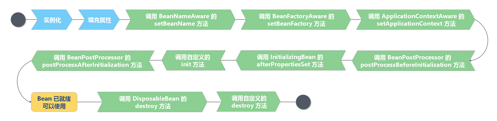

## Bean生命周期图片表示

1. Spring先对Bean进行实例化
2. Spring织入值和引用到Bean的属性中
3. 实现对应的Aware标识，完成一些属性的设置，
4. 如果 Bean 实现了 BeanPostProcess 接口，Spring 将调用 postProcessBeforeInitialization 方法
5. 如果 Bean 实现了 InitializingBean 接口，Spring 将调用 afterPropertiesSet 方法，作用与在配置文件中对 Bean 使用 init-method 声明初始化的作用一样，都是在 Bean 的全部属性设置成功后执行的初始化方法。
6. 如果 Bean 实现了 BeanPostProcess 接口，Spring 将调用 postProcessAfterInitialization 方法

7. postProcessBeforeInitialization 是在 Bean 初始化前执行的，而 postProcessAfterInitialization 是在 Bean 初始化后执行的
8. 经过以上的工作后，Bean 将一直驻留在应用上下文中给应用使用，直到应用上下文被销毁
9. 如果 Bean 实现了 DispostbleBean 接口，Spring 将调用它的 destory 方法，作用与在配置文件中对 Bean 使用 destory-method 属性的作用一样，都是在 Bean 实例销毁前执行的方法。

## Bean生命周期的文字表述

### Spring Bean 元信息配置阶段

BeanDefinition 配置

- 面向资源
  - XML 配置
  - Properties 资源配置
- 面向注解
- 面向 API

### Spring Bean 元信息解析阶段
- 面向资源 BeanDefinition 解析
   - BeanDefinitionReader
   - XML 解析器 - BeanDefinitionParser
- 面向注解 BeanDefinition 解析 
   - AnnotatedBeanDefinitionReader

### Spring Bean 注册阶段

### Spring Bean Class 加载阶段

### Spring Bean 实例化前阶段

- 实例化方式

   - 传统实例化方式：实例化策略（InstantiationStrategy）
   - 构造器依赖注入

### #Spring Bean 实例化阶段

### Spring Bean 实例化后阶段

### Spring Bean 属性赋值前阶段

### Spring Bean Aware 接口回调阶段

### Spring Bean 初始化前阶段

### Spring Bean 初始化阶段

BeanDefinition 注册接口：BeanDefinitionRegistry

## Bean的注册
Bean的注册实际上就是将BeanDefinition注册到IOC容器中
### 注册方式

1. XML配置文件

Spring 的传统配置方式。在 <bean> 标签中配置元数据内容。

缺点是当 JavaBean 过多时，产生的配置文件足以让你眼花缭乱

2. 注解配置元消息

使用 @Bean、@Component、@Import 注解注册 Spring Bean。

3. Java API 配置元信息

## Bean的实例化

1. 构造器
2. 静态方法
3. Bean工厂方法
4. FactoryBean
## Bean初始化和销毁

1. 使用 @PostConstruct 和 @PreDestroy 注解分别指定相应的初始化方法和销毁方法。

2. 实现 InitializingBean 接口的 afterPropertiesSet() 方法来编写初始化方法；实现 DisposableBean 接口的 destroy() 方法来编写销毁方法。

  - InitializingBean 接口包含一个 afterPropertiesSet 方法，可以通过实现该接口，然后在这个方法中编写初始化逻辑。
- DisposableBean接口包含一个 destory 方法，可以通过实现该接口，然后在这个方法中编写销毁逻辑。
3. 自定义初始化方法

- XML 配置：<bean init-method="init" destroy="destroy" ... />

- Java 注解：@Bean(initMethod = "init", destroyMethod = "destroy")

- Java API：AbstractBeanDefinition#setInitMethodName(String) 和 AbstractBeanDefinition#setDestroyMethodName(String) 分别定义初始化和销毁方法

***注意***：如果同时存在，执行顺序会按照序列执行。

## Bean的作用范围

| 来源        | 说明                                                       |
| ----------- | ---------------------------------------------------------- |
| singleton   | 默认 Spring Bean 作用域，一个 BeanFactory 有且仅有一个实例 |
| prototype   | 原型作用域，每次依赖查找和依赖注入生成新 Bean 对象         |
| request     | 将 Spring Bean 存储在 ServletRequest 上下文中              |
| session     | 将 Spring Bean 存储在 HttpSession 中                       |
| application | 将 Spring Bean 存储在 ServletContext 中                    |