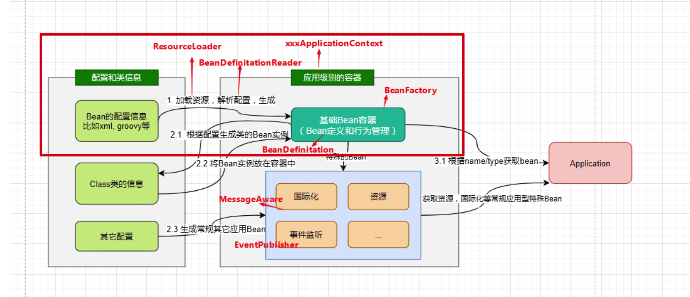

## BeanFactory和ApplicationContext

### BeanFactory

BeanFactory作为 Spring 框架里最基础的 Bean 容器，BeanFactory 仅提供了基本的 Bean 管理功能，像 Bean 的实例化、依赖注入等。它采用的是延迟加载策略，也就是在首次请求 Bean 时才会进行实例化。

BeanFactory适用于资源受限的环境，或者对启动时间有严格要求的场景。因为它采用延迟加载策略，能降低启动时的资源消耗。
### ApplicationContext 

在 BeanFactory 的基础上，ApplicationContext 提供了更多高级特性，比如国际化支持、事件发布、AOP 自动代理等。并且，ApplicationContext 在容器启动时就会实例化所有的单例 Bean。

ApplicationContext适用于大多数企业级应用开发。它提供的丰富功能可以简化开发流程，提高开发效率。

ApplicationContext 接口有两个常用的实现类

| 实现类                          | 描述                                                         | 示例代码                                                     |
| ------------------------------- | ------------------------------------------------------------ | ------------------------------------------------------------ |
| ClassPathXmlApplicationContext  | 加载类路径 ClassPath 下指定的 XML 配置文件，并完成 ApplicationContext 的实例化工作 | ApplicationContext applicationContext = new ClassPathXmlApplicationContext(String configLocation); |
| FileSystemXmlApplicationContext | 加载指定的文件系统路径中指定的 XML 配置文件，并完成 ApplicationContext 的实例化工作 | ApplicationContext applicationContext = new FileSystemXmlApplicationContext(String configLocation); |

### IOC容器的初始化流程

