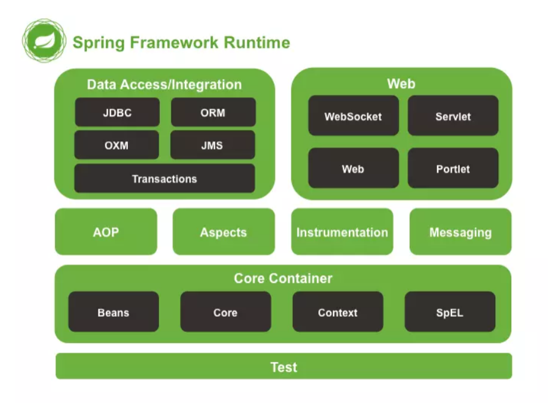

### 什么是Spring
Spring是一个轻量级Java开发框架，最早有Rod Johnson创建，目的是为了解决企业级应用开发的业务
逻辑层和其他各层的耦合问题。它是一个分层的JavaSE/JavaEE full-stack（一站式）轻量级开源框架，
为开发Java应用程序提供全面的基础架构支持。Spring负责基础架构，因此Java开发者可以专注于应用
程序的开发。

Spring最根本的使命是解决企业级应用开发的复杂性，即简化Java开发。

Spring可以做很多事情，它为企业级开发提供给了丰富的功能，但是这些功能的底层都依赖于它的两个
核心特性，也就是依赖注入（dependency injection，DI）和面向切面编程（aspect-oriented
programming，AOP）。

为了降低Java开发的复杂性，Spring采取了以下4种关键策略
1. 基于POJO的轻量级和最小侵入性编程；
2. 通过依赖注入和面向接口实现松耦合；
3. 基于切面和惯例进行声明式编程；
4. 通过切面和模板减少样板式代码。
### Spring框架的设计目标，设计理念，和核心是什么

1. ***Spring设计目标***：Spring为开发者提供一个一站式轻量级应用开发平台；
2. ***Spring设计理念***：在JavaEE开发中，支持POJO和JavaBean开发方式，使应用面向接口开发，充分支持
OO（面向对象）设计方法；Spring通过IoC容器实现对象耦合关系的管理，并实现依赖反转，将对象之
间的依赖关系交给IoC容器，实现解耦；
3. ***Spring框架的核心***：IoC容器和AOP模块。通过IoC容器管理POJO对象以及他们之间的耦合关系；通过
AOP以动态非侵入的方式增强服务。
4. IoC让相互协作的组件保持松散的耦合，而AOP编程允许你把遍布于应用各层的功能分离出来形成可重
用的功能组件。
### Spring的优缺点是什么

***优点***

1. 方便解耦，简化开发
Spring就是一个大工厂，可以将所有对象的创建和依赖关系的维护，交给Spring管理。
2. AOP编程的支持
Spring提供面向切面编程，可以方便的实现对程序进行权限拦截、运行监控等功能。
3. 声明式事务的支持
只需要通过配置就可以完成对事务的管理，而无需手动编程。
4. 方便程序的测试
Spring对Junit4支持，可以通过注解方便的测试Spring程序。
5. 方便集成各种优秀框架
Spring不排斥各种优秀的开源框架，其内部提供了对各种优秀框架的直接支持（如：Struts、
Hibernate、MyBatis等）。
6. 降低JavaEE API的使用难度
Spring对JavaEE开发中非常难用的一些API（JDBC、JavaMail、远程调用等），都提供了封装，使
这些API应用难度大大降低。

***缺点***

1. Spring明明一个很轻量级的框架，却给人感觉大而全
2. Spring依赖反射，反射影响性能
3. 使用门槛升高，入门Spring需要较长时间
### Spring由哪些模块组成

Spring 总共大约有 20 个模块， 由 1300 多个不同的文件构成。 而这些组件被分别整合在 核心容器
（Core Container） 、 AOP（Aspect Oriented Programming）和设备支持（Instrmentation） 、
数据访问与集成（Data Access/Integeration） 、 Web 、 消息（Messaging） 、 Test 等 6 个模块
中。

1. spring core：提供了框架的基本组成部分，包括控制反转（Inversion of Control，IOC）和依赖
注入（Dependency Injection，DI）功能。
2. spring beans：提供了BeanFactory，是工厂模式的一个经典实现，Spring将管理对象称为
Bean。
3. spring context：构建于 core 封装包基础上的 context 封装包，提供了一种框架式的对象访问方
法。
4. spring jdbc：提供了一个JDBC的抽象层，消除了烦琐的JDBC编码和数据库厂商特有的错误代码解
析， 用于简化JDBC。
5. spring aop：提供了面向切面的编程实现，让你可以自定义拦截器、切点等。
6. spring Web：提供了针对 Web 开发的集成特性，例如文件上传，利用 servlet listeners 进行 ioc
容器初始化和针对 Web 的 ApplicationContext。
7. spring test：主要为测试提供支持的，支持使用JUnit或TestNG对Spring组件进行单元测试和集成
测试。
### Spring 框架中都用到了哪些设计模式
1. 工厂模式：BeanFactory就是简单工厂模式的体现，用来创建对象的实例；
2. 单例模式：Bean默认为单例模式。
3. 代理模式：Spring的AOP功能用到了JDK的动态代理和CGLIB字节码生成技术；
4. 模板方法：用来解决代码重复的问题。比如. RestTemplate, JmsTemplate, JpaTemplate。
5. 观察者模式：定义对象键一种一对多的依赖关系，当一个对象的状态发生改变时，所有依赖于它的
   对象都会得到通知被制动更新，如Spring中listener的实现–ApplicationListener。
### Spring框架中有哪些不同类型的事件

Spring 提供了以下5种标准的事件：

1. 上下文更新事件（ContextRefreshedEvent）：在调用ConfigurableApplicationContext 接口中
   的refresh()方法时被触发。
2. 上下文开始事件（ContextStartedEvent）：当容器调用ConfigurableApplicationContext的
   Start()方法开始/重新开始容器时触发该事件。
3. 上下文停止事件（ContextStoppedEvent）：当容器调用ConfigurableApplicationContext的
   Stop()方法停止容器时触发该事件。
4. 上下文关闭事件（ContextClosedEvent）：当ApplicationContext被关闭时触发该事件。容器被
   关闭时，其管理的所有单例Bean都被销毁。
5. 请求处理事件（RequestHandledEvent）：在Web应用中，当一个http请求（request）结束触发
   该事件。如果一个bean实现了ApplicationListener接口，当一个ApplicationEvent 被发布以后，
   bean会自动被通知。
