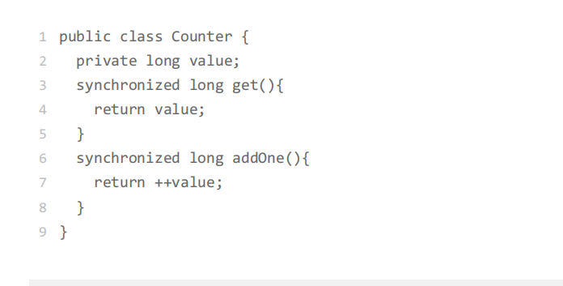

### 封装共享变量

面向对象思想里面有一个很重要的特性是封装，封装的通俗解释就是将属性和实现细节封装
在对象内部，外界对象只能通过目标对象提供的公共方法来间接访问这些内部属性，这和门
票管理模型匹配度相当的高，球场里的座位就是对象属性，球场入口就是对象的公共方法。
我们把共享变量作为对象的属性，那对于共享变量的访问路径就是对象的公共方法，所有入
口都要安排检票程序就相当于我们前面提到的并发访问策略。
利用面向对象思想写并发程序的思路，其实就这么简单：将共享变量作为对象属性封装在内
部，对所有公共方法制定并发访问策略。就拿很多统计程序都要用到计数器来说，下面的计
数器程序共享变量只有一个，就是 value，我们把它作为 Counter 类的属性，并且将两个
公共方法 get() 和 addOne() 声明为同步方法，这样 Counter 类就成为一个线程安全的类
了。

当然，实际工作中，很多的场景都不会像计数器这么简单，经常要面临的情况往往是有很多
的共享变量，例如，信用卡账户有卡号、姓名、身份证、信用额度、已出账单、未出账单等
很多共享变量。这么多的共享变量，如果每一个都考虑它的并发安全问题，那我们就累死了。但其实仔细观察，你会发现，很多共享变量的值是不会变的，例如信用卡账户的卡号、
姓名、身份证。对于这些不会发生变化的共享变量，建议你用 final 关键字来修饰。这样既
能避免并发问题，也能很明了地表明你的设计意图，让后面接手你程序的兄弟知道，你已经
考虑过这些共享变量的并发安全问题了

### 识别共享变量间的约束条件

### 制定并发访问策略

1. 避免共享：避免共享的技术主要是利于线程本地存储以及为每个任务分配独立的线程。
2. 不变模式：这个在 Java 领域应用的很少，但在其他领域却有着广泛的应用，例如 Actor
   模式、CSP 模式以及函数式编程的基础都是不变模式。
3. 管程及其他同步工具：Java 领域万能的解决方案是管程，但是对于很多特定场景，使用
   Java 并发包提供的读写锁、并发容器等同步工具会更好

除了这些方案之外，还有一些宏观的原则需要你了解。这些宏观原则，有助于你写出“健
壮”的并发程序。这些原则主要有以下三条。
1. 优先使用成熟的工具类：Java SDK 并发包里提供了丰富的工具类，基本上能满足你日常
   的需要，建议你熟悉它们，用好它们，而不是自己再“发明轮子”，毕竟并发工具类不
   是随随便便就能发明成功的。
2. 迫不得已时才使用低级的同步原语：低级的同步原语主要指的是 synchronized、Lock、
   Semaphore 等，这些虽然感觉简单，但实际上并没那么简单，一定要小心使用。
3. 避免过早优化：安全第一，并发程序首先要保证安全，出现性能瓶颈后再优化。在设计
   期和开发期，很多人经常会情不自禁地预估性能的瓶颈，并对此实施优化，但残酷的现
   实却是：性能瓶颈不是你想预估就能预估的。

，我们可以总结出这样一个基本的原则：锁，应是私有的、不可变的、不可
重用的。