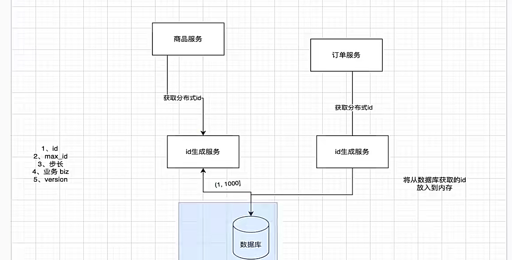

## 全局唯一 ID 应当具备什么样的属性

1. 全局唯一性：不能出现重复的 ID 号，既然是唯一标识，这是最基本的要求；
2. 趋势递增：在 MySQL InnoDB 引擎中使用的是聚集索引，由于多数 RDBMS 使用 B-tree 的数据结构来存储索引数据，在主键的选择上面我们应该尽量使用有序的主键保证写入性能；
3. 单调递增：保证下一个 ID 一定大于上一个 ID，例如事务版本号、IM 增量消息、排序等特殊需求；
4. 信息安全：如果 ID 是连续的，恶意用户的爬取工作就非常容易做了，直接按照顺序下载指定 URL 即可；如果是订单号就更危险了，竞争对手可以直接知道我们一天的单量。所以在一些应用场景下，会需要 ID 无规则、不规则。


## UUID


### 生成策略

### 1. 版本 1：基于时间戳


- **原理**：版本 1 的 UUID 是基于时间戳和 MAC 地址生成的。它包含了生成 UUID 的时间戳信息，精确到 100 纳秒，以及生成该 UUID 的计算机的 MAC 地址。通过结合时间和 MAC 地址，可以保证在不同时间和不同计算机上生成的 UUID 是唯一的。
- **Java 示例**：


java


```java
import java.util.UUID;

public class UUIDVersion1Example {
    public static void main(String[] args) {
        // Java 标准库没有直接生成版本 1 UUID 的方法，可借助第三方库，如 Hibernate
        // 这里只是示意 UUID 生成对象的创建
        UUID uuid = UUID.randomUUID(); 
        System.out.println("生成的 UUID: " + uuid);
    }
}
```


- 优缺点

  ：

    - **优点**：由于包含时间信息，可用于排序；具有较高的唯一性，适用于分布式系统中需要唯一标识且对时间顺序有要求的场景。
    - **缺点**：暴露了 MAC 地址，存在一定的安全风险；生成的 UUID 包含时间戳，可能会被攻击者利用来推测系统的使用时间等信息。

### 2. 版本 2：DCE 安全


- **原理**：版本 2 的 UUID 是基于分布式计算环境（DCE）安全模型生成的，它与版本 1 类似，但使用的是用户 ID 或组 ID 代替 MAC 地址。
- **使用场景**：在一些需要考虑安全和权限的分布式系统中使用，但在实际应用中并不常见。
- **注意事项**：Java 标准库中没有直接支持生成版本 2 UUID 的方法，需要使用特定的第三方库。

### 3. 版本 3：基于命名空间


- **原理**：版本 3 的 UUID 是通过 MD5 哈希算法生成的。它需要一个命名空间（通常是另一个 UUID）和一个名称作为输入，将命名空间和名称组合后进行 MD5 哈希计算，得到 128 位的哈希值，再将其转换为 UUID 格式。
- **Java 示例**：


java


```java
import java.util.UUID;

public class UUIDVersion3Example {
    public static void main(String[] args) {
        UUID namespace = UUID.randomUUID();
        String name = "exampleName";
        UUID uuid = UUID.nameUUIDFromBytes((namespace.toString() + name).getBytes());
        System.out.println("版本 3 的 UUID: " + uuid);
    }
}
```


- 优缺点

  ：

    - **优点**：只要命名空间和名称相同，生成的 UUID 就是相同的，可用于需要确定性生成 UUID 的场景，如数据索引。
    - **缺点**：由于使用的是 MD5 哈希算法，存在一定的哈希冲突风险。

### 4. 版本 4：随机生成


- **原理**：版本 4 的 UUID 是完全随机生成的，它使用随机数生成器（通常是安全的随机数生成器）生成 128 位的随机数，然后将其转换为 UUID 格式。
- **Java 示例**：


java


```java
import java.util.UUID;

public class UUIDVersion4Example {
    public static void main(String[] args) {
        UUID uuid = UUID.randomUUID();
        System.out.println("版本 4 的 UUID: " + uuid);
    }
}
```


- 优缺点

  ：

    - **优点**：生成速度快，使用方便，适用于大多数需要唯一标识但对唯一性要求不是极端严格的场景。
    - **缺点**：由于是随机生成的，不包含任何有意义的信息，无法从 UUID 本身推测出生成的时间、地点等信息。

### 5. 版本 5：基于命名空间（SHA - 1）


- **原理**：版本 5 的 UUID 与版本 3 类似，也是基于命名空间和名称生成的，但使用的是 SHA - 1 哈希算法。SHA - 1 比 MD5 更安全，哈希冲突的概率更低。
- **Java 示例**：


java


```java
import java.nio.charset.StandardCharsets;
import java.security.MessageDigest;
import java.security.NoSuchAlgorithmException;
import java.util.UUID;

public class UUIDVersion5Example {
    public static UUID nameUUIDFromNamespaceAndString(UUID namespace, String name) {
        try {
            MessageDigest md = MessageDigest.getInstance("SHA-1");
            md.update(toBytes(namespace));
            md.update(name.getBytes(StandardCharsets.UTF_8));
            byte[] sha1Bytes = md.digest();
            sha1Bytes[6] &= 0x0f;  /* clear version        */
            sha1Bytes[6] |= 0x50;  /* set to version 5     */
            sha1Bytes[8] &= 0x3f;  /* clear variant        */
            sha1Bytes[8] |= 0x80;  /* set to IETF variant  */
            return fromBytes(sha1Bytes);
        } catch (NoSuchAlgorithmException e) {
            throw new InternalError("SHA-1 not supported", e);
        }
    }

    private static byte[] toBytes(UUID uuid) {
        long msb = uuid.getMostSignificantBits();
        long lsb = uuid.getLeastSignificantBits();
        byte[] buffer = new byte[16];

        for (int i = 0; i < 8; i++) {
            buffer[i] = (byte) (msb >>> 8 * (7 - i));
        }
        for (int i = 8; i < 16; i++) {
            buffer[i] = (byte) (lsb >>> 8 * (7 - i));
        }
        return buffer;
    }

    private static UUID fromBytes(byte[] data) {
        long msb = 0;
        long lsb = 0;
        assert data.length == 16 : "data must be 16 bytes in length";
        for (int i = 0; i < 8; i++) {
            msb = (msb << 8) | (data[i] & 0xff);
        }
        for (int i = 8; i < 16; i++) {
            lsb = (lsb << 8) | (data[i] & 0xff);
        }
        return new UUID(msb, lsb);
    }

    public static void main(String[] args) {
        UUID namespace = UUID.randomUUID();
        String name = "exampleName";
        UUID uuid = nameUUIDFromNamespaceAndString(namespace, name);
        System.out.println("版本 5 的 UUID: " + uuid);
    }
}
```


- 优缺点

  ：

    - **优点**：与版本 3 相比，使用 SHA - 1 算法减少了哈希冲突的风险，同时具有确定性，适用于对唯一性和安全性要求较高的场景。
    - **缺点**：生成过程相对复杂，性能略低于版本 3。
### 虽然 UUID 生成方便，本地生成没有网络消耗，但是使用起来也有一些缺点

不易于存储：UUID太长，16字节128位，通常以36长度的字符串表示，很多场景不适用。
信息不安全：基于MAC地址生成UUID的算法可能会造成MAC地址泄露，暴露使用者的位置。
对MySQL索引不利：如果作为数据库主键，在InnoDB引擎下，UUID的无序性可能会引起数据位置频繁变动，严重影响性能，可以查阅 Mysql 索引原理 B+树的知识


## 数据库生成

数据库水平拆分，设置初始值和相同的自增步长


### 缺点也很明显，
首先它强依赖DB，当DB异常时整个系统不可用。虽然配置主从复制可以尽可能的增加可用性，但是数据一致性在特殊情况下难以保证。
主从切换时的不一致可能会导致重复发号。还有就是ID发号性能瓶颈限制在单台MySQL的读写性能。
预留字段要根据业务估计

## 基于数据库的号段模式

号段模式是当下分布式ID生成器的主流实现方式之一，号段模式可以理解为从数据库批量的获取自增ID，每次从数据库取出一个号段范围，例如 (1,1000] 代表1000个ID，具体的业务服务将本号段，生成1~1000的自增ID并加载到内存。表结构如下：

```mysql
CREATE TABLE id_generator (
  id int(10) NOT NULL,
  max_id bigint(20) NOT NULL COMMENT '当前最大id',
  step int(20) NOT NULL COMMENT '号段的布长',
  biz_type	int(20) NOT NULL COMMENT '业务类型',
  version int(20) NOT NULL COMMENT '版本号',
  PRIMARY KEY (`id`)
) 
```
id : 唯一表示
  
biz_type ：代表不同业务类型

max_id ：当前最大的可用id

step ：代表号段的长度

version ：是一个乐观锁，每次都更新version，保证并发时数据的正确性


### 缺点

1. 因为固定的设计 ，所有有安全问题
2.  虽然分了1000个ID，但是还有500个没用，又因为这ID是存到内存中的，所以不会返回给数据库的
3. 我们要求重新分配ID时候，数据库宕机了，这时候就有问题，所以我们不一定需要等到要用完之后才来申请，而是设置一个阈值，提早一点来数据库中取

## 使用redis实现

Redis实现分布式唯一ID主要是通过提供像 INCR 和 INCRBY 这样的自增原子命令，由于Redis自身的单线程的特点所以能保证生成的 ID 肯定是唯一有序的。

但是单机存在性能瓶颈，无法满足高并发的业务需求，所以可以采用集群的方式来实现。集群的方式又会涉及到和数据库集群同样的问题，所以也需要设置分段和步长来实现。

为了避免长期自增后数字过大可以通过与当前时间戳组合起来使用，另外为了保证并发和业务多线程的问题可以采用 Redis + Lua的方式进行编码，保证安全。

Redis 实现分布式全局唯一ID，它的性能比较高，生成的数据是有序的，对排序业务有利，但是同样它依赖于redis，需要系统引进redis组件，增加了系统的配置复杂性。

当然现在Redis的使用性很普遍，所以如果其他业务已经引进了Redis集群，则可以资源利用考虑使用Redis来实现。

用redis实现需要注意一点，要考虑到redis持久化的问题。redis有两种持久化方式RDB和AOF

RDB会定时打一个快照进行持久化，假如连续自增但redis没及时持久化，而这会Redis挂掉了，重启Redis后会出现ID重复的情况。
AOF会对每条写命令进行持久化，即使Redis挂掉了也不会出现ID重复的情况，但由于incr命令的特殊性，会导致Redis重启恢复的数据时间过长。

有人提出了借助 Redis 来实现，例如订单号=日期+当日自增长号，自增长通过 INCR 实现。但这样操作的话又无法满足编号不可猜测需求

### 具体的实现

#### 第一种是使用RedisAtomicLong 原子类使用CAS操作来生成ID。

```java
@Service
public class RedisSequenceFactory {
    @Autowired
    RedisTemplate<String, String> redisTemplate;

    public void setSeq(String key, int value, Date expireTime) {
        RedisAtomicLong counter = new RedisAtomicLong(key, redisTemplate.getConnectionFactory());
        counter.set(value);
        counter.expireAt(expireTime);
    }

    public void setSeq(String key, int value, long timeout, TimeUnit unit) {
        RedisAtomicLong counter = new RedisAtomicLong(key, redisTemplate.getConnectionFactory());
        counter.set(value);
        counter.expire(timeout, unit);
    }

    public long generate(String key) {
        RedisAtomicLong counter = new RedisAtomicLong(key, redisTemplate.getConnectionFactory());
        return counter.incrementAndGet();
    }

    public long incr(String key, Date expireTime) {
        RedisAtomicLong counter = new RedisAtomicLong(key, redisTemplate.getConnectionFactory());
        counter.expireAt(expireTime);
        return counter.incrementAndGet();
    }

    public long incr(String key, int increment) {
        RedisAtomicLong counter = new RedisAtomicLong(key, redisTemplate.getConnectionFactory());
        return counter.addAndGet(increment);
    }

    public long incr(String key, int increment, Date expireTime) {
        RedisAtomicLong counter = new RedisAtomicLong(key, redisTemplate.getConnectionFactory());
        counter.expireAt(expireTime);
        return counter.addAndGet(increment);
    }
}

```
### 第二种是使用redisTemplate.opsForHash()和结合UUID的方式来生成生成ID。
```java
public Long getSeq(String key,String hashKey,Long delta) throws BusinessException{
        try {
            if (null == delta) {
                delta=1L;
            }
            return redisTemplate.opsForHash().increment(key, hashKey, delta);
        } catch (Exception e) {  // 若是redis宕机就采用uuid的方式
            int first = new Random(10).nextInt(8) + 1;
            int randNo=UUID.randomUUID().toString().hashCode();
            if (randNo < 0) {
                randNo=-randNo;
            }
            return Long.valueOf(first + String.format("%16d", randNo));
        }
    }

```

## 雪花算法-Snowflake

snowflake 不依赖数据库，也不依赖内存存储，随时可生成 ID，这也是它如此受欢迎的原因。但因为它在设计时通过时间戳来避免对内存和数据库的依赖，所以它依赖于服务器的时间。上面我们提到了 Snowflake 的 4 段结构，实际上影响 ID 大小的是较高位的值，由于最高位固定为 0，遂影响 ID 大小的是中位的值，也就是时间戳。


雪花算法提供了一个很好的设计思想，雪花算法生成的ID是趋势递增，不依赖数据库等第三方系统，以服务的方式部署，稳定性更高，生成ID的性能也是非常高的，而且可以根据自身业务特性分配bit位，非常灵活。

但是雪花算法强依赖机器时钟，如果机器上时钟回拨，会导致发号重复或者服务会处于不可用状态。如果恰巧回退前生成过一些ID，而时间回退后，生成的ID就有可能重复。官方对于此并没有给出解决方案，而是简单的抛错处理，这样会造成在时间被追回之前的这段时间服务不可用。


1. 第1位占用1bit，其值始终是0，可看做是符号位不使用。
2. 第2位开始的41位是时间戳，41-bit位可表示2^41个数，每个数代表毫秒，那么雪花算法可用的时间年限是(1L<<41)/(1000L360024*365)=69 年的时间。
3. 中间的10-bit位可表示机器数，即2^10 = 1024台机器，但是一般情况下我们不会部署这么台机器。如果我们对IDC（互联网数据中心）有需求，还可以将 10-bit 分 5-bit 给 IDC，分5-bit给工作机器。这样就可以表示32个IDC，每个IDC下可以有32台机器，具体的划分可以根据自身需求定义。
4. 最后12-bit位是自增序列，可表示2^12 = 4096个数。

这样的划分之后相当于在一毫秒一个数据中心的一台机器上可产生4096个有序的不重复的ID。但是我们 IDC 和机器数肯定不止一个，所以毫秒内能生成的有序ID数是翻倍的。

雪花算法使用数据中心ID和机器ID作为标识，不会产生ID的重复，并且是在本地生成，不会消耗网络，效率高，有数据显示，每秒能生成26万个ID


雪花算法（Snowflake）是 Twitter 开源的分布式 ID 生成算法，其生成的 ID 是一个 64 位的长整型数字，由时间戳、工作机器 ID 和序列号组成。不过，雪花算法在实际使用中会存在一些问题，下面将详细介绍这些问题以及相应的解决办法。

### 1. 时钟回拨问题


- **问题描述**：雪花算法依赖系统时钟来生成 ID，如果系统时钟发生回拨，可能会导致生成重复的 ID。例如，当服务器进行 NTP 时间同步时，时钟可能会被调整到之前的时间，此时如果继续按照原算法生成 ID，就会与之前已经生成的 ID 产生冲突。
- 解决方法
    - **等待时钟恢复**：当检测到时钟回拨时，程序暂停一段时间，等待时钟恢复到正常时间后再继续生成 ID。


java


```java
// 简单示例，检测到时钟回拨后等待
private long lastTimestamp = -1L;
private final long waitTime = 1000L; // 等待 1 秒

public synchronized long nextId() {
    long currentTimestamp = System.currentTimeMillis();
    if (currentTimestamp < lastTimestamp) {
        // 发生时钟回拨
        try {
            Thread.sleep(waitTime);
            currentTimestamp = System.currentTimeMillis();
            if (currentTimestamp < lastTimestamp) {
                throw new RuntimeException("Clock moved backwards. Refusing to generate id for " + waitTime + " milliseconds");
            }
        } catch (InterruptedException e) {
            Thread.currentThread().interrupt();
        }
    }
    lastTimestamp = currentTimestamp;
    // 生成 ID 的其他逻辑
    return id;
}
```


- **使用备用时钟源**：可以引入一个备用的时钟源，如 GPS 时钟，当系统时钟发生回拨时，切换到备用时钟源来生成 ID。
- **记录时钟回拨并补偿**：记录时钟回拨的时间和偏移量，在后续生成 ID 时，通过增加时间戳的偏移量来避免 ID 重复。

### 2. 机器 ID 分配问题


- **问题描述**：雪花算法需要为每个工作机器分配唯一的机器 ID，如果机器 ID 分配不合理，可能会导致不同机器生成相同的 ID。手动分配机器 ID 容易出错，而且在大规模分布式系统中，管理机器 ID 会变得非常复杂。
- 解决方法
    - **使用 Zookeeper 分配机器 ID**：利用 Zookeeper 的有序节点特性，为每个工作机器分配唯一的机器 ID。当机器启动时，向 Zookeeper 注册一个临时有序节点，节点的序号即为机器 ID。


java


```java
import org.apache.zookeeper.*;
import org.apache.zookeeper.data.Stat;

import java.io.IOException;
import java.util.List;
import java.util.concurrent.CountDownLatch;

public class ZookeeperMachineIdAllocator {
    private static final String ZOOKEEPER_CONNECT_STRING = "localhost:2181";
    private static final int SESSION_TIMEOUT = 3000;
    private static final String MACHINE_ID_NODE_PATH = "/snowflake/machine_ids";
    private ZooKeeper zk;

    public ZookeeperMachineIdAllocator() throws IOException, InterruptedException, KeeperException {
        CountDownLatch connectedSignal = new CountDownLatch(1);
        zk = new ZooKeeper(ZOOKEEPER_CONNECT_STRING, SESSION_TIMEOUT, event -> {
            if (event.getState() == Watcher.Event.KeeperState.SyncConnected) {
                connectedSignal.countDown();
            }
        });
        connectedSignal.await();
        if (zk.exists(MACHINE_ID_NODE_PATH, false) == null) {
            zk.create(MACHINE_ID_NODE_PATH, new byte[0], ZooDefs.Ids.OPEN_ACL_UNSAFE, CreateMode.PERSISTENT);
        }
    }

    public long getMachineId() throws KeeperException, InterruptedException {
        String path = zk.create(MACHINE_ID_NODE_PATH + "/machine_", new byte[0], ZooDefs.Ids.OPEN_ACL_UNSAFE, CreateMode.EPHEMERAL_SEQUENTIAL);
        String[] parts = path.split("/");
        String nodeName = parts[parts.length - 1];
        return Long.parseLong(nodeName.substring("machine_".length()));
    }

    public void close() throws InterruptedException {
        zk.close();
    }
}
```


- **使用数据库分配机器 ID**：在数据库中创建一个表来管理机器 ID，每个机器启动时从数据库中获取一个唯一的机器 ID，并将该 ID 标记为已使用。

### 3. 并发性能问题


- **问题描述**：雪花算法是通过同步锁来保证线程安全的，在高并发场景下，频繁的加锁和解锁操作会成为性能瓶颈，影响 ID 生成的速度。
- 解决方法
    - **分段缓存 ID**：每个工作机器预先从 ID 生成器中获取一段连续的 ID 缓存起来，当需要生成 ID 时，直接从缓存中获取，避免频繁加锁。当缓存中的 ID 快用完时，再批量获取新的 ID 段。
    - **多线程生成 ID**：可以使用多个线程同时生成 ID，每个线程维护自己的计数器和时间戳，提高 ID 生成的并发性能。

### 4. 数据中心 ID 和机器 ID 位数限制问题


- **问题描述**：雪花算法中数据中心 ID 和机器 ID 的位数是固定的，如果系统规模不断扩大，可能会导致数据中心 ID 或机器 ID 不够用。
- 解决方法
    - **调整位数分配**：根据实际情况调整时间戳、数据中心 ID、机器 ID 和序列号的位数分配。例如，如果机器数量较多，可以适当减少数据中心 ID 的位数，增加机器 ID 的位数。
    - **采用分层架构**：将系统划分为多个层次，每个层次使用不同的 ID 生成策略，以应对大规模分布式系统的需求。
## 百度-UidGenerator


## 美团Leaf

## Mist 薄雾算法

## 滴滴TinyID