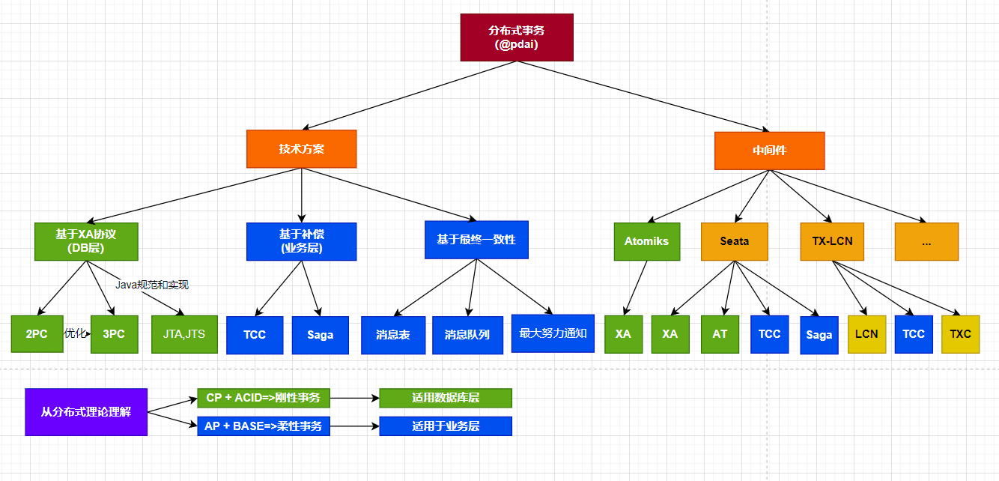
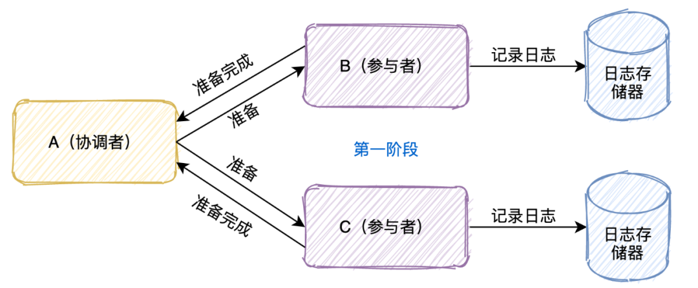
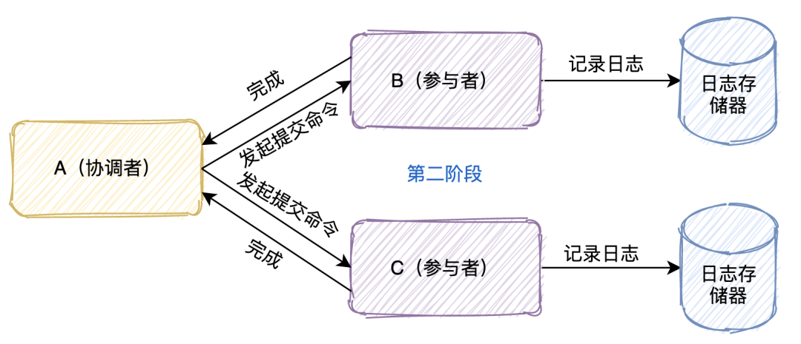
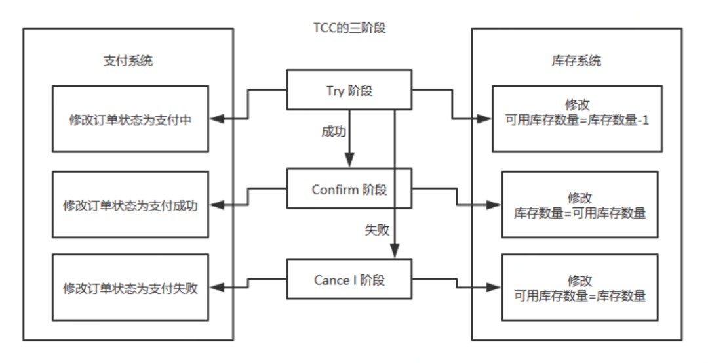
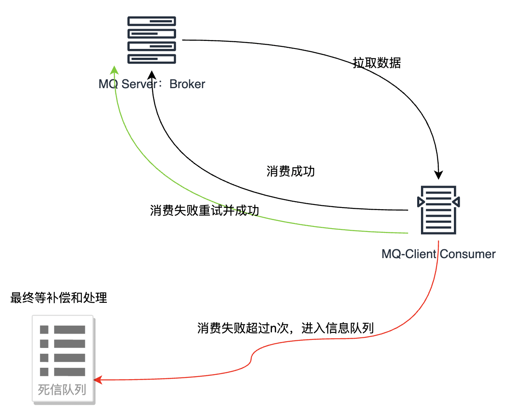
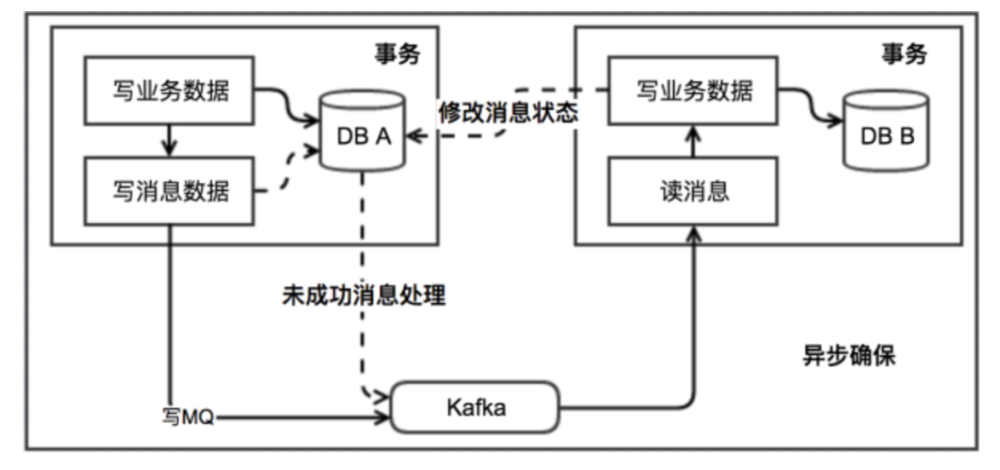

# 分布式事务解决方案

##  XA 两阶段提交协议

两阶段提交协议（Two-phase commit protocol，简称2PC）是一种分布式事务处理协议，旨在确保参与分布式事务的所有节点都能达成一致的结果。此协议被广泛应用于许多分布式关系型数据管理系统，以完成分布式事务。
它是一种强一致性设计，引入一个事务协调者的角色来协调管理各参与者的提交和回滚，二阶段分别指的是准备（投票）和提交两个阶段。

## 两阶段提交（2PC）

这个协议有「两个角色」，

A节点是事务的协调者，B和C是事务的参与者。

事务的提交分成两个阶段

第一个阶段是「投票阶段」

1. 协调者首先将命令「写入日志」
2. 「发一个prepare命令」给B和C节点这两个参与者
3. B和C收到消息后，根据自己的实际情况，「判断自己的实际情况是否可以提交」
4. 将处理结果「记录到日志」系统
5. 将结果「返回」给协调者

   第二个阶段是「决定阶段」

当A节点收到B和C参与者所有的确认消息后

1. 「判断」所有协调者「是否都可以提交」

如果可以则「写入日志」并且发起commit命令

有一个不可以则「写入日志」并且发起abort命令
2. 参与者收到协调者发起的命令，「执行命令」
3. 将执行命令及结果「写入日志」
4. 「返回结果」给协调者

可能会存在哪些问题？

1. 「单点故障」：一旦事务管理器出现故障，整个系统不可用
2. 「数据不一致」：在阶段二，如果事务管理器只发送了部分 commit 消息，此时网络发生异常，那么只有部分参与者接收到 commit 消息，也就是说只有部分参与者提交了事务，使得系统数据不一致。
3. 「响应时间较长」：整个消息链路是串行的，要等待响应结果，不适合高并发的场景
4. 「不确定性」：当事务管理器发送 commit 之后，并且此时只有一个参与者收到了 commit，那么当该参与者与事务管理器同时宕机之后，重新选举的事务管理器无法确定该条消息是否提交成功。
## XA三阶段提交

三阶段提交：CanCommit 阶段、PreCommit 阶段、DoCommit 阶段，简称3PC
三阶段提交协议（Three-phase commit protocol，3PC），是二阶段提交（2PC）的改进版本。与两阶段提交不同的是，三阶段提交有两个改动点：在协调者和参与者中都引入超时机制，同时引入了预提交阶段。

在第一阶段和第二阶段中插入的预提交阶段，保证了在最后提交阶段之前各参与节点的状态是一致的。
即 3PC 把 2PC 的准备阶段再次一分为二，这样三阶段提交就有 CanCommit、PreCommit、DoCommit 三个阶段。当 CanCommit、PreCommit、DoCommit的任意一个步骤失败或者等待超时，执行RollBack。
## 三阶段提交（3PC）

第一阶段：「CanCommit阶段」这个阶段所做的事很简单，就是协调者询问事务参与者，你是否有能力完成此次事务。
如果都返回yes，则进入第二阶段 有一个返回no或等待响应超时，则中断事务，并向所有参与者发送abort请求

第二阶段：「PreCommit阶段」此时协调者会向所有的参与者发送PreCommit请求，参与者收到后开始执行事务操作，并将Undo和Redo信息记录到事务日志中。参与者执行完事务操作后（此时属于未提交事务的状态），就会向协调者反馈“Ack”表示我已经准备好提交了，并等待协调者的下一步指令。

第三阶段：「DoCommit阶段」在阶段二中如果所有的参与者节点都可以进行PreCommit提交，那么协调者就会从“预提交状态”转变为“提交状态”。然后向所有的参与者节点发送"doCommit"请求，参与者节点在收到提交请求后就会各自执行事务提交操作，并向协调者节点反馈“Ack”消息，协调者收到所有参与者的Ack消息后完成事务。相反，如果有一个参与者节点未完成PreCommit的反馈或者反馈超时，那么协调者都会向所有的参与者节点发送abort请求，从而中断事务。
## MQ事务

## TCC事务

TCC事务是Try、Confirm、Cancel三种指令的缩写，其逻辑模式类似于XA两阶段提交，但是实现方式是在代码层面人为实现。 2PC 和 3PC 都是数据库层面的，而 TCC 是业务层面的分布式事务。
这种事务模式特别适用于需要强一致性保证的分布式事务场景，除了上面提到的数据库层面的操作外,例如电商平台的订单系统、跨行转账、分布式资源预订系统以及金融交易处理等。
下图就是一个典型的分布式系统的原子性操作，涉及A、B、C三个服务的执行。 如果有一个服务 try 出问题，整个事务管理器就执行calcel，如果三个try都成功，才执行confirm做正式提交。

## 最终补偿机制，同于MQ事务

最后使用补偿机制做最后的一致性保障，MQ方案尽量使用补偿机制进行保障。
如下图，对于发送成功，消费失败的消息，进入Dead-Letter Queu，使用单独的作业服务进行独立处理，比如重新发送死信消息进行消费，避免生产和消费的不一致，保证了最终的原子性、一致性。

## 本地消息表

执行流程：

消息生产方，需要额外建一个消息表，并「记录消息发送状态」。消息表和业务数据要在一个事务里提交，也就是说他们要在一个数据库里面。然后消息会经过MQ发送到消息的消费方。

如果消息发送失败，会进行重试发送。

消息消费方，需要「处理」这个「消息」，并完成自己的业务逻辑。

如果是「业务上面的失败」，可以给生产方「发送一个业务补偿消息」，通知生产方进行回滚等操作。

此时如果本地事务处理成功，表明已经处理成功了

如果处理失败，那么就会重试执行。

生产方和消费方定时扫描本地消息表，把还没处理完成的消息或者失败的消息再发送一遍。

## 消息事务

消息事务的原理是将两个事务「通过消息中间件进行异步解耦」，和上述的本地消息表有点类似，但是是通过消息中间件的机制去做的，其本质就是'将本地消息表封装到了消息中间件中'。

执行流程：

发送prepare消息到消息中间件

发送成功后，执行本地事务
如果事务执行成功，则commit，消息中间件将消息下发至消费端
如果事务执行失败，则回滚，消息中间件将这条prepare消息删除

消费端接收到消息进行消费，如果消费失败，则不断重试

这种方案也是实现了「最终一致性」，对比本地消息表实现方案，不需要再建消息表，「不再依赖本地数据库事务」了，所以这种方案更适用于高并发的场景。目前市面上实现该方案的「只有阿里的 RocketMQ」。

## 最大努力通知

最大努力通知的方案实现比较简单，适用于一些最终一致性要求较低的业务。

执行流程：

系统 A 本地事务执行完之后，发送个消息到 MQ；

这里会有个专门消费 MQ 的服务，这个服务会消费 MQ 并调用系统 B 的接口；

要是系统 B 执行成功就 ok 了；要是系统 B 执行失败了，那么最大努力通知服务就定时尝试重新调用系统 B, 反复 N 次，最后还是不行就放弃。

## Sagas 事务模型

### 2.5. 事务状态表方案

另外有一种类似 TCC 的事务解决方案，借助事务状态表来实现。假设要在一个分布式事务中实现调用 repo-service 扣减库存、调用 order-service 生成订单两个过程。在这种方案中，协调者 shopping-service 维护一张如下的事务状态表：

| 分布式事务 ID    | 事务内容                                                     | 事务状态                                                   |
| --------------- | ------------------------------------------------------------ | ---------------------------------------------------------- |
| global_trx_id_1 | 操作 1：调用 repo-service 扣减库存 操作 2：调用 order-service 生成订单 | 状态 1：初始 状态 2：操作 1 成功 状态 3：操作 1、2 成功 |

初始状态为 1，每成功调用一个服务则更新一次状态，最后所有的服务调用成功，状态更新到 3。

有了这张表，就可以启动一个后台任务，扫描这张表中事务的状态，如果一个分布式事务一直（设置一个事务周期阈值）未到状态 3，说明这条事务没有成功执行，于是可以重新调用 repo-service 扣减库存、调用 order-service 生成订单。直至所有的调用成功，事务状态到 3。

如果多次重试仍未使得状态到 3，可以将事务状态置为 error，通过人工介入进行干预。

由于存在服务的调用重试，因此每个服务的接口要根据全局的分布式事务 ID 做幂等，原理同 2.4 节的幂等性实现。