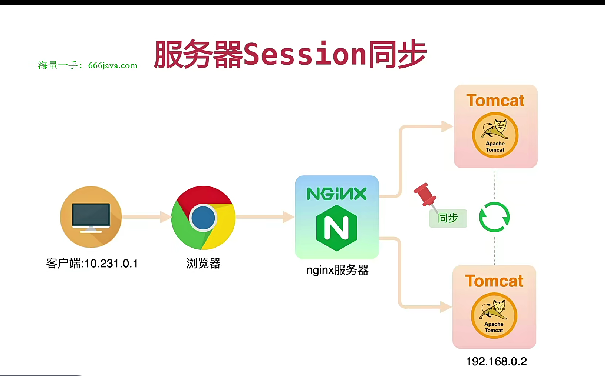

## 为什么要产生Sessionhttp

协议本身是无状态的，客户端只需要向服务器请求下载内容，客户端和服务器都不记录彼此的历史信息，每一次请求都是独立的。为什么是无状态的呢？因为浏览器与服务器是使用socke套接字进行通信，服务器将请求结果返回给浏览器之后，会关闭当前的socket链接，而且服务器也会在处理页面完毕之后销毁页面对象。然而在Web应用的很多场景下需要维护用户状态才能正常工作(是否登录等)，或者说提供便捷(记住密码，浏览历史等)，状态的保持就是一个很重要的功能。因此在web应用开发里就出现了保持http链接状态的技术：一个是cookie技术，另一种是session技术。

## Cookie的内容、作用域以及有效期

cookie的内容主要包括：名字，值，过期时间，路径和域。路径与域合在一起就构成了cookie的作用范围。如果不设置过期时间，则表示这个cookie的生命期为浏览器会话期间，只要关闭浏览器窗口，cookie就消失了，这种生命期为浏览器会话期的 cookie被称为会话cookie。会话cookie一般不存储在硬盘上而是保存在内存里。如果设置了过期时间，浏览器就会把cookie保存到硬盘上，关闭后再次打开浏览器，这些cookie仍然有效直到超过设定的过期时间。

## Cookie如何使用cookie 的使用

是由浏览器按照一定的原则在后台自动发送给服务器的。当客户端二次向服务器发送请求的时候，浏览器检查所有存储的cookie，如果某个cookie所声明的作用范围大于等于将要请求的资源所在的位置，则把该cookie附在请求资源的HTTP请求头上发送给服务器。有了Cookie这样的技术实现，服务器在接收到来自客户端浏览器的请求之后，就能够通过分析存放于请求头的Cookie得到客户端特有的信息，从而动态生成与该客户端相对应的内容。通常，我们可以从很多网站的登录界面中看到“请记住我”这样的选项，如果你勾选了它之后再登录，那么在下一次访问该网站的时候就不需要进行重复而繁琐的登录动作了，而这个功能就是通过Cookie实现的。

## 什么是Session
Session一般叫做会话，Session技术是http状态保持在服务端的解决方案，它是通过服务器来保持状态的。我们可以把客户端浏览器与服务器之间一系列交互的动作称为一个 Session。是服务器端为客户端所开辟的存储空间，在其中保存的信息就是用于保持状态。因此，session是解决http协议无状态问题的服务端解决方案，它能让客户端和服务端一系列交互动作变成一个完整的事务。

## Session的创建

那么Session在何时创建呢？当然还是在服务器端程序运行的过程中创建的，不同语言实现的应用程序有不同创建Session的方法。当客户端第一次请求服务端，当server端程序调用 HttpServletRequest.getSession(true)这样的语句时的时候，服务器会为客户端创建一个session，并将通过特殊算法算出一个session的ID，用来标识该session对象。Session存储在服务器的内存中(tomcat服务器通过StandardManager类将session存储在内存中)，也可以持久化到file，数据库，memcache，redis等。客户端只保存sessionid到cookie中，而不会保存session。浏览器的关闭并不会导致Session的删除，只有当超时、程序调用HttpSession.invalidate()以及服务端程序关闭才会删除。

## Cookie与Session的关系

cookie和session的方案虽然分别属于客户端和服务端，但是服务端的session的实现对客户端的cookie有依赖关系的，服务端执行session机制时候会生成session的id值，这个id值会发送给客户端，客户端每次请求都会把这个id值放到http请求的头部发送给服务端，而这个id值在客户端会保存下来，保存的容器就是cookie，因此当我们完全禁掉浏览器的cookie的时候，服务端的session也会不能正常使用。

## 会话技术的发展?

单机 - Session + Cookie多机器 在负载均衡侧 - Session 粘滞Session数据同步多机器，集群 - session集中管理，比如redis；目前方案上用的最多的是SpringSession，早前也有用tomcat集成方式的。无状态token，比如JWT

## 分布式会话的方案

Session Stick

为什么这种方案到目前还有很多项目使用呢？因为不需要在项目代码侧改动，而是只需要在负载均衡侧改动。

方案即将客户端的每次请求都转发至同一台服务器，这就需要负载均衡器能够根据每次请求的会话标识（SessionId）来进行请求转发，如下图所示。

这种方案实现比较简单，对于Web服务器来说和单机的情况一样。但是可能会带来如下问题：如果有一台服务器宕机或者重启，那么这台机器上的会话数据会全部丢失。会话标识是应用层信息，那么负载均衡要将同一个会话的请求都保存到同一个Web服务器上的话，就需要进行应用层（第7层）的解析，这个开销比第4层大。负载均衡器将变成一个有状态的节点，要将会话保存到具体Web服务器的映射。和无状态节点相比，内存消耗更大，容灾方面也会更麻烦

Session Replication

Session Replication 的方案则不对负载均衡器做更改，而是在Web服务器之间增加了会话数据同步的功能，各个服务器之间通过同步保证不同Web服务器之间的Session数据的一致性，如下图所示。

Session Replication 方案对负载均衡器不再有要求，但是同样会带来以下问题：同步Session数据会造成额外的网络带宽的开销，只要Session数据有变化，就需要将新产生的Session数据同步到其他服务器上，服务器数量越多，同步带来的网络带宽开销也就越大。每台Web服务器都需要保存全部的Session数据，如果整个集群的Session数量太多的话，则对于每台机器用于保存Session数据的占用会很严重。

session是什么？
我们通过浏览器上网时，浏览器和服务器间是通过HTTP协议交互。当我们请求页面时，这一次请求和上一次请求没有任何关系，这就是无状态性。无状态性使得交互更加快速，但也带来一个问题，例如：当我在商品详情页面登陆后，等到了订单页面，仍然需要登陆，每个页面都需要登陆，这是我们无法忍受的。两个不同的页面，也就是两个不同的HTTP请求，HTTP请求是无状态的，页面间无法关联。

## 粘性session

1）原理

粘性Session是指将用户锁定到某一个服务器上，比如上面说的例子，用户第一次请求时，负载均衡器将用户的请求转发到了A服务器上，如果负载均衡器设置了粘性Session的话，那么用户以后的每次请求都会转发到A服务器上，相当于把用户和A服务器粘到了一块，这就是粘性Session机制。

2）优缺点

优点：简单，不需要对session做任何处理。

缺点：缺乏容错性，如果当前访问的服务器发生故障，用户被转移到第二个服务器上时，他的session信息都将失效。

3）适用场景

发生故障对客户产生的影响较小；服务器发生故障是低概率事件。

4）实现方式

以Nginx为例，在upstream模块配置ip_hash属性即可实现粘性Session。

upstream mycluster{
#这里添加的是上面启动好的两台Tomcat服务器
ip_hash;#粘性Session
server 192.168.22.229:8080 weight=1;
server 192.168.22.230:8080 weight=1;
}

## 服务器session复制

1）原理

任何一个服务器上的session发生改变（增删改），该节点会把这个 session的所有内容序列化，然后广播给所有其它节点，不管其他服务器需不需要session，以此来保证Session同步。

2）优缺点

优点：可容错，各个服务器间session能够实时响应。

缺点：会对网络负荷造成一定压力，如果session量大的话可能会造成网络堵塞，拖慢服务器性能。

3）适用场景

网络带宽大

4）实现方式

tomcat-redis-session-manager

## 缓存集中式管理

1）原理

将Session存入分布式缓存集群中的某台机器上，当用户访问不同节点时先从缓存中拿Session信息

2）优缺点

优点：可靠性好

缺点：实现复杂、稳定性依赖于缓存的稳定性、Session信息放入缓存时要有合理的策略写入

3）适用场景

集群中机器数多、网络环境复杂

## session持久化到数据库中

1）原理

拿出一个数据库，专门用来存储session信息。保证session的持久化。

2）优缺点

优点：服务器出现问题，session不会丢失

缺点：如果网站的访问量很大，把session存储到数据库中，会对数据库造成很大压力，还需要增加额外的开销维护数据库。 