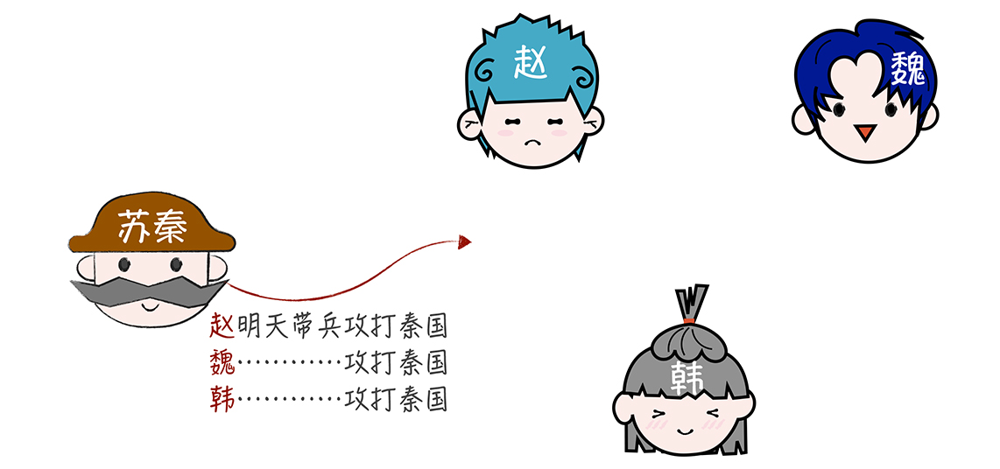
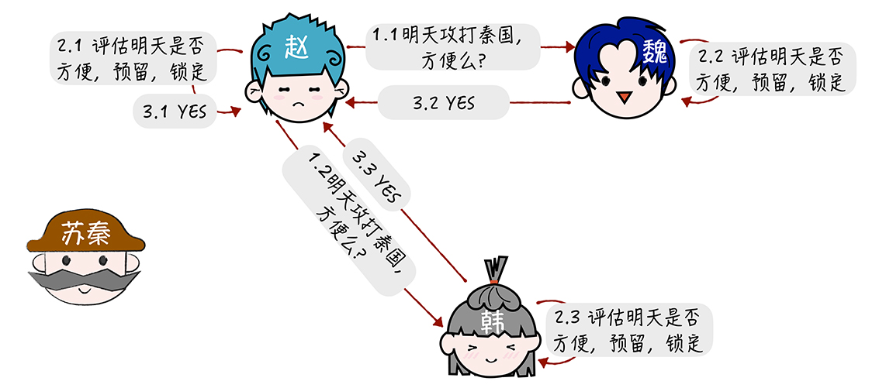
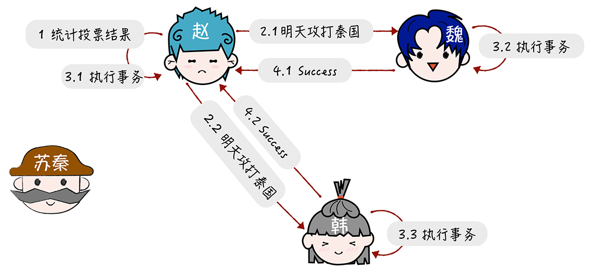
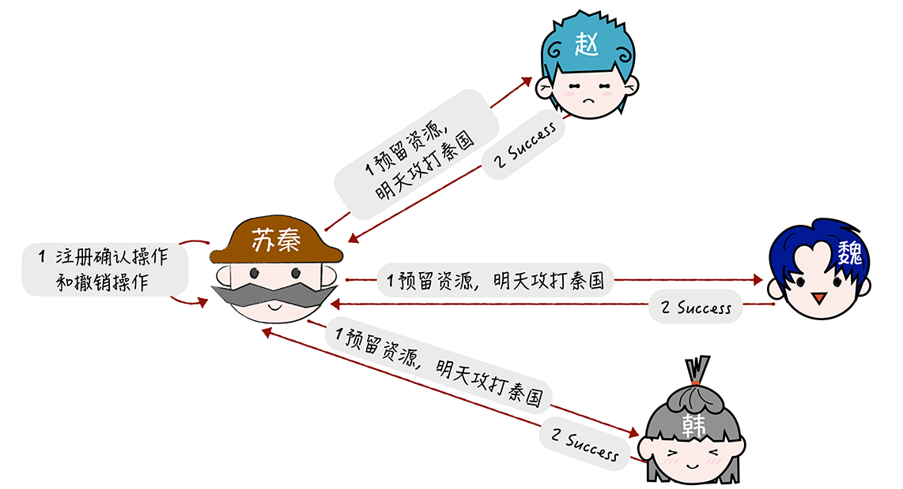
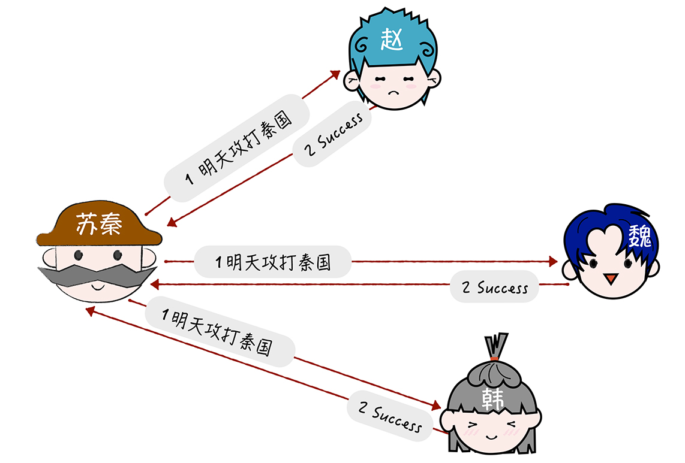
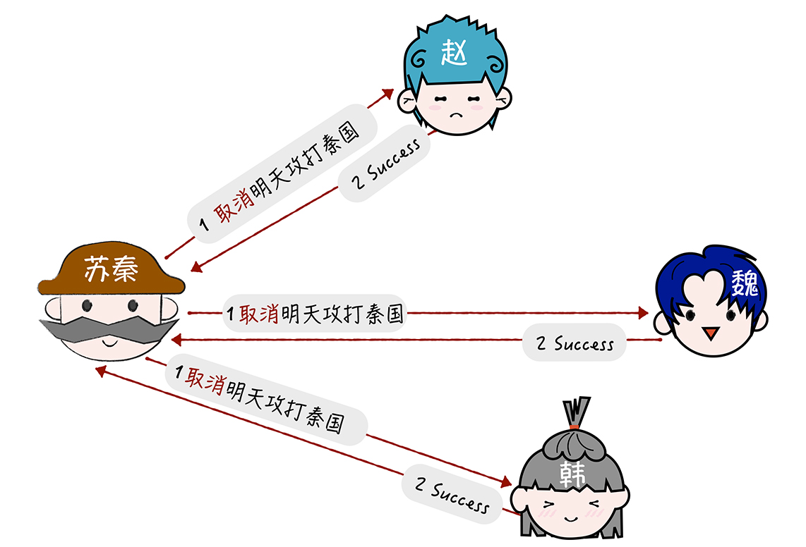

## 二阶段提交协议

首先，苏秦发消息给赵，赵接收到消息后就扮演协调者（Coordinator）的身份，由赵联系
魏和韩，发起二阶段提交：

赵发起二阶段提交后，先进入提交请求阶段（又称投票阶段）。 为了方便演示，我们先假
设赵、魏、韩明天都能去攻打秦国：

也就是说，第一步，赵分别向魏、韩发送消息：“明天攻打秦国，方便吗？”

第二步，赵、魏、韩，分别评估明天能否去攻打秦国，如果能，就预留时间并锁定，不再安
排其他军事活动。

第三步，赵得到全部的回复结果（包括他自己的评估结果），都是 YES。

赵收到所有回复后，进入提交执行阶段（又称完成阶段）， 也就是具体执行操作了，大致
步骤如下：

首先，赵按照“要么全部执行，要么放弃”的原则，统计投票结果，因为所有的回复结果都
是 YES，所以赵决定执行分布式事务，明天攻打秦国。

然后，赵通知魏、韩：“明天攻打秦国。”

接到通知之后，魏、韩执行事务，明天攻打秦国。

最后，魏、韩将执行事务的结果返回给赵。

这样一来，赵就将事务执行的结果（也就是赵、魏、韩明天一起攻打秦国），返回给苏秦，
那么，这时苏秦就解决了问题，协调好了明天的作战计划。

你可以将“赵明天攻打秦国、魏明天攻打秦国、韩明天攻打秦国”，理解成一个分布式
事务操作；
将赵、魏、韩理解为分布式系统的三个节点，其中，赵是协调者（Coordinator），将苏
秦理解为业务，也就是客户端；
将消息理解为网络消息；
将“明天能否攻打秦国，预留时间”，理解为评估事务中需要操作的对象和对象状态，
是否准备好，能否提交新操作。

需要注意的是，在第一个阶段，每个参与者投票表决事务是放弃还是提交。一旦参与者投票
要求提交事务，那么就不允许放弃事务。也就是说，在一个参与者投票要求提交事务之前，
它必须保证能够执行提交协议中它自己那一部分，即使参与者出现故障或者中途被替换掉。
这个特性，是我们需要在代码实现时保障的。

## TCC（Try-Confirm-Cancel）

首先，我们先进入到预留阶段，大致的步骤如下：

第一步，苏秦分别发送消息通知赵、魏、韩，让他们预留明天的时间和相关资源。然后苏秦
实现确认操作（明天攻打秦国），和撤销操作（取消明天攻打秦国）。
第二步，苏秦收到赵、魏、韩的预留答复，都是 OK。
如果预留阶段的执行都没有问题，就进入确认阶段，大致步骤如下：

第一步，苏秦执行确认操作，通知赵、魏、韩明天攻打秦国。
第二步，收到确认操作的响应，完成分布式事务。
如果预留阶段执行出错，比如赵的一部分军队还在赶来的路上，无法出兵，那么就进入撤销
阶段，大致步骤如下：

第一步，苏秦执行撤销操作，通知赵、魏、韩取消明天攻打秦国的计划。
第二步，收到撤销操作的响应。
你看，在经过了预留和确认（或撤销）2 阶段的协商，苏秦实现这个分布式事务：赵、魏、
韩三国，要么明天一起进攻，要么明天都按兵不动。

其实在我看来，TCC 本质上是补偿事务，它的核心思想是针对每个操作都要注册一个与其
对应的确认操作和补偿操作（也就是撤销操作）。 它是一个业务层面的协议，你也可以将
TCC 理解为编程模型，TCC 的 3 个操作是需要在业务代码中编码实现的，为了实现一致
性，确认操作和补偿操作必须是等幂的，因为这 2 个操作可能会失败重试。

另外，TCC 不依赖于数据库的事务，而是在业务中实现了分布式事务，这样能减轻数据库
的压力，但对业务代码的入侵性也更强，实现的复杂度也更高。所以，我推荐在需要分布式
事务能力时，优先考虑现成的事务型数据库（比如 MySQL XA），当现有的事务型数据库
不能满足业务的需求时，再考虑基于 TCC 实现分布式事务。