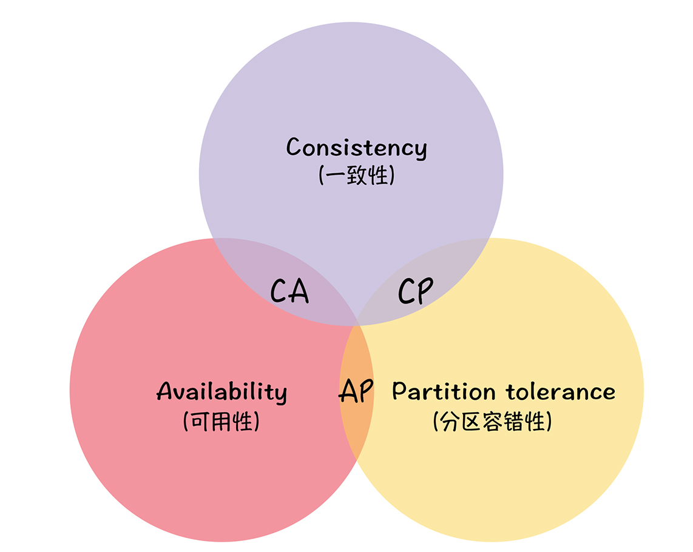

## CAP 三指标

1. 一致性（Consistency）
2. 可用性（Availability）
3. 分区容错性（Partition Tolerance）

一致性说的是客户端的每次读操作，不管访问哪个节点，要么读到的都是同一份最新的数
据，要么读取失败。

你可以把一致性看作是分布式系统对访问本系统的客户端的一种承诺：不管你访问哪个节
点，要么我给你返回的都是绝对一致的数据，要么你都读取失败。你可以看到，一致性强调
的不是数据完整，而是各节点间的数据一致。

可用性说的是任何来自客户端的请求，不管访问哪个节点，都能得到响应数据，但不保证是
同一份最新数据。你也可以把可用性看作是分布式系统对访问本系统的客户端的另外一种承
诺：我尽力给你返回数据，不会不响应你，但是我不保证每个节点给你的数据都是最新的。
这个指标强调的是服务可用，但不保证数据的一致。

我还是用一个例子，帮助你理解一下。比如，用户可以选择向节点 1 或节点 2 发起读操
作，如果不管节点间的数据是否一致，只要节点服务器收到请求，就响应 X 的值，那么，2
个节点的服务是满足可用性的。

最后的分区容错性说的是，当节点间出现任意数量的消息丢失或高延迟的时候，系统仍然可
以继续提供服务。也就是说，分布式系统在告诉访问本系统的客户端：不管我的内部出现什
么样的数据同步问题，我会一直运行，提供服务。这个指标，强调的是集群对分区故障的容
错能力。

## CAP 不可能三角

CAP 不可能三角说的是对于一个分布式系统而言，一致性（Consistency）、可用性
（Availability）、分区容错性（Partition Tolerance）3 个指标不可兼得，只能在 3 个指
标中选择 2 个。

## 如何使用 CAP 理论

我们都知道，只要有网络交互就一定会有延迟和数据丢失，而这种状况我们必须接受，还必
须保证系统不能挂掉。所以就像我上面提到的，节点间的分区故障是必然发生的。也就是
说，分区容错性（P）是前提，是必须要保证的。

现在就只剩下一致性（C）和可用性（A）可以选择了：要么选择一致性，保证数据绝对一
致；要么选择可用性，保证服务可用。那么 CP 和 AP 的含义是什么呢？

当选择了一致性（C）的时候，如果因为消息丢失、延迟过高发生了网络分区，部分节点
无法保证特定信息是最新的，那么这个时候，当集群节点接收到来自客户端的写请求
时，因为无法保证所有节点都是最新信息，所以系统将返回写失败错误，也就是说集群
拒绝新数据写入。

当选择了可用性（A）的时候，系统将始终处理客户端的查询，返回特定信息，如果发生
了网络分区，一些节点将无法返回最新的特定信息，它们将返回自己当前的相对新的信
息。

这里我想强调一点，大部分人对 CAP 理论有个误解，认为无论在什么情况下，分布式系统
都只能在 C 和 A 中选择 1 个。 其实，在不存在网络分区的情况下，也就是分布式系统正
常运行时（这也是系统在绝大部分时候所处的状态），就是说在不需要 P 时，C 和 A 能够
同时保证。只有当发生分区故障的时候，也就是说需要 P 时，才会在 C 和 A 之间做出选
择。而且如果各节点数据不一致，影响到了系统运行或业务运行（也就是说会有负面的影
响），推荐选择 C，否则选 A。