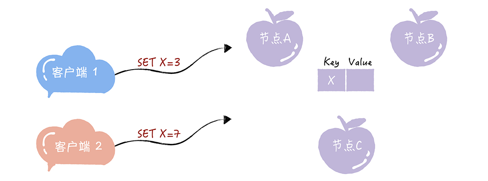
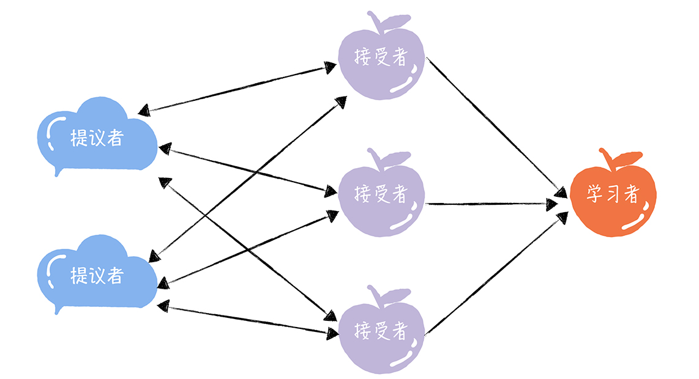
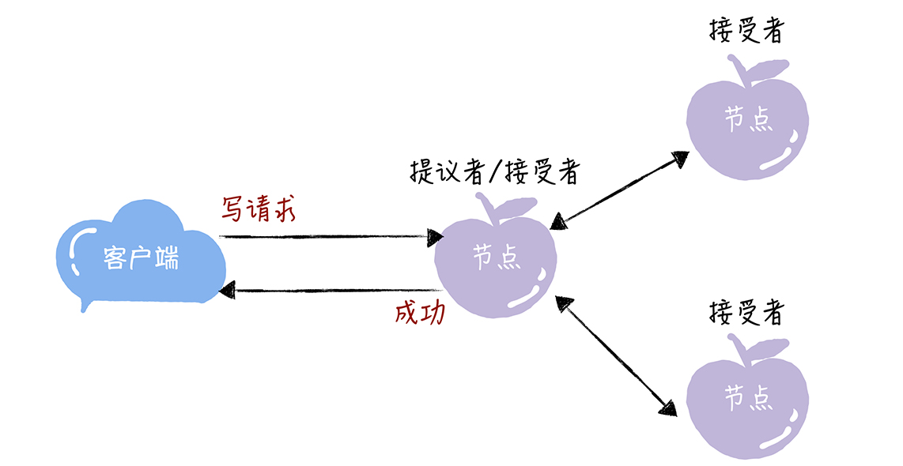
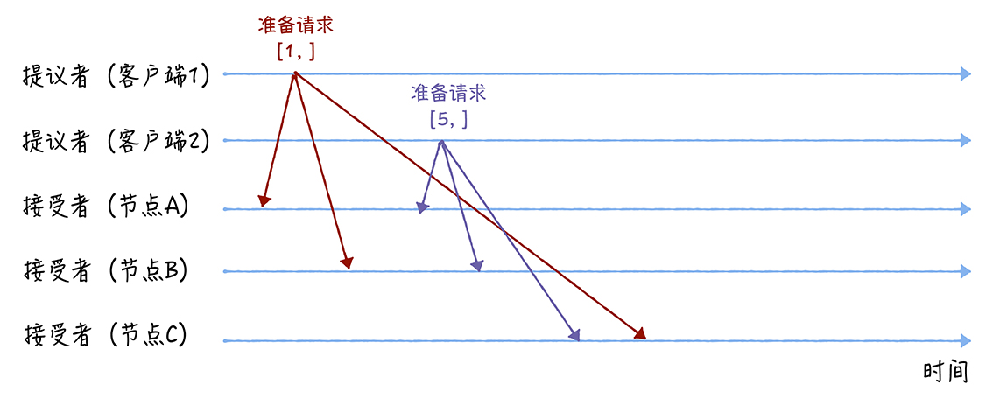
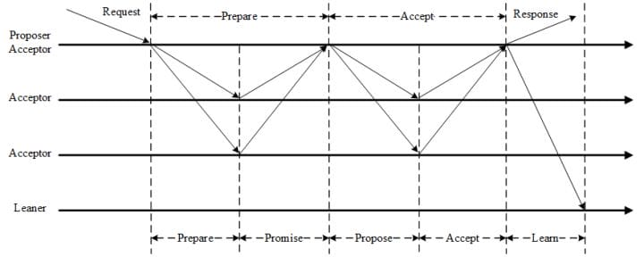

## 来看一道思考题。
假设我们要实现一个分布式集群，这个集群是由节点 A、B、C 组成，提供只读 KV 存储服
务。你应该知道，创建只读变量的时候，必须要对它进行赋值，而且这个值后续没办法修
改。因此一个节点创建只读变量后就不能再修改它了，所以所有节点必须要先对只读变量的
值达成共识，然后所有节点再一起创建这个只读变量。

那么，当有多个客户端（比如客户端 1、2）访问这个系统，试图创建同一个只读变量（比
如 X），客户端 1 试图创建值为 3 的 X，客户端 2 试图创建值为 7 的 X，这样要如何达成
共识，实现各节点上 X 值的一致呢？带着这个问题，我们进入今天的学习。

在一些经典的算法中，你会看到一些既形象又独有的概念（比如二阶段提交协议中的协调
者），Basic Paxos 算法也不例外。为了帮助人们更好地理解 Basic Paxos 算法，兰伯特在
讲解时，也使用了一些独有而且比较重要的概念，提案、准备（Prepare）请求、接受
（Accept）请求、角色等等，其中最重要的就是“角色”。因为角色是对 Basic Paxos 中
最核心的三个功能的抽象，比如，由接受者（Acceptor）对提议的值进行投票，并存储接
受的值。

## 在 Basic Paxos 中，有提议者（Proposer）、接受者（Acceptor）、学习者（Learner）三种角色，他们之间的关系如下：

提议者（Proposer）：提议一个值，用于投票表决。为了方便演示，你可以把图 1 中的
客户端 1 和 2 看作是提议者。但在绝大多数场景中，集群中收到客户端请求的节点，才
是提议者（图 1 这个架构，是为了方便演示算法原理）。这样做的好处是，对业务代码
没有入侵性，也就是说，我们不需要在业务代码中实现算法逻辑，就可以像使用数据库
一样访问后端的数据。

接受者（Acceptor）：对每个提议的值进行投票，并存储接受的值，比如 A、B、C 三
个节点。 一般来说，集群中的所有节点都在扮演接受者的角色，参与共识协商，并接受
和存储数据。

讲到这儿，你可能会有疑惑：前面不是说接收客户端请求的节点是提议者吗？这里怎么又是
接受者呢？这是因为一个节点（或进程）可以身兼多个角色。想象一下，一个 3 节点的集
群，1 个节点收到了请求，那么该节点将作为提议者发起二阶段提交，然后这个节点和另外
2 个节点一起作为接受者进行共识协商，就像下图的样子：

学习者（Learner）：被告知投票的结果，接受达成共识的值，存储保存，不参与投票的
过程。一般来说，学习者是数据备份节点，比如“Master-Slave”模型中的 Slave，被
动地接受数据，容灾备份

其实，这三种角色，在本质上代表的是三种功能：
提议者代表的是接入和协调功能，收到客户端请求后，发起二阶段提交，进行共识协
商；
接受者代表投票协商和存储数据，对提议的值进行投票，并接受达成共识的值，存储保
存；
学习者代表存储数据，不参与共识协商，只接受达成共识的值，存储保存。
因为一个完整的算法过程是由这三种角色对应的功能组成的，所以理解这三种角色，是你理
解 Basic Paxos 如何就提议的值达成共识的基础。那么接下来，咱们看看如何使用 Basic
Paxos 达成共识，解决开篇提到的那道思考题。

## 如何达成共识

想象这样一个场景，现在疫情这么严重，每个村的路都封得差不多了，就你的村委会不作
为，迟迟没有什么防疫的措施。你决定给村委会提交个提案，提一些防疫的建议，除了建议
之外，为了和其他村民的提案做区分，你的提案还得包含一个提案编号，来起到唯一标识的
作用。
与你的做法类似，在 Basic Paxos 中，兰伯特也使用提案代表一个提议。不过在提案中，
除了提案编号，还包含了提议值。为了方便演示，我使用[n, v]表示一个提案，其中 n 为提
案编号，v 为提议值。

## 准备（Prepare）阶段
先来看第一个阶段，首先客户端 1、2 作为提议者，分别向所有接受者发送包含提案编号的
准备请求：

你要注意，在准备请求中是不需要指定提议的值的，只需要携带提案编号就可以了，这是很
多同学容易产生误解的地方。

## 三阶段

第一阶段: Prepare阶段Proposer向Acceptors发出Prepare请求，Acceptors针对收到的Prepare请求进行Promise承诺。Prepare: Proposer生成全局唯一且递增的Proposal ID (可使用时间戳加Server ID)，向所有Acceptors发送Prepare请求，这里无需携带提案内容，只携带Proposal ID即可。Promise: Acceptors收到Prepare请求后，做出“两个承诺，一个应答”。承诺1: 不再接受Proposal ID小于等于(注意: 这里是<= )当前请求的Prepare请求;承诺2: 不再接受Proposal ID小于(注意: 这里是< )当前请求的Propose请求;应答: 不违背以前作出的承诺下，回复已经Accept过的提案中Proposal ID最大的那个提案的Value和Proposal ID，没有则返回空值。
