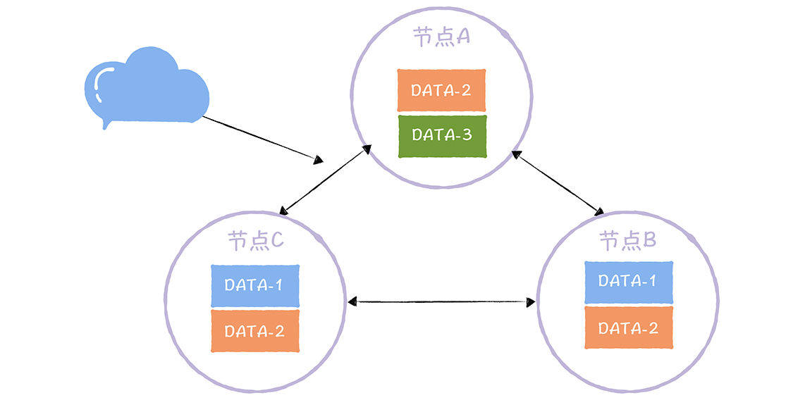

## Quorum NWR 的三要素

N 表示副本数，又叫做复制因子（Replication Factor）。也就是说，N 表示集群中同一份
数据有多少个副本，就像下图的样子：

## W，又称写一致性级别（Write Consistency Level），表示成功完成 W 个副本更新，才完成写操作：

## R，又称读一致性级别（Read Consistency Level），表示读取一个数据对象时需要读 R个副本。你可以这么理解，读取指定数据时，要读 R 副本，然后返回 R 个副本中最新的那份数据：

除此之外，关于 NWR 需要你注意的是，N、W、R 值的不同组合，会产生不同的一致性效
果，具体来说，有这么两种效果：
当 W + R > N 的时候，对于客户端来讲，整个系统能保证强一致性，一定能返回更新后
的那份数据。
当 W + R < N 的时候，对于客户端来讲，整个系统只能保证最终一致性，可能会返回旧
数据。

下面就N、W、R参数在不同组合条件下，如何实现强一致性、最终一致性进行介绍：

当 「W + R > N」 时，根据「鸽巢原理」可知，在进行读操作时R个副本返回的结果中一定包含最新的数据。然后再利用时间戳、版本号等手段即可确定出最新的数据。换言之在满足该条件的参数组合下，可以实现数据的强一致性
当 「W + R <= N」 时，无法实现强一致性，其只能保障最终一致性。即系统可能会获取旧数据
事实上当W=N、R=1时，即所谓的WARO(Write All Read One)。就是CAP理论中CP模型的场景。综上所述从实际应用角度出发，Quorum NWR算法有效解决了AP模型下不同业务场景对自定义一致性级别的需求

当 N 大于节点数时，就会出现一个节点存在多个副本的情况，这个节点故障时，多个副本会受到影响。
W + R > N 时，代表强一致性。
W = N 时，读性能好。R = N，写性能好。
W = R = (N+1)/2，容错能力好，能容忍 少数节点（也就是(N-1)/2） 个节点故障。
如何设置 N、W、R 值，取决于我们的系统该往哪方面优化。
Quorum NWR 分布式算法给业务提供了按需选择一致性级别的灵活度，弥补了 AP 型系统缺乏强一致性的缺点。