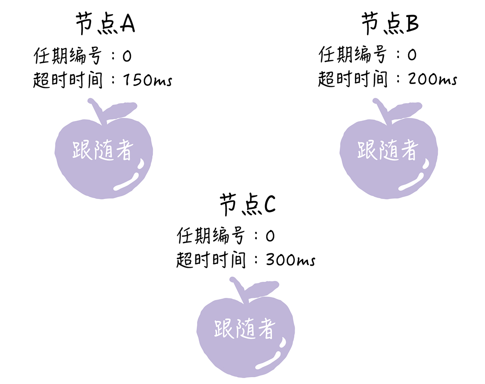
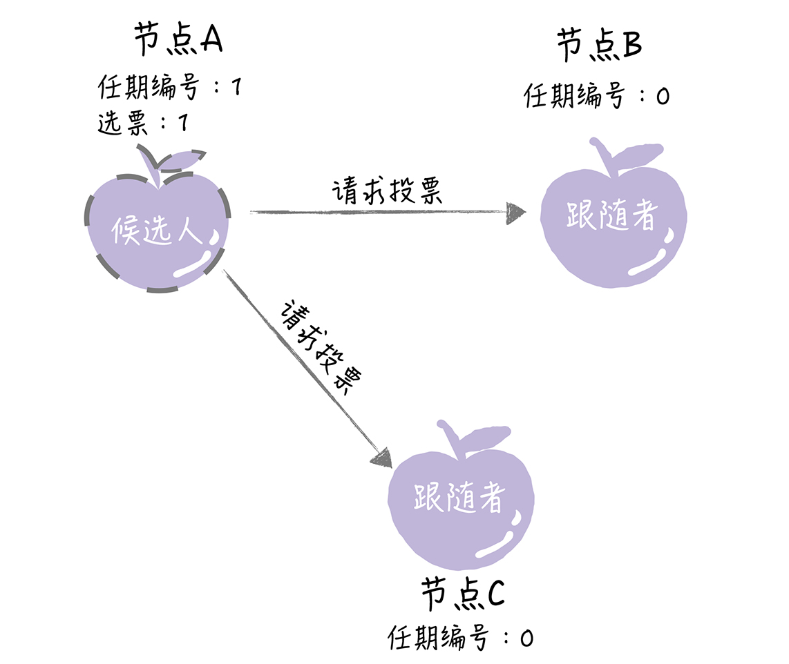
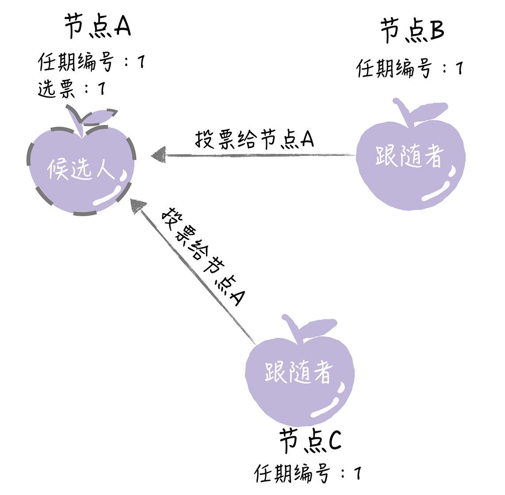
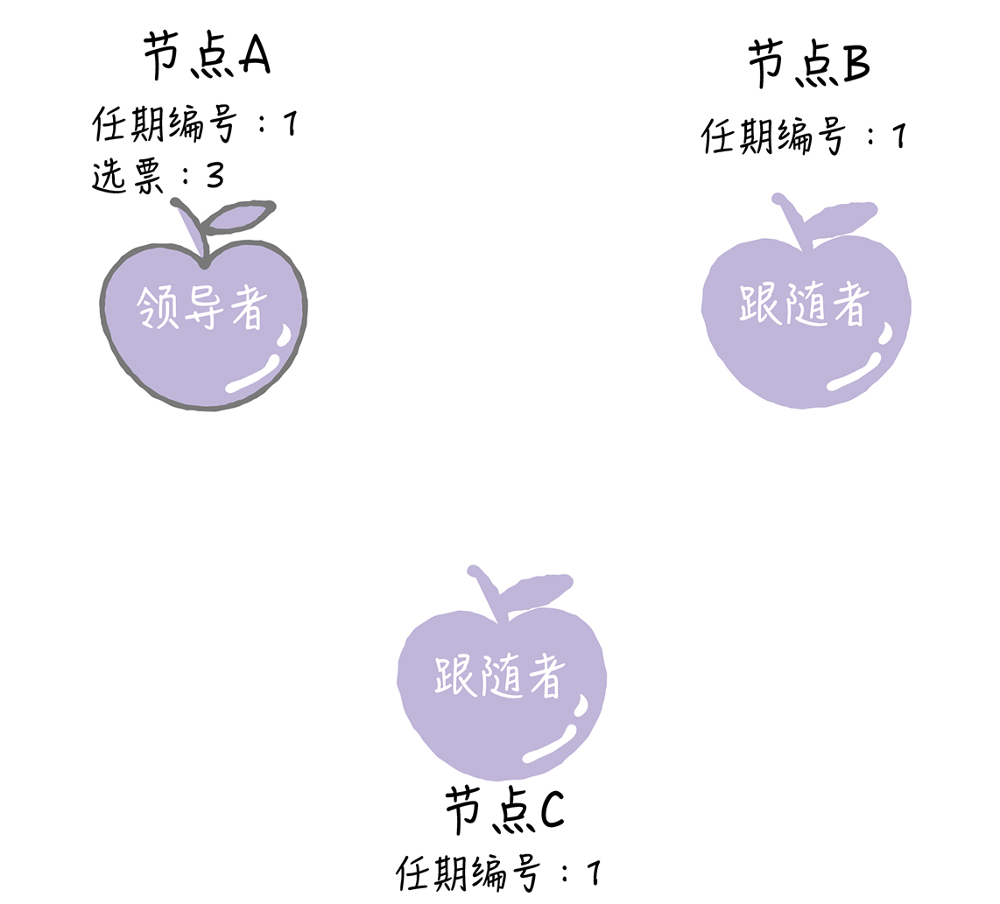
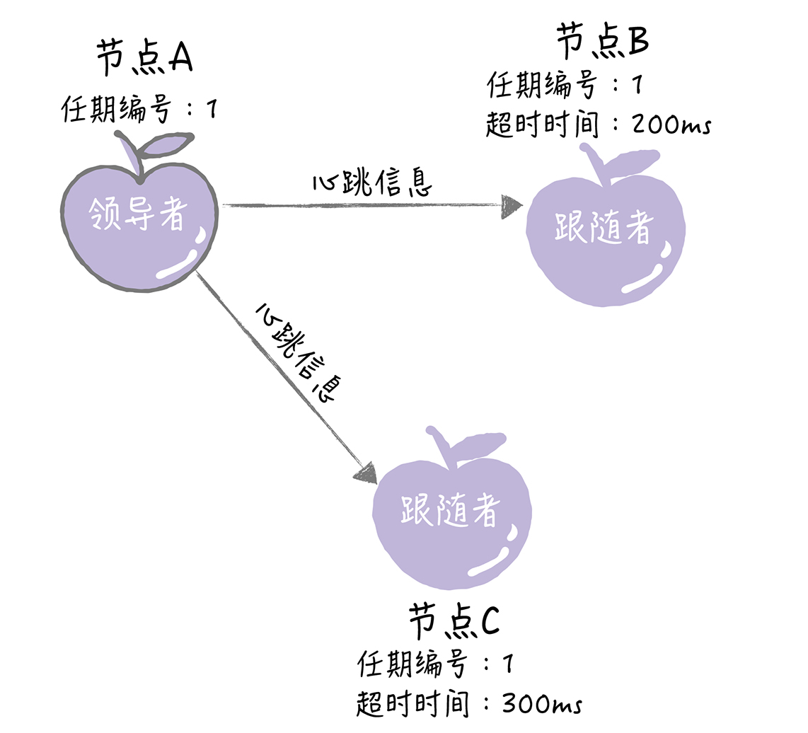
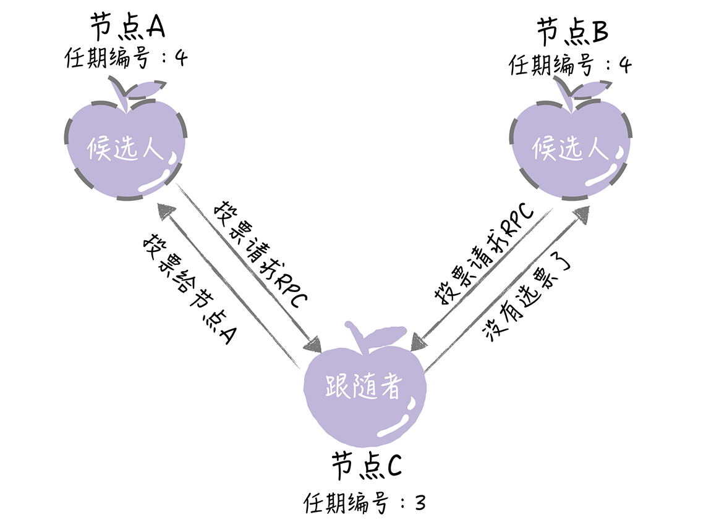
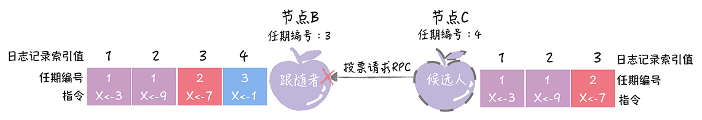

## Raft 算法支持领导者（Leader）、跟随者（Follower）和候选人（Candidate） 3 种状态

跟随者：就相当于普通群众，默默地接收和处理来自领导者的消息，当等待领导者心跳
信息超时的时候，就主动站出来，推荐自己当候选人。
候选人：候选人将向其他节点发送请求投票（RequestVote）RPC 消息，通知其他节点
来投票，如果赢得了大多数选票，就晋升当领导者。
领导者：蛮不讲理的霸道总裁，一切以我为准，平常的主要工作内容就是 3 部分，处理
写请求、管理日志复制和不断地发送心跳信息，通知其他节点“我是领导者，我还活
着，你们现在不要发起新的选举，找个新领导者来替代我。”

需要你注意的是，Raft 算法是强领导者模型，集群中只能有一个“霸道总裁”。

首先，在初始状态下，集群中所有的节点都是跟随者的状态。

Raft 算法实现了随机超时时间的特性。也就是说，每个节点等待领导者节点心跳信息的超
时时间间隔是随机的。通过上面的图片你可以看到，集群中没有领导者，而节点 A 的等待
超时时间最小（150ms），它会最先因为没有等到领导者的心跳信息，发生超时。

这个时候，节点 A 就增加自己的任期编号，并推举自己为候选人，先给自己投上一张选
票，然后向其他节点发送请求投票 RPC 消息，请它们选举自己为领导者。

如果其他节点接收到候选人 A 的请求投票 RPC 消息，在编号为 1 的这届任期内，也还没有
进行过投票，那么它将把选票投给节点 A，并增加自己的任期编号。

如果候选人在选举超时时间内赢得了大多数的选票，那么它就会成为本届任期内新的领导
者。

节点 A 当选领导者后，他将周期性地发送心跳消息，通知其他服务器我是领导者，阻止跟
随者发起新的选举，篡权。

讲到这儿，你是不是发现领导者选举很容易理解？与现实中的议会选举也蛮类似？当然，你
可能还是对一些细节产生一些疑问：
节点间是如何通讯的呢？
什么是任期呢？
选举有哪些规则？
随机超时时间又是什么？

## 选举过程四连问

## 节点间如何通讯？

在 Raft 算法中，服务器节点间的沟通联络采用的是远程过程调用（RPC），在领导者选举
中，需要用到这样两类的 RPC：
1. 请求投票（RequestVote）RPC，是由候选人在选举期间发起，通知各节点进行投票；
2. 日志复制（AppendEntries）RPC，是由领导者发起，用来复制日志和提供心跳消息。
   我想强调的是，日志复制 RPC 只能由领导者发起，这是实现强领导者模型的关键之一，希
   望你能注意这一点，后续能更好地理解日志复制，理解日志的一致是怎么实现的。

## 什么是任期？

我们知道，议会选举中的领导者是有任期的，领导者任命到期后，要重新开会再次选举。
Raft 算法中的领导者也是有任期的，每个任期由单调递增的数字（任期编号）标识，比如
节点 A 的任期编号是 1。任期编号是随着选举的举行而变化的，这是在说下面几点。
1. 跟随者在等待领导者心跳信息超时后，推举自己为候选人时，会增加自己的任期号，比
   如节点 A 的当前任期编号为 0，那么在推举自己为候选人时，会将自己的任期编号增加
   为 1。
2. 如果一个服务器节点，发现自己的任期编号比其他节点小，那么它会更新自己的编号到
   较大的编号值。比如节点 B 的任期编号是 0，当收到来自节点 A 的请求投票 RPC 消息
   时，因为消息中包含了节点 A 的任期编号，且编号为 1，那么节点 B 将把自己的任期编
   号更新为 1。

   我想强调的是，与现实议会选举中的领导者的任期不同，Raft 算法中的任期不只是时间
   段，而且任期编号的大小，会影响领导者选举和请求的处理。

1. 在 Raft 算法中约定，如果一个候选人或者领导者，发现自己的任期编号比其他节点小，
   那么它会立即恢复成跟随者状态。比如分区错误恢复后，任期编号为 3 的领导者节点
   B，收到来自新领导者的，包含任期编号为 4 的心跳消息，那么节点 B 将立即恢复成跟
   随者状态。
2. 还约定如果一个节点接收到一个包含较小的任期编号值的请求，那么它会直接拒绝这个
   请求。比如节点 C 的任期编号为 4，收到包含任期编号为 3 的请求投票 RPC 消息，那
   么它将拒绝这个消息。
   在这里，你可以看到，Raft 算法中的任期比议会选举中的任期要复杂。同样，在 Raft 算法
   中，选举规则的内容也会比较多。

## 选举有哪些规则

在议会选举中，比成员的身份、领导者的任期还要重要的就是选举的规则，比如一人一票、
弹劾制度等。“无规矩不成方圆”，在 Raft 算法中，也约定了选举规则，主要有这样几
点。

1. 领导者周期性地向所有跟随者发送心跳消息（即不包含日志项的日志复制 RPC 消息），
   通知大家我是领导者，阻止跟随者发起新的选举。
2. 如果在指定时间内，跟随者没有接收到来自领导者的消息，那么它就认为当前没有领导
   者，推举自己为候选人，发起领导者选举。
3. 在一次选举中，赢得大多数选票的候选人，将晋升为领导者。
4. 在一个任期内，领导者一直都会是领导者，直到它自身出现问题（比如宕机），或者因
   为网络延迟，其他节点发起一轮新的选举。
5. 在一次选举中，每一个服务器节点最多会对一个任期编号投出一张选票，并且按照“先
   来先服务”的原则进行投票。比如节点 C 的任期编号为 3，先收到了 1 个包含任期编号
   为 4 的投票请求（来自节点 A），然后又收到了 1 个包含任期编号为 4 的投票请求（来
   自节点 B）。那么节点 C 将会把唯一一张选票投给节点 A，当再收到节点 B 的投票请求
   RPC 消息时，对于编号为 4 的任期，已没有选票可投了。

1. 当任期编号相同时，日志完整性高的跟随者（也就是最后一条日志项对应的任期编号值
   更大，索引号更大），拒绝投票给日志完整性低的候选人。比如节点 B、C 的任期编号
   都是 3，节点 B 的最后一条日志项对应的任期编号为 3，而节点 C 为 2，那么当节点 C
   请求节点 B 投票给自己时，节点 B 将拒绝投票

我想强调的是，选举是跟随者发起的，推举自己为候选人；大多数选票是指集群成员半数以
上的选票；大多数选票规则的目标，是为了保证在一个给定的任期内最多只有一个领导者。
其实在选举中，除了选举规则外，我们还需要避免一些会导致选举失败的情况，比如同一任
期内，多个候选人同时发起选举，导致选票被瓜分，选举失败。那么在 Raft 算法中，如何
避免这个问题呢？答案就是随机超时时间。

## 如何理解随机超时时间

在议会选举中，常出现未达到指定票数，选举无效，需要重新选举的情况。在 Raft 算法的
选举中，也存在类似的问题，那它是如何处理选举无效的问题呢？
其实，Raft 算法巧妙地使用随机选举超时时间的方法，把超时时间都分散开来，在大多数
情况下只有一个服务器节点先发起选举，而不是同时发起选举，这样就能减少因选票瓜分导
致选举失败的情况。
我想强调的是，在 Raft 算法中，随机超时时间是有 2 种含义的，这里是很多同学容易理解
出错的地方，需要你注意一下：
1. 跟随者等待领导者心跳信息超时的时间间隔，是随机的；
2. 当没有候选人赢得过半票数，选举无效了，这时需要等待一个随机时间间隔，也就是
   说，等待选举超时的时间间隔，是随机的。
## 

如果要用一句话概括 Raft 算法，我觉得是这样的：从本质上说，Raft 算法是通过一切以
领导者为准的方式，实现一系列值的共识和各节点日志的一致。

## 1.raft和pbft的最大容错节点数

首先我们先来思考一个问题，为什么 pbft 算法的最大容错节点数量是（n-1）/3，而 raft 算法的最大容错节点数量是（n-1）/2 ？

对于raft算法，raft算法的的容错只支持容错故障节点，不支持容错作恶节点。什么是故障节点呢？就是节点因为系统繁忙、宕机或者网络问题等其它异常情况导致的无响应，出现这种情况的节点就是故障节点。那什么是作恶节点呢？作恶节点除了可以故意对集群的其它节点的请求无响应之外，还可以故意发送错误的数据，或者给不同的其它节点发送不同的数据，使整个集群的节点最终无法达成共识，这种节点就是作恶节点。

raft 算法只支持容错故障节点，假设集群总节点数为n，故障节点为 f ，根据小数服从多数的原则，集群里正常节点只需要比 f 个节点再多一个节点，即 f+1 个节点，正确节点的数量就会比故障节点数量多，那么集群就能达成共识。因此 raft 算法支持的最大容错节点数量是（n-1）/2。

对于 pbft 算法，因为 pbft 算法的除了需要支持容错故障节点之外，还需要支持容错作恶节点。假设集群节点数为 N，有问题的节点为 f。有问题的节点中，可以既是故障节点，也可以是作恶节点，或者只是故障节点或者只是作恶节点。那么会产生以下两种极端情况：

第一种情况，f 个有问题节点既是故障节点，又是作恶节点，那么根据小数服从多数的原则，集群里正常节点只需要比f个节点再多一个节点，即 f+1 个节点，确节点的数量就会比故障节点数量多，那么集群就能达成共识。也就是说这种情况支持的最大容错节点数量是 （n-1）/2。
第二种情况，故障节点和作恶节点都是不同的节点。那么就会有 f 个问题节点和 f 个故障节点，当发现节点是问题节点后，会被集群排除在外，剩下 f 个故障节点，那么根据小数服从多数的原则，集群里正常节点只需要比f个节点再多一个节点，即 f+1 个节点，确节点的数量就会比故障节点数量多，那么集群就能达成共识。所以，所有类型的节点数量加起来就是 f+1 个正确节点，f个故障节点和f个问题节点，即 3f+1=n。
