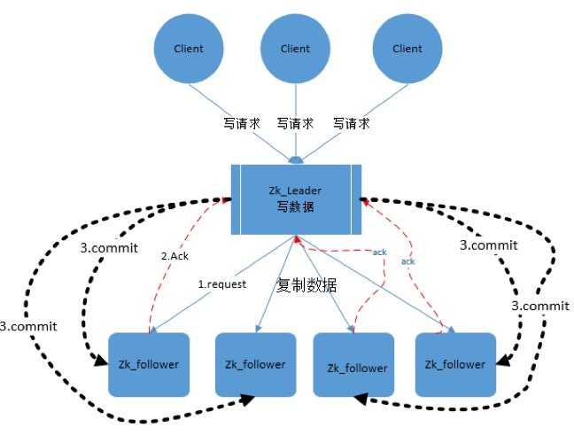

## 深入ZAB算法
    ZAB算法分为两大块内容，消息广播和崩溃恢复。

消息广播（boardcast）：Zab 协议中，所有的写请求都由 leader 来处理。正常工作状态下，leader 接收请求并通过广播协议来处理。

崩溃恢复（recovery）：当服务初次启动，或者 leader 节点挂了，系统就会进入恢复模式，直到选出了有合法数量 follower 的新 leader，然后新 leader 负责将整个系统同步到最新状态。


## ZAB消息广播过程

Leader：Zookeeper集群的核心角色，在集群启动或崩溃恢复中通过Follower参与选举产生，为客户端提供读写服务，并对事务请求进行处理。
Follower：Zookeeper集群的核心角色，在集群启动或崩溃恢复中参加选举，没有被选上就是这个角色，为客户端提供读取服务，也就是处理非事务请求，Follower不能处理事务请求，对于收到的事务请求会转发给Leader。
Observer：观察者角色，不参加选举，为客户端提供读取服务，处理非事务请求**，对于收到的事务请求会转发给Leader。使用Observer的目的是为了扩展系统，提高读取性能。


Leader 接收到消息请求后，将消息赋予一个全局唯一的 64 位自增 id，叫做：zxid，通过 zxid 的大小比较即可实现因果有序这一特性。
Leader 通过先进先出队列（通过 TCP 协议来实现，以此实现了全局有序这一特性）将带有 zxid 的消息作为一个提案（proposal）分发给所有 follower。
当 follower 接收到 proposal，先将 proposal 写到硬盘，写硬盘成功后再向 leader 回一个 ACK。
当 leader 接收到合法数量的 ACKs 后，leader 就向所有 follower 发送 COMMIT 命令，同时会在本地执行该消息。
当 follower 收到消息的 COMMIT 命令时，就会执行该消息。




相比于完整的二阶段提交，Zab 协议最大的区别就是不能终止事务，follower 要么回 ACK 给 leader，要么抛弃 leader，在某一时刻，leader 的状态与 follower 的状态很可能不一致，因此它不能处理 leader 挂掉的情况，所以 Zab 协议引入了恢复模式来处理这一问题。

从另一角度看，正因为 Zab 的广播过程不需要终止事务，也就是说不需要所有 follower 都返回 ACK 才能进行 COMMIT，而是只需要合法数量（2n+1 台服务器中的 n+1 台） 的follower，也提升了整体的性能。

Leader 服务器与每一个 Follower 服务器之间都维护了一个单独的 FIFO 消息队列进行收发消息，使用队列消息可以做到异步解耦。 Leader 和 Follower 之间只需要往队列中发消息即可。如果使用同步的方式会引起阻塞，性能要下降很多。


## 崩溃恢复

崩溃恢复的主要任务就是选举Leader（Leader Election），Leader选举分两个场景：

Zookeeper服务器启动时Leader选举。
Zookeeper集群运行过程中Leader崩溃后的Leader选举。


选举参数
在介绍选举流程之前，需要介绍几个参数，

myid: 服务器ID，这个是在安装Zookeeper时配置的，myid越大，该服务器在选举中被选为Leader的优先级会越大。ZAB算法中通过myid来规避了多个节点可能有相同zxid问题，注意可以对比之前的Raft算法，Raft算法中通过随机的timeout来规避多个节点可能同时成为Leader的问题。

zxid: 事务ID，这个是由Zookeeper集群中的Leader节点进行Proposal时生成的全局唯一的事务ID，由于只有Leader才能进行Proposal，所以这个zxid很容易做到全局唯一且自增。因为Follower没有生成zxid的权限。zxid越大，表示当前节点上提交成功了最新的事务，这也是为什么在崩溃恢复的时候，需要优先考虑zxid的原因。

epoch: 投票轮次，每完成一次Leader选举的投票，当前Leader节点的epoch会增加一次。在没有Leader时，本轮此的epoch会保持不变。


另外在选举的过程中，每个节点的当前状态会在以下几种状态之中进行转变。

```mysql
LOOKING: 竞选状态。
FOLLOWING: 随从状态，同步Leader 状态，参与Leader选举的投票过程。
OBSERVING: 观察状态，同步Leader 状态，不参与Leader选举的投票过程。
LEADING: 领导者状态。


```

选举的流程如下：

每个Server会发出一个投票,第一次都是投自己。投票信息：（myid，ZXID）
收集来自各个服务器的投票
处理投票并重新投票，处理逻辑：优先比较ZXID,然后比较myid
统计投票，只要超过半数的机器接收到同样的投票信息，就可以确定leader
改变服务器状态，进入正常的消息广播流程。


## ZAB算法需要解决的两大问题


1. 已经被处理的消息不能丢
   这一情况会出现在以下场景：当 leader 收到合法数量 follower 的 ACKs 后，就向各个 follower 广播 COMMIT 命令，同时也会在本地执行 COMMIT 并向连接的客户端返回「成功」。但是如果在各个 follower 在收到 COMMIT 命令前 leader 就挂了，导致剩下的服务器并没有执行都这条消息。


为了实现已经被处理的消息不能丢这个目的，Zab 的恢复模式使用了以下的策略：

选举拥有 proposal 最大值（即 zxid 最大） 的节点作为新的 leader：由于所有提案被 COMMIT 之前必须有合法数量的 follower ACK，即必须有合法数量的服务器的事务日志上有该提案的 proposal，因此，只要有合法数量的节点正常工作，就必然有一个节点保存了所有被 COMMIT 的 proposal。 而在选举Leader的过程中，会比较zxid，因此选举出来的Leader必然会包含所有被COMMIT的proposal。
新的 leader 将自己事务日志中 proposal 但未 COMMIT 的消息处理。
新的 leader 与 follower 建立先进先出的队列， 先将自身有而 follower 没有的 proposal 发送给 follower，再将这些 proposal 的 COMMIT 命令发送给 follower，以保证所有的 follower 都保存了所有的 proposal、所有的 follower 都处理了所有的消息。


. 被丢弃的消息不能再次出现
这一情况会出现在以下场景：当 leader 接收到消息请求生成 proposal 后就挂了，其他 follower 并没有收到此 proposal，因此经过恢复模式重新选了 leader 后，这条消息是被跳过的。 此时，之前挂了的 leader 重新启动并注册成了 follower，他保留了被跳过消息的 proposal 状态，与整个系统的状态是不一致的，需要将其删除。

Zab 通过巧妙的设计 zxid 来实现这一目的。一个 zxid 是64位，高 32 是纪元（epoch）编号，每经过一次 leader 选举产生一个新的 leader，新 leader 会将 epoch 号 +1。低 32 位是消息计数器，每接收到一条消息这个值 +1，新 leader 选举后这个值重置为 0。这样设计的好处是旧的 leader 挂了后重启，它不会被选举为 leader，因为此时它的 zxid 肯定小于当前的新 leader。当旧的 leader 作为 follower 接入新的 leader 后，新的 leader 会让它将所有的拥有旧的 epoch 号的未被 COMMIT 的 proposal 清除。


Zab 协议设计的优秀之处有两点，一是简化二阶段提交，提升了在正常工作情况下的性能；二是巧妙地利用率自增序列，简化了异常恢复的逻辑，也很好地保证了顺序处理这一特性
 ## Leader选举概述

Leader选举是保证分布式数据一致性的关键所在。当Zookeeper集群中的一台服务器出现以下两种情况之一时，需要进入Leader选举。

(1) 服务器初始化启动。

(2) 服务器运行期间无法和Leader保持连接。


## 　1. 服务器启动时期的Leader选举

若进行Leader选举，则至少需要两台机器，这里选取3台机器组成的服务器集群为例。在集群初始化阶段，当有一台服务器Server1启动时，其单独无法进行和完成Leader选举，当第二台服务器Server2启动时，此时两台机器可以相互通信，每台机器都试图找到Leader，于是进入Leader选举过程。选举过程如下

(1) 每个Server发出一个投票。由于是初始情况，Server1和Server2都会将自己作为Leader服务器来进行投票，每次投票会包含所推举的服务器的myid和ZXID，使用(myid, ZXID)来表示，此时Server1的投票为(1, 0)，Server2的投票为(2, 0)，然后各自将这个投票发给集群中其他机器。

(2) 接受来自各个服务器的投票。集群的每个服务器收到投票后，首先判断该投票的有效性，如检查是否是本轮投票、是否来自LOOKING状态的服务器。

(3) 处理投票。针对每一个投票，服务器都需要将别人的投票和自己的投票进行PK，PK规则如下

・ 优先检查ZXID。ZXID比较大的服务器优先作为Leader。

・ 如果ZXID相同，那么就比较myid。myid较大的服务器作为Leader服务器。

对于Server1而言，它的投票是(1, 0)，接收Server2的投票为(2, 0)，首先会比较两者的ZXID，均为0，再比较myid，此时Server2的myid最大，于是更新自己的投票为(2, 0)，然后重新投票，对于Server2而言，其无须更新自己的投票，只是再次向集群中所有机器发出上一次投票信息即可。

(4) 统计投票。每次投票后，服务器都会统计投票信息，判断是否已经有过半机器接受到相同的投票信息，对于Server1、Server2而言，都统计出集群中已经有两台机器接受了(2, 0)的投票信息，此时便认为已经选出了Leader。

(5) 改变服务器状态。一旦确定了Leader，每个服务器就会更新自己的状态，如果是Follower，那么就变更为FOLLOWING，如果是Leader，就变更为LEADING。


2. 服务器运行时期的Leader选举

在Zookeeper运行期间，Leader与非Leader服务器各司其职，即便当有非Leader服务器宕机或新加入，此时也不会影响Leader，但是一旦Leader服务器挂了，那么整个集群将暂停对外服务，进入新一轮Leader选举，其过程和启动时期的Leader选举过程基本一致。假设正在运行的有Server1、Server2、Server3三台服务器，当前Leader是Server2，若某一时刻Leader挂了，此时便开始Leader选举。选举过程如下

(1) 变更状态。Leader挂后，余下的非Observer服务器都会讲自己的服务器状态变更为LOOKING，然后开始进入Leader选举过程。

(2) 每个Server会发出一个投票。在运行期间，每个服务器上的ZXID可能不同，此时假定Server1的ZXID为123，Server3的ZXID为122；在第一轮投票中，Server1和Server3都会投自己，产生投票(1, 123)，(3, 122)，然后各自将投票发送给集群中所有机器。

(3) 接收来自各个服务器的投票。与启动时过程相同。

(4) 处理投票。与启动时过程相同，此时，Server1将会成为Leader。

(5) 统计投票。与启动时过程相同。

(6) 改变服务器的状态。与启动时过程相同。