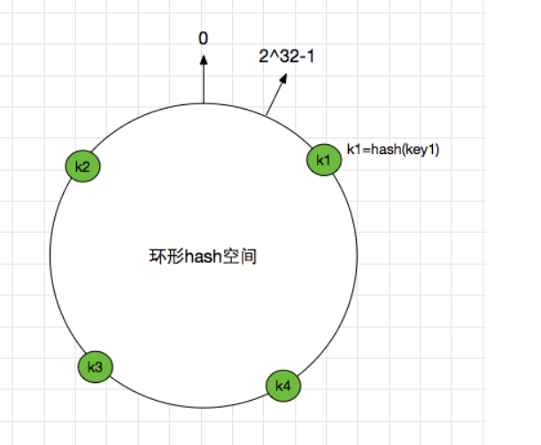
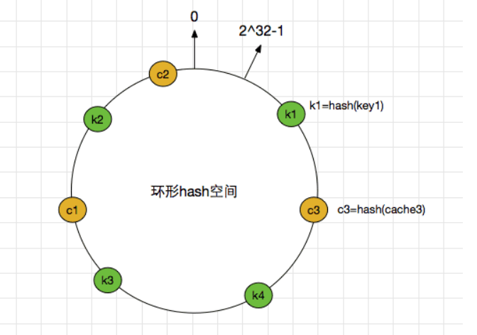
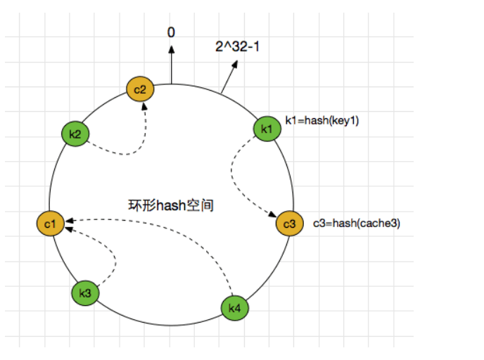
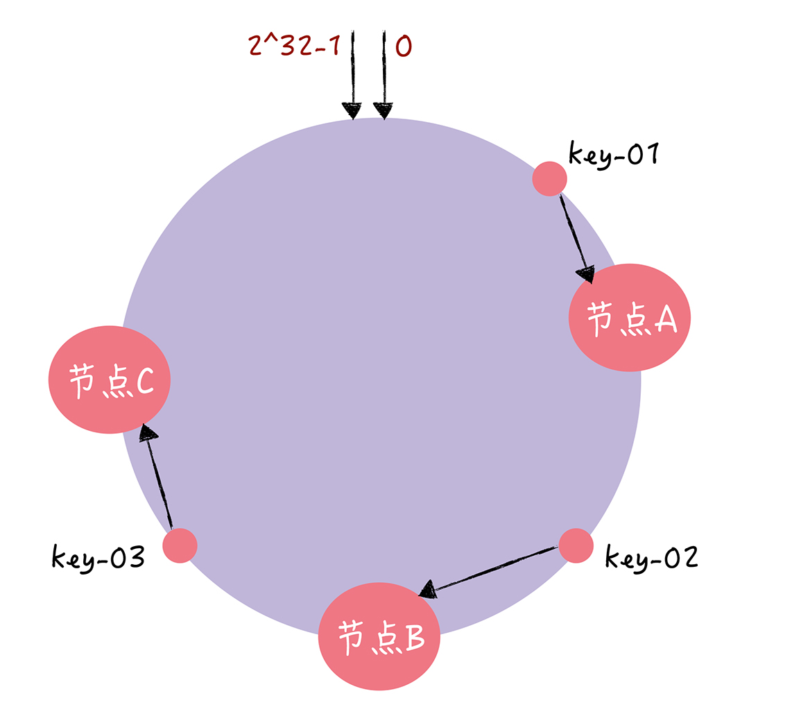
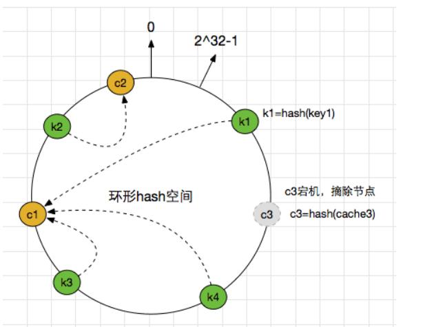
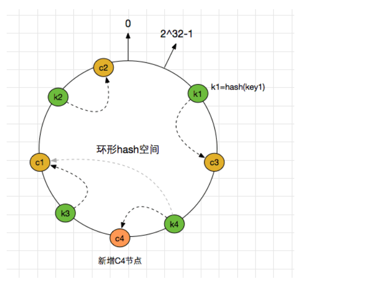
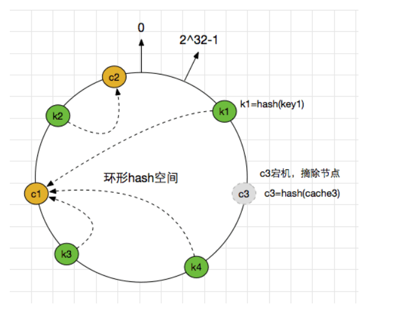
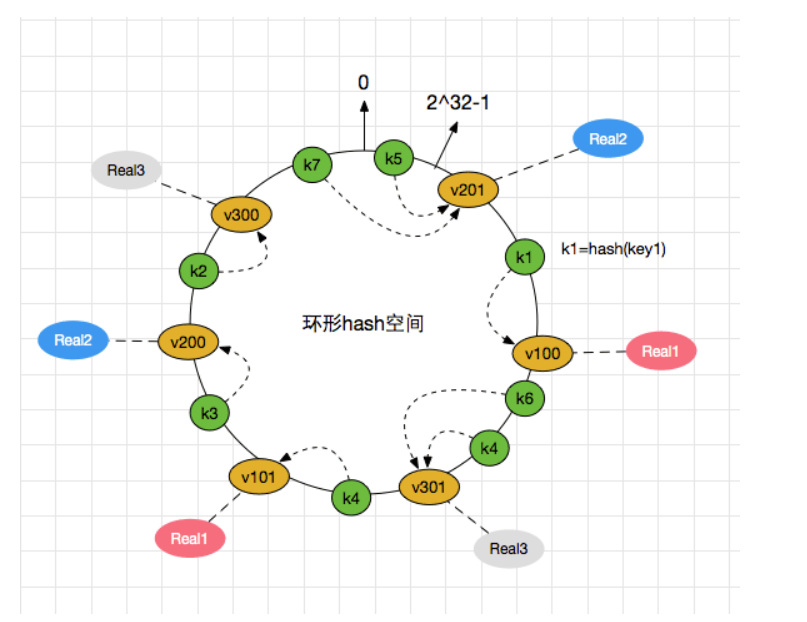

## 如何使用一致哈希实现哈希寻址？
一致哈希算法也用了取模运算，但与哈希算法不同的是，哈希算法是对节点的数量进行取模
运算，而一致哈希算法是对 2^32 进行取模运算。你可以想象下，一致哈希算法，将整个
哈希值空间组织成一个虚拟的圆环，也就是哈希环：

## 一致性Hash算法引入

在分布式集群中，对机器的添加删除，或者机器故障后自动脱离集群这些操作是分布式集群管理最基本的功能。如果采用常用的hash(object)%N算法，那么在有机器添加或者删除后，很多原有的数据就无法找到了，这样严重的违反了单调性原则。

## Hash环

使用常见的hash算法可以把一个key值哈希到一个具有2^32个桶的空间中。也可以理解成，将key值哈希到 [0, 2^32) 的一个数字空间中。 我们假设这个是个首尾连接的环形空间。如下图:

## 删除节点

## 增加节点

## 不平衡的问题

上面的简单的一致性hash的方案在某些情况下但依旧存在问题: 一个节点宕机之后，数据需要落到距离他最近的节点上，会导致下个节点的压力突然增大，可能导致雪崩，整个服务挂掉。

当节点C3摘除之后，之前再C3上的k1就要迁移到C1上，这时候带来了两部分的压力:之前请求到C3上的流量转嫁到了C1上,会导致C1的流量增加，如果之前C3上存在热点数据，则可能导致C1扛不住压力挂掉。之前存储到C3上的key值转义到了C1，会导致C1的内容占用量增加，可能存在瓶颈。当上面两个压力发生的时候，可能导致C1节点也宕机了。那么压力便会传递到C2上，又出现了类似滚雪球的情况，服务压力出现了雪崩，导致整个服务不可用。这一点违背了最开始提到的四个原则中的 平衡性， 节点宕机之后，流量及内存的分配方式打破了原有的平衡

## 虚拟节点

