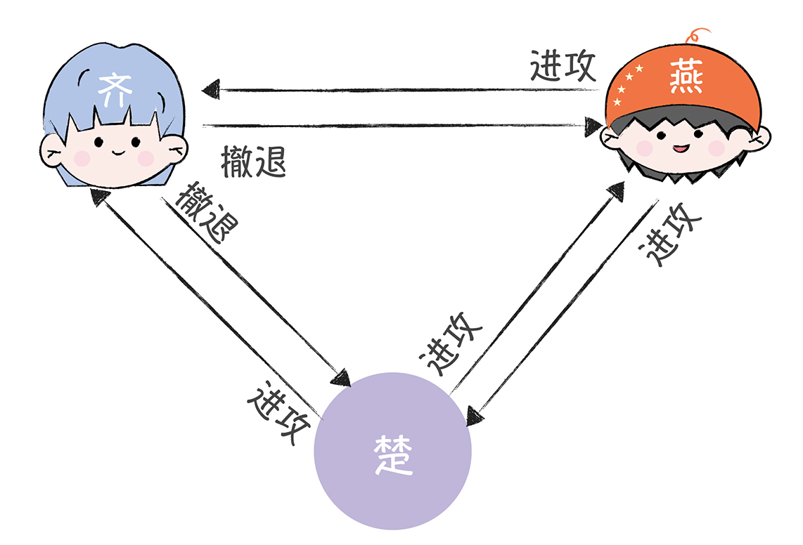
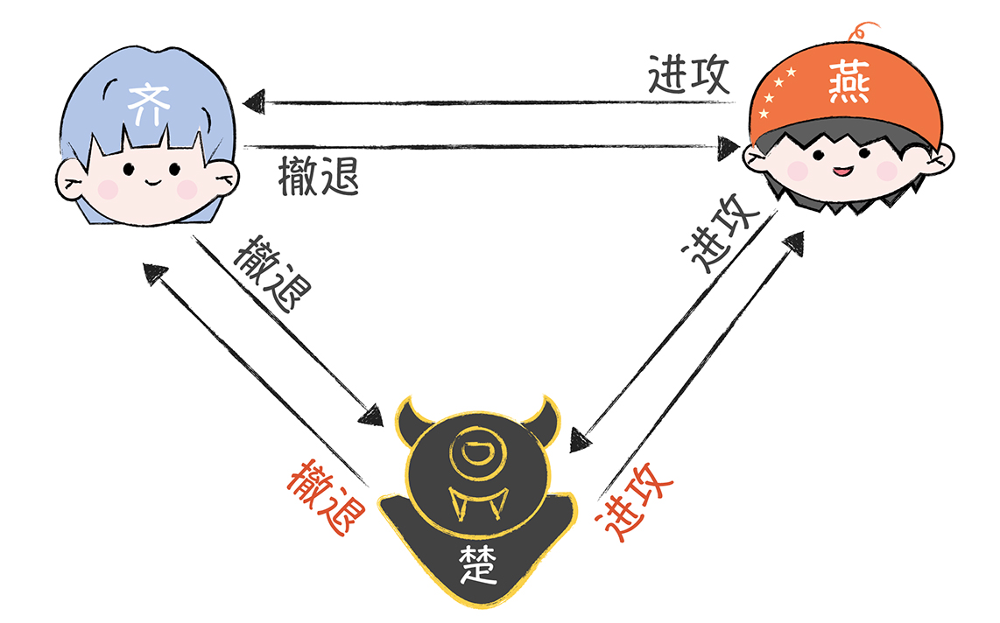

## 苏秦的困境

战国时期，齐、楚、燕、韩、赵、魏、秦七雄并立，后来秦国的势力不断强大起来，成了东
方六国的共同威胁。于是，这六个国家决定联合，全力抗秦，免得被秦国各个击破。一天，
苏秦作为合纵长，挂六国相印，带着六国的军队叩关函谷，驻军在了秦国边境，为围攻秦国
作准备。但是，因为各国军队分别驻扎在秦国边境的不同地方，所以军队之间只能通过信使
互相联系，这时，苏秦面临了一个很严峻的问题：如何统一大家的作战计划？

万一一些诸侯国在暗通秦国，发送误导性的作战信息，怎么办？如果信使被敌人截杀，甚至
被敌人间谍替换，又该怎么办？这些都会导致自己的作战计划被扰乱，然后出现有的诸侯国
在进攻，有的诸侯国在撤退的情况，而这时，秦国一定会趁机出兵，把他们逐一击破的。

## 所以，如何达成共识，制定统一的作战计划呢？苏秦他很愁。

这个故事，是拜占庭将军问题的一个简化表述，苏秦面临的就是典型的共识难题，也就是如
何在可能有误导信息的情况下，采用合适的通讯机制，让多个将军达成共识，制定一致性的
作战计划？
你可以先停下来想想，这个问题难在哪儿？我们又是否有办法，帮助诸侯国们达成共识呢？

## 二忠一叛的难题

为了便于你理解和层层深入，我先假设只有 3 个国家要攻打秦国，这三个国家的三位将
军，咱们简单点儿，分别叫齐、楚、燕。同时，又因为秦国很强大，所以只有半数以上的将
军参与进攻，才能击败敌人（注意，这里是假设哈，你别较真），在这个期间，将军们彼此
之间需要通过信使传递消息，然后协商一致之后，才能在同一时间点发动进攻。
举个例子，有一天，这三位将军各自一脸严肃地讨论明天是进攻还是撤退，并让信使传递信
息，按照“少数服从多数”的原则投票表决，两个人意见一致就可以了，比如：

1. 齐根据侦查情况决定撤退；

2. 楚和燕根据侦查信息，决定进攻。

那么按照原则，齐也会进攻。最终，3 支军队同时进攻，大败秦军。

可是，问题来了： 一旦有人在暗通秦国，就会出现作战计划不一致的情况。比如齐向楚、
燕分别发送了“撤退”的消息，燕向齐和楚发送了“进攻”的消息。撤退：进攻 =1:1，无
论楚投进攻还是撤退，都会成为 2:1，这个时候还是会形成一个一致性的作战方案。

但是，楚这个叛徒在暗中配合秦国，让信使向齐发送了“撤退”，向燕发送了“进攻”，那
么：
燕看到的是，撤退：进攻 =1:2；
齐看到的是，撤退：进攻 =2:1。

按照“少数服从多数”的原则，就会出现燕单独进攻秦军，当然，最后肯定是因为寡不敌
众，被秦军给灭了    

## 苏秦该怎么办？

### 解决办法一：口信消息型拜占庭问题之解

如果叛将人数为 m，将军人数不能少于 3m + 1 ，那么拜占庭
将军问题就能解决了。
