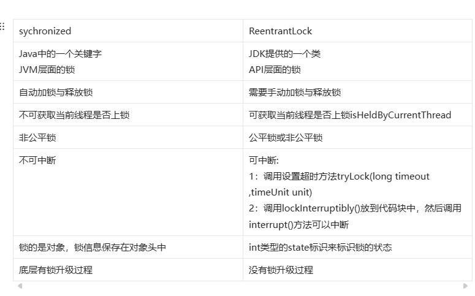

### **1. 基本概念**

#### **(1) `synchronized`**

- 是 Java 的关键字，用于修饰方法或代码块。
- 基于 JVM 内置的锁机制实现。
- 使用简单，无需显式释放锁。

#### **(2) `ReentrantLock`**

- 是 `java.util.concurrent.locks` 包中的一个类。
- 基于 API 实现，提供了更灵活的锁控制。
- 需要显式地获取和释放锁。

------

### **2. 不同点对比**

| **特性**           | **synchronized**                           | **ReentrantLock**                    |
| :----------------- | :----------------------------------------- | :----------------------------------- |
| **实现方式**       | JVM 内置实现                               | 基于 API 实现                        |
| **锁的获取与释放** | 自动获取和释放锁                           | 需要显式调用 `lock()` 和 `unlock()`  |
| **可中断性**       | 不支持中断                                 | 支持中断（`lockInterruptibly()`）    |
| **公平锁**         | 不支持公平锁                               | 支持公平锁和非公平锁（默认非公平锁） |
| **条件变量**       | 只能通过 `wait()`、`notify()` 实现条件等待 | 支持多个条件变量（`Condition`）      |
| **锁的尝试获取**   | 不支持                                     | 支持尝试获取锁（`tryLock()`）        |
| **锁的可重入性**   | 支持                                       | 支持                                 |
| **性能**           | 在低竞争情况下性能较好                     | 在高竞争情况下性能较好               |
| **代码复杂度**     | 简单                                       | 较复杂                               |

------

### **3. 详细说明**

#### **(1) 锁的获取与释放**

- **`synchronized`**：
    - 锁的获取和释放由 JVM 自动管理。
    - 进入同步代码块时自动获取锁，退出时自动释放锁。
- **`ReentrantLock`**：
    - 需要显式调用 `lock()` 获取锁，调用 `unlock()` 释放锁。
    - 必须在 `finally` 块中释放锁，以避免死锁。

#### **(2) 可中断性**

- **`synchronized`**：
    - 不支持中断，线程在等待锁时会一直阻塞。
- **`ReentrantLock`**：
    - 支持中断，可以通过 `lockInterruptibly()` 方法获取锁，线程在等待锁时可以被中断。

#### **(3) 公平锁**

- **`synchronized`**：
    - 不支持公平锁，锁的获取是非公平的。
- **`ReentrantLock`**：
    - 支持公平锁和非公平锁（默认是非公平锁）。
    - 公平锁按照线程请求锁的顺序分配锁，避免线程饥饿。

#### **(4) 条件变量**

- **`synchronized`**：
    - 只能通过 `wait()`、`notify()` 实现条件等待，功能有限。
- **`ReentrantLock`**：
    - 支持多个条件变量（`Condition`），可以更灵活地控制线程的等待和唤醒。

#### **(5) 锁的尝试获取**

- **`synchronized`**：
    - 不支持尝试获取锁。
- **`ReentrantLock`**：
    - 支持尝试获取锁（`tryLock()`），可以设置超时时间。

#### **(6) 性能**

- **`synchronized`**：
    - 在低竞争情况下性能较好，因为 JVM 对其进行了优化。
- **`ReentrantLock`**：
    - 在高竞争情况下性能较好，因为提供了更灵活的锁控制。

------

### **4. 示例**

#### **(1) `synchronized`**

java

复制

```
public class SynchronizedExample {
    private int count = 0;

    public synchronized void increment() {
        count++;
    }
}
```

#### **(2) `ReentrantLock`**

java

复制

```
import java.util.concurrent.locks.Lock;
import java.util.concurrent.locks.ReentrantLock;

public class ReentrantLockExample {
    private int count = 0;
    private Lock lock = new ReentrantLock();

    public void increment() {
        lock.lock();
        try {
            count++;
        } finally {
            lock.unlock();
        }
    }
}
```

------

### **5. 总结**

| **特性**           | **synchronized**                           | **ReentrantLock**                    |
| :----------------- | :----------------------------------------- | :----------------------------------- |
| **实现方式**       | JVM 内置实现                               | 基于 API 实现                        |
| **锁的获取与释放** | 自动获取和释放锁                           | 需要显式调用 `lock()` 和 `unlock()`  |
| **可中断性**       | 不支持中断                                 | 支持中断（`lockInterruptibly()`）    |
| **公平锁**         | 不支持公平锁                               | 支持公平锁和非公平锁（默认非公平锁） |
| **条件变量**       | 只能通过 `wait()`、`notify()` 实现条件等待 | 支持多个条件变量（`Condition`）      |
| **锁的尝试获取**   | 不支持                                     | 支持尝试获取锁（`tryLock()`）        |
| **锁的可重入性**   | 支持                                       | 支持                                 |
| **性能**           | 在低竞争情况下性能较好                     | 在高竞争情况下性能较好               |
| **代码复杂度**     | 简单                                       | 较复杂                               |

- **`synchronized`**：适合简单的同步场景，使用方便，性能较好。
- **`ReentrantLock`**：适合复杂的同步场景，提供更灵活的锁控制，性能在高竞争情况下较好。



## synchronized可以锁字符串吗  

### 可以使用 `synchronized` 锁字符串


从语法和使用方式上来说，`synchronized` 关键字可以对字符串对象进行加锁操作。因为 `synchronized` 关键字可以锁定任何对象，而字符串在 Java 中是 `String` 类的实例，属于对象的范畴。

#### 示例代码


java


```java
public class SynchronizedStringExample {
    private static final String LOCK_STRING = "lock";

    public static void main(String[] args) {
        Thread thread1 = new Thread(() -> {
            synchronized (LOCK_STRING) {
                System.out.println("线程 1 获取到锁");
                try {
                    Thread.sleep(2000);
                } catch (InterruptedException e) {
                    e.printStackTrace();
                }
                System.out.println("线程 1 释放锁");
            }
        });

        Thread thread2 = new Thread(() -> {
            synchronized (LOCK_STRING) {
                System.out.println("线程 2 获取到锁");
                try {
                    Thread.sleep(2000);
                } catch (InterruptedException e) {
                    e.printStackTrace();
                }
                System.out.println("线程 2 释放锁");
            }
        });

        thread1.start();
        thread2.start();
    }
}
```


#### 代码解释


在上述代码中，定义了一个静态的字符串常量 `LOCK_STRING`，两个线程 `thread1` 和 `thread2` 都使用 `synchronized` 关键字对这个字符串对象进行加锁。当 `thread1` 进入同步块时，会获取到 `LOCK_STRING` 对象的锁，`thread2` 则需要等待 `thread1` 释放锁后才能进入同步块。

### 使用 `synchronized` 锁字符串存在的问题

#### 1. 字符串常量池的影响


Java 中的字符串常量池会缓存字符串对象，相同字面量的字符串会指向同一个对象。这可能会导致不同代码块中使用相同字面量的字符串加锁时，相互影响，产生意外的同步问题。

#### 示例代码


java


```java
public class StringPoolSyncProblem {
    public static void main(String[] args) {
        String lock1 = "hello";
        String lock2 = "hello";

        Thread thread1 = new Thread(() -> {
            synchronized (lock1) {
                System.out.println("线程 1 获取到锁");
                try {
                    Thread.sleep(2000);
                } catch (InterruptedException e) {
                    e.printStackTrace();
                }
                System.out.println("线程 1 释放锁");
            }
        });

        Thread thread2 = new Thread(() -> {
            synchronized (lock2) {
                System.out.println("线程 2 获取到锁");
                try {
                    Thread.sleep(2000);
                } catch (InterruptedException e) {
                    e.printStackTrace();
                }
                System.out.println("线程 2 释放锁");
            }
        });

        thread1.start();
        thread2.start();
    }
}
```

#### 代码解释


在这个例子中，`lock1` 和 `lock2` 虽然是两个不同的变量，但由于它们的字面量相同，它们实际上指向字符串常量池中的同一个对象。因此，`thread1` 和 `thread2` 会竞争同一个锁，即使它们可能是在不同的业务逻辑中使用。

#### 2. 不可控的锁竞争


由于字符串的使用非常广泛，很难保证在整个应用程序中不会有其他地方使用相同的字符串进行加锁。这可能会导致不可控的锁竞争，增加代码的复杂性和出错的风险。

### 建议


通常情况下，不建议使用字符串作为锁对象。如果需要进行同步操作，建议使用专门创建的对象作为锁，例如：


java


```java
private final Object lock = new Object();

public void someMethod() {
    synchronized (lock) {
        // 同步代码块
    }
}
```


这样可以避免因字符串常量池带来的问题，使锁的使用更加可控和安全。

## 为什么_wait_和_notify_方法要在同步块中调用

在 Java 中，`wait()`、`notify()` 和 `notifyAll()` 方法是 `Object` 类的方法，用于线程间的协作。这些方法要求必须在同步块（`synchronized` 块）中调用，主要是出于线程安全、锁的管理和状态一致性这几方面的考虑，以下是详细解释：

### 1. 线程安全和锁的管理


- **锁的获取与释放**：`wait()` 方法的作用是让当前线程释放对象的锁并进入等待状态，直到其他线程调用相同对象的 `notify()` 或 `notifyAll()` 方法来唤醒它。`notify()` 和 `notifyAll()` 方法则是用来唤醒在该对象上等待的线程。为了保证这些操作的线程安全性，Java 规定这些方法必须在同步块中调用，因为只有在同步块中，线程才能获取到对象的锁。
- **示例代码**


java


```java
class WaitNotifyExample {
    private final Object lock = new Object();

    public void threadA() {
        synchronized (lock) {
            try {
                System.out.println("线程 A 进入同步块，准备等待");
                // 调用 wait() 方法，释放锁并进入等待状态
                lock.wait(); 
                System.out.println("线程 A 被唤醒，继续执行");
            } catch (InterruptedException e) {
                e.printStackTrace();
            }
        }
    }

    public void threadB() {
        synchronized (lock) {
            System.out.println("线程 B 进入同步块，准备唤醒线程");
            // 调用 notify() 方法，唤醒在 lock 对象上等待的一个线程
            lock.notify(); 
            System.out.println("线程 B 唤醒线程后，继续执行");
        }
    }

    public static void main(String[] args) {
        WaitNotifyExample example = new WaitNotifyExample();
        Thread a = new Thread(example::threadA);
        Thread b = new Thread(example::threadB);
        a.start();
        try {
            // 让线程 A 先执行
            Thread.sleep(1000); 
        } catch (InterruptedException e) {
            e.printStackTrace();
        }
        b.start();
    }
}
```


- **代码解释**：在上述代码中，线程 A 进入同步块后调用 `wait()` 方法，此时它会释放 `lock` 对象的锁并进入等待状态。线程 B 随后进入同步块，调用 `notify()` 方法唤醒线程 A。如果 `wait()`、`notify()` 方法不在同步块中调用，线程就无法正确地获取和释放对象的锁，会导致线程安全问题。

### 2. 状态一致性


- **保证操作的原子性**：`wait()`、`notify()` 和 `notifyAll()` 方法通常与共享对象的状态变化相关联。在调用这些方法时，需要确保对共享对象状态的检查和修改是原子性的，避免出现竞态条件。同步块可以保证在同一时刻只有一个线程能够访问和修改共享对象的状态，从而保证状态的一致性。
- **示例代码**


java


```java
class SharedResource {
    private boolean isReady = false;
    private final Object lock = new Object();

    public void waitForReady() {
        synchronized (lock) {
            while (!isReady) {
                try {
                    // 当状态不满足时，线程等待
                    lock.wait(); 
                } catch (InterruptedException e) {
                    e.printStackTrace();
                }
            }
            System.out.println("资源已准备好，可以使用");
        }
    }

    public void setReady() {
        synchronized (lock) {
            isReady = true;
            // 状态改变后，唤醒等待的线程
            lock.notifyAll(); 
        }
    }
}
```


- **代码解释**：在这个例子中，`waitForReady()` 方法会检查 `isReady` 状态，如果状态不满足则调用 `wait()` 方法等待。`setReady()` 方法会修改 `isReady` 状态并调用 `notifyAll()` 方法唤醒等待的线程。同步块确保了状态检查和状态修改操作的原子性，避免了一个线程在检查状态后、修改状态前，另一个线程对状态进行了修改的情况。

### 3. 避免非法状态异常


如果不在同步块中调用 `wait()`、`notify()` 或 `notifyAll()` 方法，Java 虚拟机（JVM）会抛出 `IllegalMonitorStateException` 异常。这是因为这些方法依赖于对象的监视器（锁），只有在获取到对象的监视器后才能调用这些方法。


综上所述，为了保证线程安全、锁的正确管理以及共享对象状态的一致性，`wait()`、`notify()` 和 `notifyAll()` 方法必须在同步块中调用。


## 什么情况线程会进入_WAITING_状态

线程进入WAITING状态有以下几种情况:
1. 调用Object.wait()方法，该方法会使得当前线程进入等待状态，等待其他线程调用同一个对象的notify()或
notifyAI0)方法唤醒该线程。
2. 调用Thread.join()方法，该方法会使得当前线程等待指定线程的结束，当指定线程结束时，当前线程将被唤
醒。
3. 调用LockSupport.park()方法，该方法会使得当前线程等待，直到获取LockSupport指定的许可或者线程被
中断、调度。
4. 在获取锁时，如果当前线程没有获取到锁，就会进入等待状态，等待其他线程释放锁。
5. 等待I/O操作:当线程在执行期间遇到了需要等待I/0操作完成的情况，它会进入WAITING状态，直到/O0操
作完成。


需要注意的是，当线程进入WAITING状态时，会释放所有的锁，并目不会占用CPU资源，如果线程长时间处于等
待状态，可能会造成CPU的空闲，因此需要注意避免出现不必要的等待。


## 什么是不可变对象，对写并发有什么帮助
不可变对象(lmmutable object)是一种一旦创建后其状态就不能被修改的对象。在ava中，不可变对象包括
String、基本类型的包装类(如Integer、Double等)等
不可变对象对写并发有如下帮助:
1. 线程安全:不可变对象是线程安全的，因为它们不会被其他线程修改。因此，多个线程可以同时使用不可变对
象，无需额外的同步措施。
2. 减少锁竞争:由于不可变对象的状态不能被修改，因此不需要使用锁来保护对它的访问。这减少了锁竞争的可 自
能性，从而提高了程序的性能。
3. 缓存优化:由于不可变对象一旦创建后其状态就不能被修改，因此可以将它们用作缓存项。这是因为缓存项的
值不会在缓存和使用之间发生改变，从而避免了因缓存项状态被修改而导致的缓存失效问题。


需要注意的是，虽然不可变对象有以上优点，但它们也有一些缺点。例如，创建新的不可变对象比创建可变对象需
要更多的内存，因为每次状态改变都需要创建新的对象。因此，在设计并发应用时，应根据具体需求和性能要求来
决定是否使用不可变对象

## 什么是伪共享问题以及如何解决

### 伪共享问题的定义


在计算机系统中，CPU 缓存以缓存行（Cache Line）为单位进行数据存储和传输，通常一个缓存行大小为 64 字节。伪共享（False Sharing）是指多个线程同时访问不同的变量，但这些变量恰好位于同一个缓存行中，当其中一个线程修改了该缓存行中的某个变量时，会导致整个缓存行失效，其他线程再访问该缓存行中的其他变量时，就需要重新从主内存中加载数据，从而影响了程序的性能。

### 示例场景说明


假设有两个变量 `a` 和 `b` 位于同一个缓存行中，线程 1 频繁修改变量 `a`，线程 2 频繁读取变量 `b`。当线程 1 修改 `a` 时，该缓存行的状态会变为无效，线程 2 再读取 `b` 时，由于缓存行失效，就需要从主内存重新加载包含 `b` 的缓存行，这就造成了不必要的性能开销。

### 代码示例体现伪共享问题


java


```java
public class FalseSharingExample {
    private static class Data {
        long value1;
        long value2;
    }

    private static final int THREAD_COUNT = 2;
    private static final int ITERATIONS = 10000000;

    public static void main(String[] args) throws InterruptedException {
        Data data = new Data();
        Thread[] threads = new Thread[THREAD_COUNT];

        threads[0] = new Thread(() -> {
            for (int i = 0; i < ITERATIONS; i++) {
                data.value1++;
            }
        });

        threads[1] = new Thread(() -> {
            for (int i = 0; i < ITERATIONS; i++) {
                data.value2++;
            }
        });

        long startTime = System.currentTimeMillis();
        for (Thread thread : threads) {
            thread.start();
        }
        for (Thread thread : threads) {
            thread.join();
        }
        long endTime = System.currentTimeMillis();
        System.out.println("执行时间: " + (endTime - startTime) + " 毫秒");
    }
}
```


在上述代码中，`value1` 和 `value2` 很可能位于同一个缓存行中，两个线程分别对它们进行操作，会产生伪共享问题，影响性能。

### 解决伪共享问题的方法

#### 1. 缓存行填充（Padding）


通过在变量之间插入足够多的填充数据，确保每个需要独立访问的变量位于不同的缓存行中。


java


```java
public class PaddingSolution {
    private static class Data {
        // 填充数据，确保 value1 单独占用一个缓存行
        long p1, p2, p3, p4, p5, p6, p7;
        long value1;
        // 填充数据，确保 value2 单独占用一个缓存行
        long q1, q2, q3, q4, q5, q6, q7;
        long value2;
    }

    private static final int THREAD_COUNT = 2;
    private static final int ITERATIONS = 10000000;

    public static void main(String[] args) throws InterruptedException {
        Data data = new Data();
        Thread[] threads = new Thread[THREAD_COUNT];

        threads[0] = new Thread(() -> {
            for (int i = 0; i < ITERATIONS; i++) {
                data.value1++;
            }
        });

        threads[1] = new Thread(() -> {
            for (int i = 0; i < ITERATIONS; i++) {
                data.value2++;
            }
        });

        long startTime = System.currentTimeMillis();
        for (Thread thread : threads) {
            thread.start();
        }
        for (Thread thread : threads) {
            thread.join();
        }
        long endTime = System.currentTimeMillis();
        System.out.println("执行时间: " + (endTime - startTime) + " 毫秒");
    }
}
```


在这个改进后的代码中，通过插入多个 `long` 类型的填充变量，使得 `value1` 和 `value2` 分别位于不同的缓存行中，避免了伪共享问题。

#### 2. 使用 `@Contended` 注解（Java 8 及以上）


Java 8 引入了 `@Contended` 注解，用于自动进行缓存行填充。使用该注解需要开启 JVM 参数 `-XX:-RestrictContended`。


java


```java
import sun.misc.Contended;

public class ContendedSolution {
    @Contended
    private static class Data {
        long value1;
        long value2;
    }

    private static final int THREAD_COUNT = 2;
    private static final int ITERATIONS = 10000000;

    public static void main(String[] args) throws InterruptedException {
        Data data = new Data();
        Thread[] threads = new Thread[THREAD_COUNT];

        threads[0] = new Thread(() -> {
            for (int i = 0; i < ITERATIONS; i++) {
                data.value1++;
            }
        });

        threads[1] = new Thread(() -> {
            for (int i = 0; i < ITERATIONS; i++) {
                data.value2++;
            }
        });

        long startTime = System.currentTimeMillis();
        for (Thread thread : threads) {
            thread.start();
        }
        for (Thread thread : threads) {
            thread.join();
        }
        long endTime = System.currentTimeMillis();
        System.out.println("执行时间: " + (endTime - startTime) + " 毫秒");
    }
}
```


`@Contended` 注解会自动在变量周围添加填充数据，确保变量位于不同的缓存行中，从而避免伪共享。

#### 3. 数据结构设计优化


在设计数据结构时，可以将经常被不同线程访问的变量分开存储，避免它们位于同一个缓存行中。例如，将原本存储在一个数组中的不同线程访问的数据拆分成多个数组，每个数组单独存储一个线程访问的数据。


java


```java
public class DataStructureOptimization {
    private static final int THREAD_COUNT = 2;
    private static final int ITERATIONS = 10000000;

    public static void main(String[] args) throws InterruptedException {
        long[] array1 = new long[1];
        long[] array2 = new long[1];

        Thread[] threads = new Thread[THREAD_COUNT];

        threads[0] = new Thread(() -> {
            for (int i = 0; i < ITERATIONS; i++) {
                array1[0]++;
            }
        });

        threads[1] = new Thread(() -> {
            for (int i = 0; i < ITERATIONS; i++) {
                array2[0]++;
            }
        });

        long startTime = System.currentTimeMillis();
        for (Thread thread : threads) {
            thread.start();
        }
        for (Thread thread : threads) {
            thread.join();
        }
        long endTime = System.currentTimeMillis();
        System.out.println("执行时间: " + (endTime - startTime) + " 毫秒");
    }
}
```


在这个示例中，将原本可能位于同一个缓存行的两个变量分别存储在不同的数组中，减少了伪共享的可能性。


## 启动线程为何调用start而不是run方法

调用start方法会告诉jvm创建一个新的线程，并在这个新线程中执行与 run( 方法相关联的代码
块。这个过程允许多个线程同时运行，每个线程都拥有独立的执行上下文，这意味着它们可以在不互相干扰的情况
下执行任务。

与此不同，如果直接调用 run(方法，它仅仅是一个普通的方法调用，不会创建新的线程。相反，它会在当前线
程的上下文中执行 run()方法中的代码。这将导致代码的顺序执行，没有并行性可言，因为它们都在同一个线程内
执行。

这种区别非常重要，因为多线程编程的一个主要目标是实现并行性，从而提高程序的性能和响应能力。通过调用
start() 方法，可以利用多核处理器的优势，同时执行多个线程，以更有效地完成任务。而直接调用 run() 方法只
是按照一般的方法顺序执行代码，无法发挥多线程的潜力。因此，使用 start0) 方法来启动线程是实现并行性的关
键。

## ReentrantLock中tryLock()和lock()方法的区别
1. tryLock()表示尝试加锁，可能加到，也可能加不到，该方法不会阻塞线程，如果加到锁则返回true，没有加
到则返回false
2. lock0)表示阻塞加锁，线程会阻塞直到加到锁，方法也没有返回值

