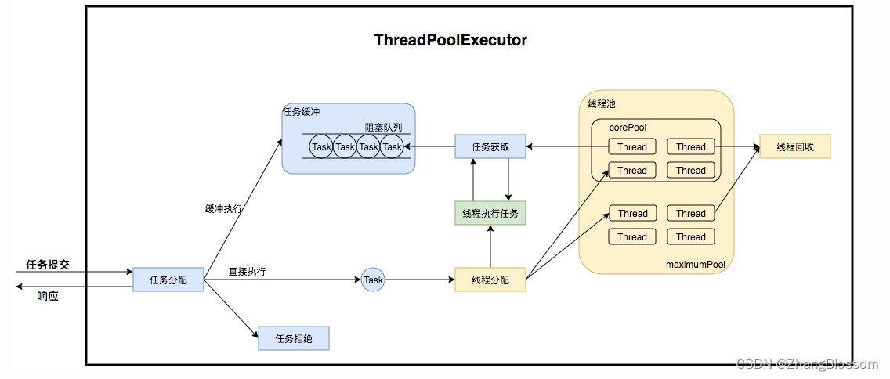

## 线程池有哪几种状态

### 线程池的状态


在 Java 中，`ThreadPoolExecutor` 类是线程池的核心实现类，线程池有 5 种状态，这些状态定义在 `ThreadPoolExecutor` 类中，由一个 `AtomicInteger` 类型的变量来维护，该变量的高 3 位用于表示线程池的状态，低 29 位用于表示线程池中的线程数量。以下是这 5 种状态：


1. RUNNING
    - **状态描述**：这是线程池的初始状态，线程池被创建后就处于该状态。在 `RUNNING` 状态下，线程池可以接收新的任务，并且会处理阻塞队列中的任务。
    - **状态值**：`-1 << COUNT_BITS`，即二进制表示为 `111` 后跟 29 个 0。
2. SHUTDOWN
    - **状态描述**：当调用线程池的 `shutdown()` 方法时，线程池会从 `RUNNING` 状态转变为 `SHUTDOWN` 状态。在该状态下，线程池不再接收新的任务，但会继续处理阻塞队列中已有的任务。
    - **状态值**：`0 << COUNT_BITS`，即二进制表示为 `000` 后跟 29 个 0。
3. STOP
    - **状态描述**：当调用线程池的 `shutdownNow()` 方法时，线程池会从 `RUNNING` 或 `SHUTDOWN` 状态转变为 `STOP` 状态。在该状态下，线程池不再接收新的任务，并且会尝试中断正在执行的任务，同时会丢弃阻塞队列中未处理的任务。
    - **状态值**：`1 << COUNT_BITS`，即二进制表示为 `001` 后跟 29 个 0。
4. TIDYING
    - **状态描述**：当线程池中的所有任务都已终止，并且工作线程数量为 0 时，线程池会从 `SHUTDOWN` 或 `STOP` 状态转变为 `TIDYING` 状态。在该状态下，线程池会调用 `terminated()` 方法。
    - **状态值**：`2 << COUNT_BITS`，即二进制表示为 `010` 后跟 29 个 0。
5. TERMINATED
    - **状态描述**：当 `terminated()` 方法执行完毕后，线程池会进入 `TERMINATED` 状态，此时线程池完全终止。
    - **状态值**：`3 << COUNT_BITS`，即二进制表示为 `011` 后跟 29 个 0。


以下是一个简单的 Java 代码示例，展示线程池状态的变化：


```java
import java.util.concurrent.ExecutorService;
import java.util.concurrent.Executors;
import java.util.concurrent.ThreadPoolExecutor;

public class ThreadPoolStateExample {
    public static void main(String[] args) {
        ExecutorService executorService = Executors.newFixedThreadPool(2);
        ThreadPoolExecutor threadPoolExecutor = (ThreadPoolExecutor) executorService;
        System.out.println("Initial state: " + threadPoolExecutor.getPoolState());

        executorService.shutdown();
        System.out.println("After shutdown: " + threadPoolExecutor.getPoolState());
    }
}
```


## 创建线程池的常见方式

1. 使用 `Executors` 工具类创建
    - **`newFixedThreadPool`**：创建一个固定大小的线程池，线程池中的线程数量始终保持不变。


```java
import java.util.concurrent.ExecutorService;
import java.util.concurrent.Executors;

public class FixedThreadPoolExample {
    public static void main(String[] args) {
        ExecutorService executor = Executors.newFixedThreadPool(5);
        for (int i = 0; i < 10; i++) {
            executor.execute(() -> {
                System.out.println(Thread.currentThread().getName() + " is running");
            });
        }
        executor.shutdown();
    }
}
```


- **`newCachedThreadPool`**：创建一个可缓存的线程池，线程池的线程数量会根据任务的数量动态调整。如果线程空闲时间超过 60 秒，会被回收。


```java
import java.util.concurrent.ExecutorService;
import java.util.concurrent.Executors;

public class CachedThreadPoolExample {
    public static void main(String[] args) {
        ExecutorService executor = Executors.newCachedThreadPool();
        for (int i = 0; i < 10; i++) {
            executor.execute(() -> {
                System.out.println(Thread.currentThread().getName() + " is running");
            });
        }
        executor.shutdown();
    }
}
```


- **`newSingleThreadExecutor`**：创建一个单线程的线程池，线程池只有一个线程，任务会按顺序依次执行。


```java
import java.util.concurrent.ExecutorService;
import java.util.concurrent.Executors;

public class SingleThreadExecutorExample {
    public static void main(String[] args) {
        ExecutorService executor = Executors.newSingleThreadExecutor();
        for (int i = 0; i < 10; i++) {
            executor.execute(() -> {
                System.out.println(Thread.currentThread().getName() + " is running");
            });
        }
        executor.shutdown();
    }
}
```


- **`newScheduledThreadPool`**：创建一个定时任务线程池，可用于执行定时任务和周期性任务。


```java
import java.util.concurrent.Executors;
import java.util.concurrent.ScheduledExecutorService;
import java.util.concurrent.TimeUnit;

public class ScheduledThreadPoolExample {
    public static void main(String[] args) {
        ScheduledExecutorService executor = Executors.newScheduledThreadPool(2);
        executor.schedule(() -> {
            System.out.println("Task is executed after 2 seconds");
        }, 2, TimeUnit.SECONDS);
        executor.shutdown();
    }
}
```


1. **手动创建 `ThreadPoolExecutor`**
   手动创建 `ThreadPoolExecutor` 可以更灵活地配置线程池的参数，例如核心线程数、最大线程数、阻塞队列等。


```java
import java.util.concurrent.ArrayBlockingQueue;
import java.util.concurrent.ThreadPoolExecutor;
import java.util.concurrent.TimeUnit;

public class ManualThreadPoolExample {
    public static void main(String[] args) {
        ThreadPoolExecutor executor = new ThreadPoolExecutor(
                2, // 核心线程数
                5, // 最大线程数
                60, // 线程空闲时间
                TimeUnit.SECONDS,
                new ArrayBlockingQueue<>(10) // 阻塞队列
        );
        for (int i = 0; i < 10; i++) {
            executor.execute(() -> {
                System.out.println(Thread.currentThread().getName() + " is running");
            });
        }
        executor.shutdown();
    }
}
```

## 如何优化线程池的性能
要优化线程池的性能，需要根据实际情况进行参数配置。以下是一些优化建议:
1. 根据应用场景和任务性质，合理设置核心线程数(corePoolSize)和最大线程数(maximumPoolSize)。如
果任务主要是I0密集型的，核心线程数可以设置为CPU核心数的两倍左右，最大线程数可以设置为CPU核心
数的四倍左右。如果任务是CPU密集型的，核心线程数可以适当减少，最大线程数也可以适当减少，
根据任务性质和实际需求，选择合适的任务队列(workQueue)。例如，如果任务是CPU密集型的，可以选
2. 择容量较大的有界队列，以减少线程的创建和销毁;如果任务是I/0密集型的，可以选择容量较小的无界队
列，以避免队列过小导致的任务拒绝问题。
3. 根据系统资源和任务性质，合理设置线程的存活时间(keepAliveTime)。如果系统资源充足且任务性质不紧
张，可以适当增加线程存活时间，以减少线程的创建和销毁;如果系统资源有限或任务性质较为紧张，可以适
当减少线程存活时间，以减少线程的空闲时间。
4. 根据实际需求，自定义线程工厂(threadFactory)和任务拒绝策略(handler)。可以通过实现自己的线程
工厂来设置线程的名称、优先级等属性，以提高线程池的可维护性。当任务队列已满目线程数达到最大值时
可以使用任务拒绝策略来处理无法执行的任务，例如抛出异常、记录日志或尝试重新提交等。
总之，在优化线程池性能时，需要根据实际情况进行参数配置，并选择合适的队列类型和任务拒绝策略。同时，还
需要注意系统资源的利用和线程池的可维护性，


## 如何确保线程安全


1. 使用synchronized关键字:synchronized关键字可以确保同一时刻只有一个线程可以执行某个代码块，从而
避免了多个线程同时访问和修改共享资源的问题。
2. 使用Atomic类:Java提供了多个原子类，如AtomicInteger、AtomicLong等，它们可以保证对基本数据类型的原子性操作，避免了使用synchronized关键字和volatile关键字的限制。
3. 使用ReentrantLock类:ReentrantLock类是)ava提供的一种可重入锁，与synchronized关键字类似，但它提供了更多的灵活性和功能。
4. 使用线程安全的数据结构:Java提供了多种线程安全的数据结构，如ConcurrentHashMap、CopyOnWriteArrayList等，这些数据结构内部已经实现了线程安全，可以直接使用。
5. 使用线程池:线程池可以避免创建和销毁线程的开销，并且可以有效地控制并发量，保证线程安全。
6. 避免共享状态: 如果可能，尽量避免多个线程共享状态。将数据封装在线程内部，减少共享数据的需求
7. 使用线程安全的设计模式: 了解并应用线程安全的设计模式，如单例模式中的双重检查锁定等。

8. 在实现线程安全时，还需要考虑其他问题，如避免死锁、合理地控制并发量等。同时，应该避免使用非线程安全的
数据结构和方法，避免使用可能会引起竟态条件和数据不一致的操作。
## 线程池中核心线程数量大小怎么设置


CPU密集型任务:比如像加解密，压缩、计算等一系列需要大量耗费 CPU 资源的任务，大部分场景下都是纯
CPU 计算，尽量使用较小的线程池，一般为CPU核心数+1。因为CPU密集型任务使得CPU使用率很高，若开过多
的线程数，会造成CPU过度切换。

I0密集型任务:比如像 MySQL数据库、文件的读写、网络通信等任务，这类任务不会特别消耗 CPU 资源，但
是 10 操作比较耗时，会占用比较多时间。可以使用稍大的线程池，一般为2*CPU核心数。I0密集型任务CPU使用
率并不高，因此可以让CPU在等待I0的时候有其他线程去处理别的任务，充分利用CPU时间，

另外:线程的平均工作时间所占比例越高，就需要越少的线程;线程的平均等待时间所占比例越高，就需要越多的
线程;
以上只是理论值，实际项目中建议在本地或者测试环境进行多次调优，找到相对理想的值大小，

## 线程池中线程异常后_销毁还是复用_

### 1. `ThreadPoolExecutor` 线程池


`ThreadPoolExecutor` 是 Java 中最常用的线程池实现类，当线程执行任务时抛出未捕获的异常，默认情况下该线程会被销毁，而不是复用。

#### 示例代码


java


```java
import java.util.concurrent.ExecutorService;
import java.util.concurrent.Executors;

public class ThreadPoolExceptionExample {
    public static void main(String[] args) {
        // 创建一个固定大小为 1 的线程池
        ExecutorService executorService = Executors.newFixedThreadPool(1);

        // 提交第一个任务，该任务会抛出异常
        executorService.submit(() -> {
            System.out.println("任务 1 开始执行");
            throw new RuntimeException("模拟任务 1 抛出异常");
        });

        // 提交第二个任务
        executorService.submit(() -> {
            System.out.println("任务 2 开始执行");
        });

        // 关闭线程池
        executorService.shutdown();
    }
}
```

#### 代码解释


在上述代码中，创建了一个固定大小为 1 的线程池。提交的第一个任务会抛出 `RuntimeException` 异常，由于这个异常没有被捕获，线程池中的线程在执行该任务时会因异常而终止。之后提交的第二个任务会由线程池创建一个新的线程来执行，说明原来的线程已被销毁。

#### 原因分析


`ThreadPoolExecutor` 在执行任务时，如果任务抛出未捕获的异常，会调用 `afterExecute` 方法，该方法默认会将抛出异常的线程标记为终止状态，并从线程池中移除该线程，然后根据线程池的配置可能会创建新的线程来补充。

### 2. 异常处理对线程复用的影响


如果在任务中捕获并处理了异常，线程不会被销毁，而是可以继续复用执行其他任务。

#### 示例代码


java


```java
import java.util.concurrent.ExecutorService;
import java.util.concurrent.Executors;

public class ThreadPoolExceptionHandlingExample {
    public static void main(String[] args) {
        // 创建一个固定大小为 1 的线程池
        ExecutorService executorService = Executors.newFixedThreadPool(1);

        // 提交第一个任务，捕获并处理异常
        executorService.submit(() -> {
            try {
                System.out.println("任务 1 开始执行");
                throw new RuntimeException("模拟任务 1 抛出异常");
            } catch (RuntimeException e) {
                System.out.println("捕获到异常: " + e.getMessage());
            }
        });

        // 提交第二个任务
        executorService.submit(() -> {
            System.out.println("任务 2 开始执行");
        });

        // 关闭线程池
        executorService.shutdown();
    }
}
```

#### 代码解释


在这个示例中，第一个任务捕获并处理了抛出的异常，线程不会因异常而终止。当提交第二个任务时，会由同一个线程来执行，说明线程被复用了。

### 3. 使用自定义 `ThreadFactory` 和异常处理器


可以通过自定义 `ThreadFactory` 和异常处理器来改变线程池对异常线程的处理方式。

#### 示例代码


java


```java
import java.util.concurrent.*;

public class CustomThreadFactoryExample {
    public static void main(String[] args) {
        // 自定义 ThreadFactory
        ThreadFactory threadFactory = r -> {
            Thread thread = new Thread(r);
            // 设置未捕获异常处理器
            thread.setUncaughtExceptionHandler((t, e) -> {
                System.out.println("线程 " + t.getName() + " 捕获到异常: " + e.getMessage());
            });
            return thread;
        };

        // 创建线程池
        ExecutorService executorService = new ThreadPoolExecutor(
                1, 1, 0L, TimeUnit.MILLISECONDS,
                new LinkedBlockingQueue<>(),
                threadFactory
        );

        // 提交任务，抛出异常
        executorService.submit(() -> {
            System.out.println("任务开始执行");
            throw new RuntimeException("模拟任务抛出异常");
        });

        // 提交第二个任务
        executorService.submit(() -> {
            System.out.println("第二个任务开始执行");
        });

        // 关闭线程池
        executorService.shutdown();
    }
}
```


#### 代码解释


在这个示例中，自定义了 `ThreadFactory`，并为创建的线程设置了未捕获异常处理器。当任务抛出异常时，异常会被处理器捕获并处理，线程不会被销毁，后续的任务仍然可以由该线程执行。


综上所述，在 Java 线程池中，默认情况下线程在抛出未捕获的异常后会被销毁，若在任务中捕获并处理异常，线程可以继续复用。也可以通过自定义 `ThreadFactory` 和异常处理器来改变线程池对异常线程的处理策略。


当一个线程池里面的线程异常后:

- 当执行方式是execute时,当执行任务出现异常，内部会抛出异常，进而就会导致线程中断而被移除掉，并且会创
建一个新的线程填充到线程池中。
- 当执行方式是submit时,内部会把异常捕获住且不会抛出，所以就不会把这个线程移除掉，也不会创建新的线程
放入到线程池中。

这俩种执行方式，都不会影响线程池里面其他线程的正常执行。
## 线程池的哪些参数影响性能

### 1. `corePoolSize`（核心线程数）


- **参数含义**：线程池的核心线程数，当提交的任务数小于 `corePoolSize` 时，线程池会创建新的线程来执行任务，即使其他核心线程处于空闲状态。
- 对性能的影响
   - **设置过小**：如果 `corePoolSize` 设置得太小，当有大量任务提交时，线程池无法及时处理，任务会被放入队列中等待执行，可能导致任务处理延迟增加，系统吞吐量降低。
   - **设置过大**：若 `corePoolSize` 设置得过大，会创建过多的线程，这些线程会占用大量的系统资源（如 CPU、内存等），可能导致系统资源紧张，甚至引发性能下降，还可能增加上下文切换的开销。

### 2. `maximumPoolSize`（最大线程数）


- **参数含义**：线程池允许创建的最大线程数。当队列已满且提交的任务数超过 `corePoolSize` 时，线程池会创建新的线程，直到线程数达到 `maximumPoolSize`。
- 对性能的影响
   - **设置过小**：当任务量突然增大，队列已满且线程数达到 `maximumPoolSize` 后，新提交的任务可能会被拒绝执行，导致任务丢失，影响系统的稳定性和性能。
   - **设置过大**：会创建过多的线程，增加系统的资源消耗，可能导致系统性能下降，甚至出现系统崩溃的情况。

### 3. `keepAliveTime`（线程空闲存活时间）


- **参数含义**：当线程池中的线程数量超过 `corePoolSize` 时，多余的空闲线程在等待新任务的最长时间，超过这个时间后，这些线程会被销毁。
- 对性能的影响
   - **设置过短**：线程会频繁地被创建和销毁，增加了系统的开销，降低了性能。因为创建和销毁线程需要一定的时间和资源。
   - **设置过长**：会导致空闲线程长时间占用系统资源，尤其是在任务量波动较大的情况下，可能会造成资源的浪费。

### 4. `TimeUnit`（时间单位）


- **参数含义**：`keepAliveTime` 的时间单位，如 `TimeUnit.SECONDS`、`TimeUnit.MILLISECONDS` 等。
- **对性能的影响**：该参数本身不会直接影响性能，但如果设置不当，会间接影响 `keepAliveTime` 的实际效果，从而影响线程的销毁和创建，进而影响性能。例如，将时间单位设置错误，可能导致线程过早或过晚被销毁。

### 5. `workQueue`（任务队列）


- **参数含义**：用于存储待执行任务的队列，常见的队列类型有 `ArrayBlockingQueue`、`LinkedBlockingQueue`、`SynchronousQueue` 等。
- 对性能的影响
   - **`ArrayBlockingQueue`**：是有界队列，当队列满时，新任务会等待线程池有空闲线程来处理。如果队列长度设置过小，可能会导致任务频繁被拒绝；如果设置过大，会增加任务的等待时间，影响系统的响应性能。
   - **`LinkedBlockingQueue`**：可以是有界队列也可以是无界队列。无界队列会使线程池的 `maximumPoolSize` 参数失效，因为任务会一直往队列中添加，不会创建超过 `corePoolSize` 的线程，可能导致内存占用过高。有界队列则需要合理设置队列长度，否则也会出现任务拒绝或等待时间过长的问题。
   - **`SynchronousQueue`**：是一种没有容量的队列，每个插入操作必须等待另一个线程的移除操作，反之亦然。使用该队列时，线程池会不断创建新线程来处理任务，直到达到 `maximumPoolSize`，可能会导致线程创建过多，增加系统开销。

### 6. `threadFactory`（线程工厂）


- **参数含义**：用于创建线程的工厂，通过自定义线程工厂可以为线程设置名称、优先级等属性。
- **对性能的影响**：一般情况下，线程工厂本身不会对性能产生直接影响，但如果在自定义线程工厂中进行了复杂的操作，如创建线程时进行大量的初始化工作，会增加线程创建的时间，从而影响性能。

### 7. `RejectedExecutionHandler`（拒绝策略）


- **参数含义**：当线程池和队列都已满，无法再接受新任务时，会调用拒绝策略来处理新提交的任务。常见的拒绝策略有 `AbortPolicy`、`CallerRunsPolicy`、`DiscardPolicy`、`DiscardOldestPolicy` 等。
- 对性能的影响
   - **`AbortPolicy`**：直接抛出 `RejectedExecutionException` 异常，会导致任务提交失败，影响系统的稳定性。
   - **`CallerRunsPolicy`**：由提交任务的线程来执行该任务，会使提交任务的线程被阻塞，影响其后续操作的执行，可能导致性能下降。
   - **`DiscardPolicy`**：直接丢弃新提交的任务，可能会造成数据丢失，影响系统的功能。
   - **`DiscardOldestPolicy`**：丢弃队列中最旧的任务，然后尝试提交新任务，可能会导致一些重要的任务被丢弃，影响系统的正确性。


## 线程池的底层工作原理

线程池是一种用于管理和重用线程的机制，其底层工作原理涉及线程的创建、调度、执行以及回收等关键过程。线
程池的底层工作原理可以分为以下几个关键步骤:

1. 线程池的创建: 在使用线程池之前，需要首先创建一个线程池。通常，线程池会根据配置参数(如核心线程
数、最大线程数、队列类型等)来初始化线程池的基本属性。
2. 任务提交: 当有任务需要执行时，将任务提交给线程池。任务可以是Runnable或Callable对象，表示需要在一个独立线程中执行的工作单元。
3. 线程分配: 线程池内部维护了一组工作线程，这些线程会被动态分配来执行任务。线程池首先会尝试将任务
分配给核心线程，如果核心线程数没有达到上限，就创建一个新的核心线程来执行任务。如果核心线程已满
任务会被放入任务队列中等待执行。
4. 任务执行: 分配给线程的任务会被执行。每个工作线程会不断地从任务队列中获取任务并执行它们。一旦任
务执行完成，线程可以选择等待新任务或被回收，具体取决于线程池的配置和实现方式
5. 线程回收: 线程池内的线程可能会被回收，这可以是根据一些策略，如闲置时间超过一定阈值或线程数超过
最大线程数等。回收的线程会释放资源，如内存和CPU，以便在需要时重新使用。
6. 任务完成和结果返回: 任务执行完成后，可以将执行结果返回给调用者。如果任务是通过Callable提交的
线程池会返回Future对象，通过该对象可以获取任务的执行结果，
7. 异常处理: 线程池通常会处理任务执行过程中抛出的异常，可以将异常信息记录下来或采取适当的措施，以确保线程池的稳定性。


总的来说，线程池的底层工作原理是通过管理一组工作线程、任务队列和任务分配策略来实现任务的调度和执行,
这种机制可以提高线程的重用性、提高程序性能，并有效地控制线程的生命周期，使得线程池成为多线程编程中的
重要工具。

## 为什么有时要等阻塞队列满了才创建新线程

在 Java 的线程池（如 `ThreadPoolExecutor`）里，并非总是等阻塞队列满了之后才创建新线程来执行任务，这和线程池的工作机制、核心参数设置有关。下面详细分析线程池的工作流程以及不同情况下创建线程的时机。

### 线程池的工作流程

`ThreadPoolExecutor` 线程池的执行流程通常如下：

1. **提交任务**：当有新任务提交到线程池时，线程池会按照以下规则处理。
2. **判断核心线程数**：如果当前线程池中的线程数量小于核心线程数（`corePoolSize`），则线程池会创建一个新的线程来执行这个任务，不管此时线程池中的其他线程是否处于空闲状态。
3. **判断阻塞队列**：如果当前线程池中的线程数量已经达到核心线程数，那么新任务会被放入阻塞队列（`workQueue`）中等待执行。
4. **判断最大线程数**：如果阻塞队列已满，且当前线程池中的线程数量小于最大线程数（`maximumPoolSize`），则线程池会创建一个新的线程来执行这个任务。
5. **执行拒绝策略**：如果阻塞队列已满，并且当前线程池中的线程数量已经达到最大线程数，那么线程池会根据设置的拒绝策略（`RejectedExecutionHandler`）来处理这个任务，比如抛出异常、丢弃任务等。

### 为什么有时要等阻塞队列满了才创建新线程

#### 资源利用和性能优化

- **避免过度创建线程**：线程的创建和销毁是有开销的，包括内存分配、CPU 时间等。如果一有任务就创建新线程，会导致系统资源的浪费，并且过多的线程会增加上下文切换的开销，降低系统的性能。通过先使用阻塞队列来缓存任务，可以让核心线程有机会处理更多的任务，提高线程的利用率。
- **平衡资源使用**：阻塞队列可以作为一个缓冲区域，在系统负载较低时，将任务暂时存储在队列中，等待核心线程处理。当队列满了之后，说明核心线程已经处理不过来了，此时再创建新的线程来处理任务，可以更好地平衡系统资源的使用。

#### 任务优先级和顺序

- **保证任务顺序**：阻塞队列可以按照一定的规则对任务进行排序，比如先进先出（FIFO）。在某些场景下，任务的执行顺序很重要，通过使用阻塞队列可以保证任务按照提交的顺序依次执行。只有当队列满了，无法再按照顺序存储任务时，才会创建新的线程来处理任务。

### 示例代码


```java
import java.util.concurrent.*;

public class ThreadPoolExample {
    public static void main(String[] args) {
        // 创建一个线程池
        ThreadPoolExecutor executor = new ThreadPoolExecutor(
                2, // 核心线程数
                5, // 最大线程数
                60, TimeUnit.SECONDS, // 线程空闲时间
                new LinkedBlockingQueue<>(3) // 阻塞队列
        );

        // 提交任务
        for (int i = 0; i < 10; i++) {
            final int taskId = i;
            executor.submit(() -> {
                System.out.println("Task " + taskId + " is being executed by thread: " + Thread.currentThread().getName());
                try {
                    Thread.sleep(1000);
                } catch (InterruptedException e) {
                    e.printStackTrace();
                }
            });
        }

        // 关闭线程池
        executor.shutdown();
    }
}
```


在这个示例中，核心线程数为 2，阻塞队列的容量为 3，最大线程数为 5。当提交的任务数量小于等于 2 时，会直接创建新线程执行；当任务数量在 3 - 5 之间时，会将任务放入队列；当队列满了，且任务数量小于等于 5 时，会创建新线程执行；当任务数量超过 5 时，会触发拒绝策略。


## 如何杀死核心线程

在 Java 的线程池（`ThreadPoolExecutor`）里，核心线程默认会一直存活，但在某些场景下你可能需要杀死核心线程，下面为你介绍几种可行的方法：

### 1. 允许核心线程超时

通过调用 `ThreadPoolExecutor` 的 `allowCoreThreadTimeOut(true)` 方法，允许核心线程在空闲时间超过 `keepAliveTime` 时被终止。

#### 代码示例


```java
import java.util.concurrent.ExecutorService;
import java.util.concurrent.Executors;
import java.util.concurrent.ThreadPoolExecutor;
import java.util.concurrent.TimeUnit;

public class KillCoreThreadsByTimeout {
    public static void main(String[] args) throws InterruptedException {
        // 创建线程池，核心线程数为 2，最大线程数为 5，keepAliveTime 为 1 秒
        ThreadPoolExecutor executor = new ThreadPoolExecutor(
                2,
                5,
                1,
                TimeUnit.SECONDS,
                Executors.newScheduledThreadPool(1).getQueue()
        );

        // 允许核心线程超时
        executor.allowCoreThreadTimeOut(true);

        // 提交任务
        executor.submit(() -> {
            try {
                System.out.println("Task is running.");
                Thread.sleep(2000);
            } catch (InterruptedException e) {
                e.printStackTrace();
            }
            System.out.println("Task is finished.");
        });

        // 等待任务执行完成
        Thread.sleep(3000);

        // 等待一段时间，让核心线程有机会超时
        Thread.sleep(2000);

        // 输出当前线程池中的活动线程数量
        System.out.println("Active threads after timeout: " + executor.getActiveCount());

        // 关闭线程池
        executor.shutdown();
    }
}
```

#### 原理说明

`allowCoreThreadTimeOut(true)` 改变了核心线程的存活策略，当核心线程空闲时间超过 `keepAliveTime` 时，线程池会将其终止。

### 2. 调用 `shutdownNow()` 方法

`shutdownNow()` 方法会尝试停止所有正在执行的活动任务，暂停处理等待中的任务，并返回等待执行的任务列表。同时，它会尝试中断线程池中的所有线程，包括核心线程。

#### 代码示例


```java
import java.util.List;
import java.util.concurrent.ExecutorService;
import java.util.concurrent.Executors;
import java.util.concurrent.ThreadPoolExecutor;
import java.util.concurrent.TimeUnit;

public class KillCoreThreadsByShutdownNow {
    public static void main(String[] args) throws InterruptedException {
        // 创建线程池，核心线程数为 2，最大线程数为 5
        ThreadPoolExecutor executor = new ThreadPoolExecutor(
                2,
                5,
                0,
                TimeUnit.SECONDS,
                Executors.newScheduledThreadPool(1).getQueue()
        );

        // 提交任务
        executor.submit(() -> {
            try {
                System.out.println("Task is running.");
                while (true) {
                    // 模拟长时间运行的任务
                }
            } catch (Exception e) {
                System.out.println("Task is interrupted.");
            }
        });

        // 调用 shutdownNow() 方法
        List<Runnable> waitingTasks = executor.shutdownNow();

        // 输出等待执行的任务数量
        System.out.println("Waiting tasks: " + waitingTasks.size());

        // 输出当前线程池中的活动线程数量
        System.out.println("Active threads after shutdownNow: " + executor.getActiveCount());
    }
}
```

#### 原理说明

`shutdownNow()` 会向线程池中的所有线程发送中断信号（调用 `Thread.interrupt()` 方法），正在执行的任务需要处理中断异常以响应中断。如果任务没有正确处理中断，可能无法被终止。

### 3. 动态调整核心线程数

通过调用 `setCorePoolSize(int corePoolSize)` 方法，将核心线程数设置为 0，线程池会尝试逐步终止所有核心线程。

#### 代码示例


```java
import java.util.concurrent.ExecutorService;
import java.util.concurrent.Executors;
import java.util.concurrent.ThreadPoolExecutor;
import java.util.concurrent.TimeUnit;

public class KillCoreThreadsByAdjustingCorePoolSize {
    public static void main(String[] args) throws InterruptedException {
        // 创建线程池，核心线程数为 2，最大线程数为 5
        ThreadPoolExecutor executor = new ThreadPoolExecutor(
                2,
                5,
                0,
                TimeUnit.SECONDS,
                Executors.newScheduledThreadPool(1).getQueue()
        );

        // 提交任务
        executor.submit(() -> {
            try {
                System.out.println("Task is running.");
                Thread.sleep(2000);
            } catch (InterruptedException e) {
                e.printStackTrace();
            }
            System.out.println("Task is finished.");
        });

        // 等待任务执行完成
        Thread.sleep(3000);

        // 将核心线程数设置为 0
        executor.setCorePoolSize(0);

        // 等待一段时间，让线程池有机会终止核心线程
        Thread.sleep(2000);

        // 输出当前线程池中的活动线程数量
        System.out.println("Active threads after adjusting core pool size: " + executor.getActiveCount());

        // 关闭线程池
        executor.shutdown();
    }
}
```


#### 原理说明

当核心线程数被设置为 0 时，线程池会在合适的时机（如线程空闲）逐步终止核心线程，直到线程池中的线程数量符合新的核心线程数设置。


