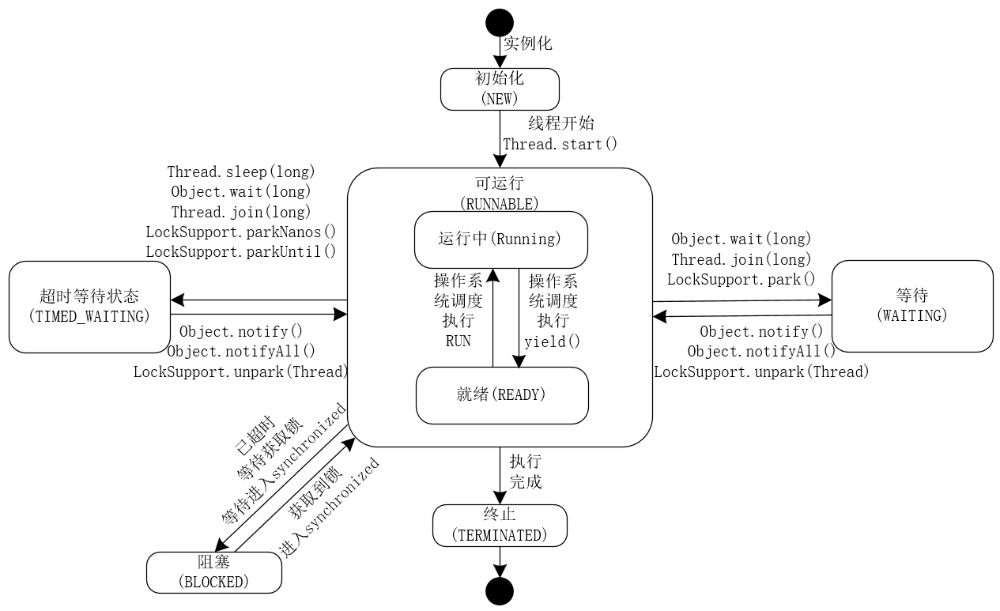

### 1. 新建状态（New）


- **描述**：当使用 `new` 关键字创建一个线程对象时，线程就处于新建状态。此时，线程仅仅是在 Java 虚拟机（JVM）中被分配了内存，还没有开始执行任何线程代码。
- **示例代码**：


java


```java
Thread thread = new Thread(() -> {
    System.out.println("线程开始执行");
});
// 此时 thread 处于新建状态
```

### 2. 就绪状态（Runnable）


- **描述**：当调用线程对象的 `start()` 方法后，线程就进入了就绪状态。处于就绪状态的线程已经具备了运行的条件，等待操作系统的调度器分配 CPU 时间片。需要注意的是，在 Java 中，就绪状态和运行状态都被统称为 `Runnable` 状态。
- **示例代码**：


java


```java
Thread thread = new Thread(() -> {
    System.out.println("线程开始执行");
});
thread.start();
// 调用 start() 方法后，thread 进入就绪状态
```

### 3. 运行状态（Running）


- **描述**：当操作系统的调度器为处于就绪状态的线程分配了 CPU 时间片后，线程就进入了运行状态，开始执行 `run()` 方法中的代码。
- **示例代码**：当 `thread` 获得 CPU 时间片后，就会执行 `run()` 方法中的 `System.out.println("线程开始执行");` 代码。

### 4. 阻塞状态（Blocked）


- 描述

  ：线程在执行过程中，由于某些原因（如等待 I/O 操作完成、等待获取锁等），会暂时放弃 CPU 使用权，进入阻塞状态。处于阻塞状态的线程不能直接进入运行状态，必须先回到就绪状态，等待再次被调度。Java 中的阻塞状态又可以细分为以下三种：

    - **等待阻塞**：当线程调用 `Object.wait()` 方法时，线程会释放对象锁，进入等待阻塞状态，直到其他线程调用该对象的 `notify()` 或 `notifyAll()` 方法唤醒它。
    - **同步阻塞**：当线程在获取对象的同步锁时，如果该锁被其他线程占用，线程会进入同步阻塞状态，直到获取到锁。
    - **其他阻塞**：当线程执行 `Thread.sleep()`、`Thread.join()` 或进行 I/O 操作时，会进入其他阻塞状态，直到相应的操作完成。

- **示例代码**：


java


```java
class BlockedExample {
    public static void main(String[] args) {
        Thread thread = new Thread(() -> {
            try {
                // 线程进入其他阻塞状态，睡眠 1000 毫秒
                Thread.sleep(1000); 
            } catch (InterruptedException e) {
                e.printStackTrace();
            }
            System.out.println("线程继续执行");
        });
        thread.start();
    }
}
```

### 5. 死亡状态（Terminated）


- **描述**：线程的 `run()` 方法执行完毕或者因异常退出 `run()` 方法时，线程就进入了死亡状态。处于死亡状态的线程已经结束了其生命周期，不能再重新启动。
- **示例代码**：


java


```java
Thread thread = new Thread(() -> {
    System.out.println("线程开始执行");
});
thread.start();
// 当 run() 方法执行完毕后，thread 进入死亡状态
```


线程生命周期的状态转换图如下：


plaintext


```plaintext
     新建状态(New)
        |
        v
     就绪状态(Runnable)
        |
        v
     运行状态(Running)
    /    |    \
   /     |     \
  v      v      v
阻塞状态(Blocked)  就绪状态(Runnable)  死亡状态(Terminated)
   |             |
   v             v
就绪状态(Runnable)  无（不能再转换）
```


这个图展示了线程状态之间的转换关系，线程可以从新建状态进入就绪状态，从就绪状态进入运行状态，运行状态可以转换为阻塞状态、就绪状态或死亡状态，阻塞状态可以再次转换为就绪状态。

## 总结
- NEW：初始状态，线程被构建，但是还没有调用start()方法。
- RUNNABLE：可运行状态，可运行状态可以包括：运行中状态和就绪状态。
- BLOCKED：阻塞状态，处于这个状态的线程需要等待其他线程释放锁或者等待进入synchronized。
- WAITING：表示等待状态，处于该状态的线程需要等待其他线程对其进行通知或中断等操作，进而进入下一个状态。
- TIME_WAITING：超时等待状态。可以在一定的时间自行返回。
- TERMINATED：终止状态，当前线程执行完毕

## 线程调用2次start会怎样

### 异常原因


`Thread` 类的 `start()` 方法设计为只能调用一次。当第一次调用 `start()` 方法时，Java 虚拟机（JVM）会为该线程分配必要的资源，创建线程的执行环境，并将线程状态从新建状态（`NEW`）转换为就绪状态（`RUNNABLE`），随后等待操作系统调度执行。一旦线程已经启动，再次调用 `start()` 方法会导致线程状态的混乱，因此 Java 禁止这种操作，通过抛出 `IllegalThreadStateException` 异常来避免潜在的问题。

### 示例代码


java


```java
public class DoubleStartExample {
    public static void main(String[] args) {
        Thread thread = new Thread(() -> {
            System.out.println("线程正在执行");
        });

        // 第一次调用 start() 方法
        thread.start();

        try {
            // 让线程有足够的时间执行
            Thread.sleep(1000);
        } catch (InterruptedException e) {
            e.printStackTrace();
        }

        try {
            // 第二次调用 start() 方法
            thread.start();
        } catch (IllegalThreadStateException e) {
            System.out.println("捕获到异常: " + e.getMessage());
        }
    }
}
```

#### 代码解释


- 首先创建一个 `Thread` 对象，并实现其 `run()` 方法。
- 第一次调用 `thread.start()` 方法，线程正常启动并执行 `run()` 方法中的代码。
- 为了确保线程有足够的时间执行，主线程休眠 1 秒。
- 第二次调用 `thread.start()` 方法时，会抛出 `IllegalThreadStateException` 异常，在 `catch` 块中捕获并输出异常信息。

### 底层机制


`Thread` 类内部有一个状态变量来记录线程的当前状态。当调用 `start()` 方法时，会检查线程的状态。如果线程状态不是新建状态（`NEW`），则会抛出 `IllegalThreadStateException` 异常。以下是 `Thread` 类中 `start()` 方法的部分源码：


java


```java
public synchronized void start() {
    if (threadStatus != 0)
        throw new IllegalThreadStateException();
    // 其他启动线程的逻辑
}
```


在上述源码中，`threadStatus` 表示线程的状态，当 `threadStatus` 不为 0 时，说明线程已经启动过，此时再次调用 `start()` 方法就会抛出异常。

### 替代方案


如果需要多次执行线程的任务逻辑，可以创建多个线程对象，每个线程对象调用一次 `start()` 方法，或者在 `run()` 方法中使用循环来多次执行任务。

#### 示例代码（创建多个线程对象）


java


```java
public class MultipleThreadExample {
    public static void main(String[] args) {
        Runnable task = () -> {
            System.out.println("线程正在执行");
        };

        // 第一次创建并启动线程
        Thread thread1 = new Thread(task);
        thread1.start();

        try {
            // 让线程有足够的时间执行
            Thread.sleep(1000);
        } catch (InterruptedException e) {
            e.printStackTrace();
        }

        // 第二次创建并启动线程
        Thread thread2 = new Thread(task);
        thread2.start();
    }
}
```


#### 示例代码（在 `run()` 方法中使用循环）


java


```java
public class LoopInRunExample {
    public static void main(String[] args) {
        Thread thread = new Thread(() -> {
            for (int i = 0; i < 2; i++) {
                System.out.println("线程执行第 " + (i + 1) + " 次");
            }
        });

        thread.start();
    }
}
```


