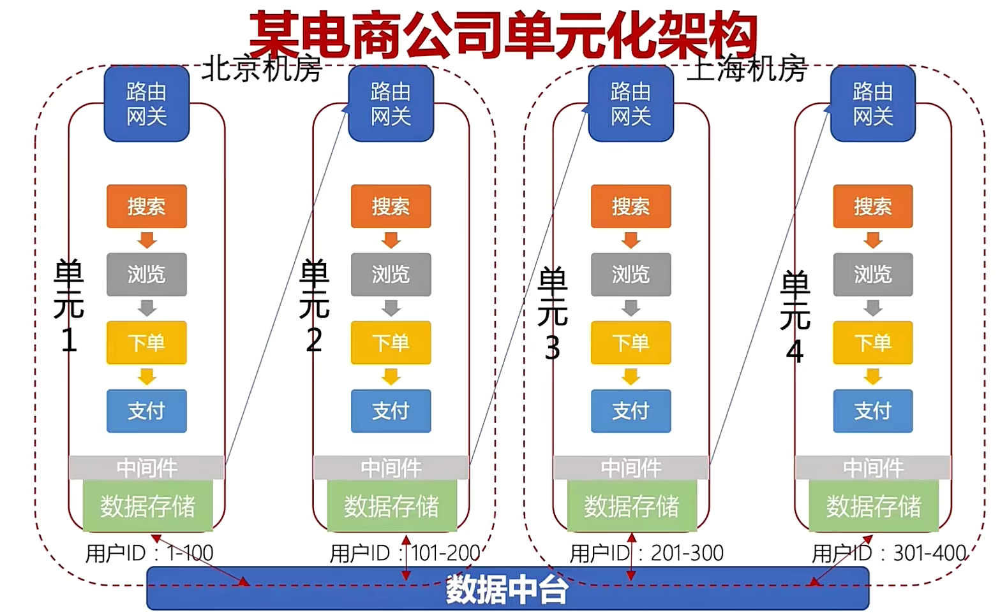
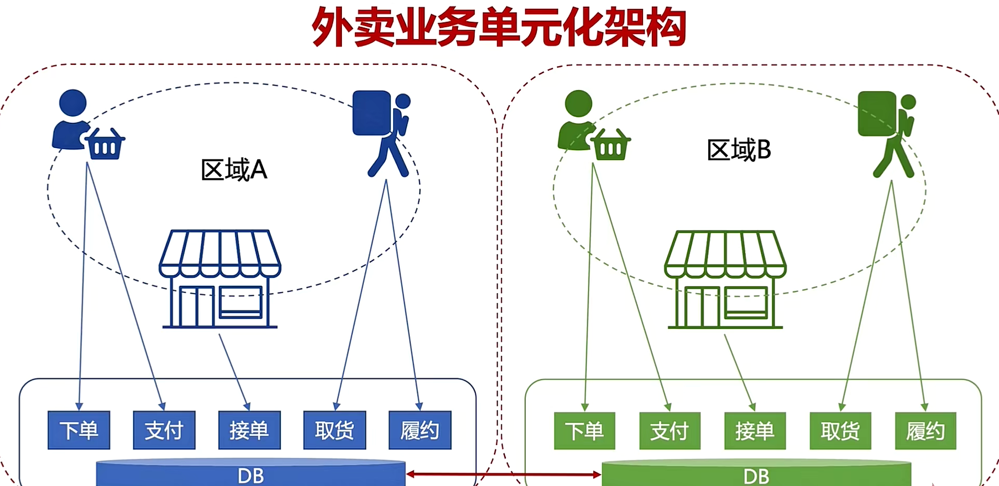
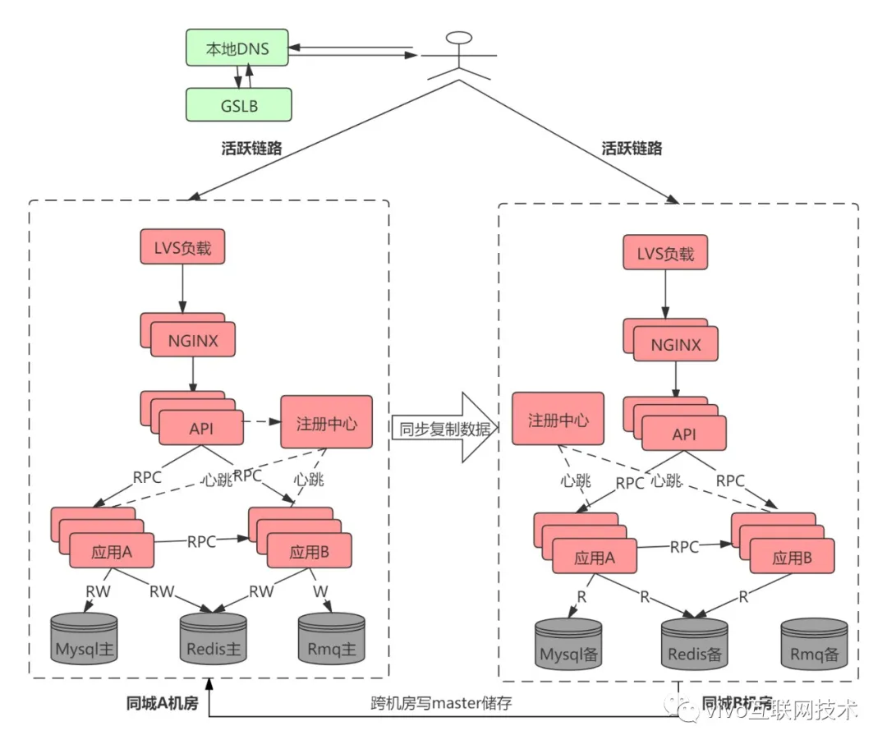
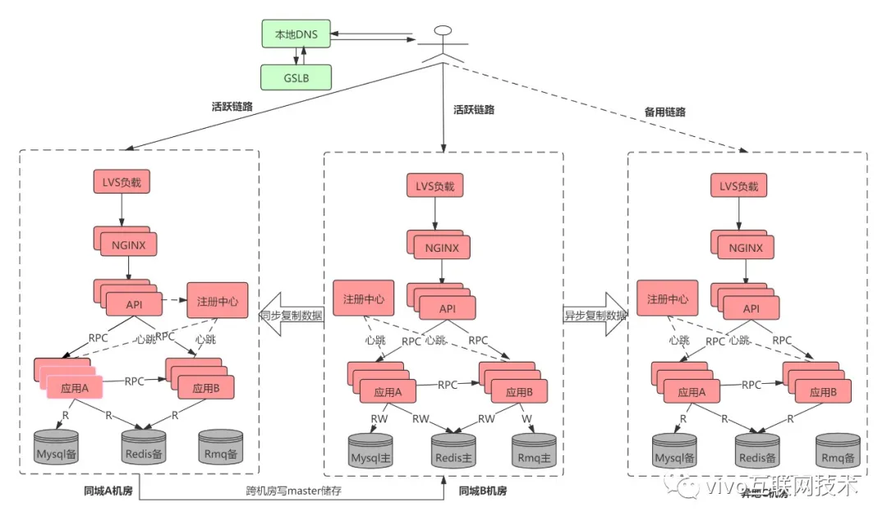
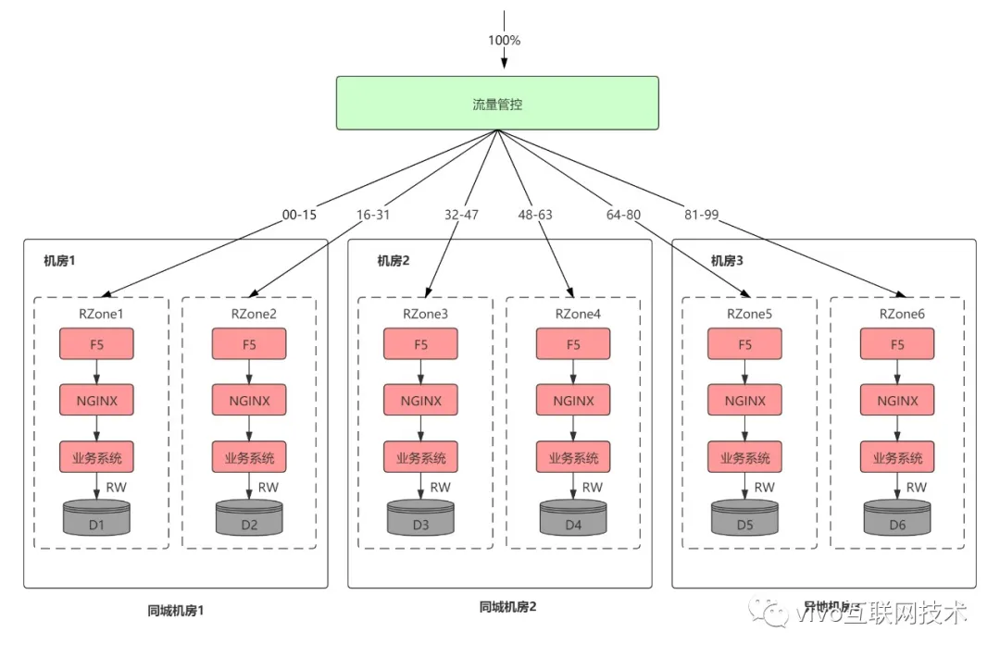
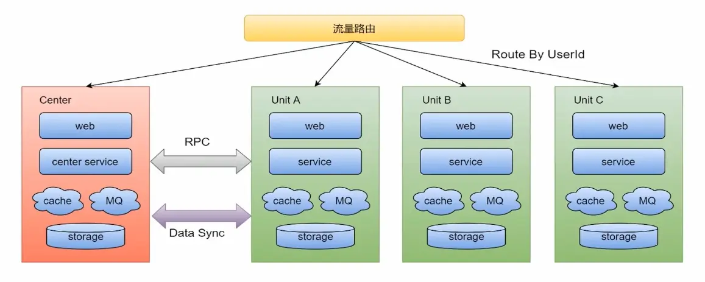

## 同城 "双活" 架构介绍

同城双活是在同城或相近区域内建立两个机房。同城双机房距离比较近，通信线路质量较好，比较容易实现数据的同步复制 ，保证高度的数据完整性和数据零丢失。同城两个机房各承担一部分流量，一般入口流量完全随机，内部RPC调用尽量通过就近路由闭环在同机房，相当于两个机房镜像部署了两个独立集群，数据仍然是单点写到主机房数据库，然后实时同步到另外一个机房。下图展示了同城双活简单部署架构，当然一般真实部署和考虑问题要远远比下图复杂。

## 两地三中心架构介绍

所谓两地三中心是指 同城双中心 + 异地灾备中心。异地灾备中心是指在异地的城市建立一个备份的灾备中心，用于双中心的数据备份，数据和服务平时都是冷的，当双中心所在城市或者地区出现异常而都无法对外提供服务的时候，异地灾备中心可以用备份数据进行业务的恢复。

## 异地多活

## Set化部署

