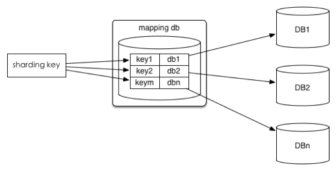
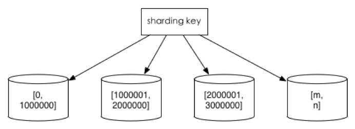
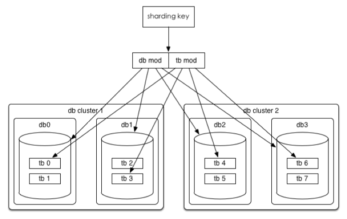
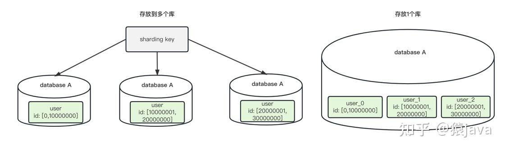
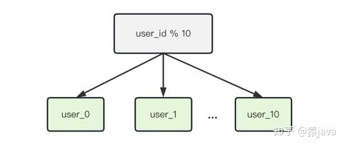
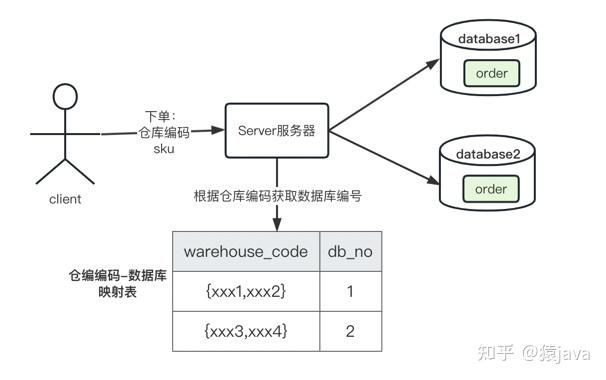

## 分库分表所引入的问题

1. 分片所引起的分布式事务问题(引申：无共享型数据架构)
2. 跨分片连表、聚合、统计
3. 扩容、缩容所引起的数据迁移
## 切分策略
1. 查询切分
   将ID和库的Mapping关系记录在一个单独的库中。

优点：ID和库的Mapping算法可以随意更改。
缺点：引入额外的单点。

2. 范围切分

比如按照时间区间或ID区间来切分。

优点：单表大小可控，天然水平扩展。
缺点：无法解决集中写入瓶颈的问题。

3. Hash切分
   一般采用Mod来切分，下面着重讲一下Mod的策略。

## 分库分表的区别
分库主要解决的是并发量大的问题，那分表其实主要解决的是数据量大的问题。

假如你的单表数据量非常大，因为并发不高，数据量连接可能还够，但是存储和查询的性能遇到了瓶颈了，你做了很多优化之后还是无法提升效率的时候，就需要考虑做分表了。

通过将数据拆分到多张表中，来减少单表的数据量，从而提升查询速度。

一般我们认为，单表行数超过 500 万行或者单表容量超过 2GB之后，才需要考虑做分库分表了，小于这个数据量，遇到性能问题先建议大家通过其他优化来解决。

## 什么时候既分库又分表?
那么什么时候分库又分表呢，那就是既需要解决并发量大的问题，又需要解决数据量大的问题时候。通常情况下，高并发和数据量大的问题都是同时发生的，所以，我们会经常遇到分库分表需要同时进行的情况。

所以，当你的数据库链接也不够了，并且单表数据量也很大导致查询比较慢的时候，就需要做既分库又分表了。

https://zhuanlan.zhihu.com/p/605884141
## 分库分表场景

### 单库出现性能瓶颈，需要分库

单库出现性能瓶颈，通常有以下几种情况：

1. 数据库服务器磁盘空间不足，但是无法扩容，导致写数据异常；
2. 数据库服务器 CPU 压力过大，无法升配，导致读写性能较慢；
3. 数据库服务器内存不足，无法扩容，导致读写性能瓶颈；
4. 数据库服务器网络带宽不足，无法升配，导致读写性能瓶颈；
5. 数据库服务器连接数过多，无法升配，导致客户端连接等待/超时；
### 单表出现性能瓶颈，需要分表

单表出现性能瓶颈，通常是因为单表数据量过大，导致读写性能较慢。

### 微服务化

因公司架构需求，技术团队需要微服务化，按照不同的域来划分管理数据库，对数据库进行物理和权限隔离，从而进行分库分表。

### 技术调研

技术部门内部作为一项技术调研，通常会选一些重要性相对较低的业务去摸索和实践，方便后期出现上面 3种情况能够有技术积累去快速支撑。

## 切分策略

主流的切分策略有3种：Range 范围、hash切分、映射表。

### Range 范围

Range 范围是指按某个字段的数据区间来进行切分。

比如：user表按照 user_id 的数据范围切分成多张表，每 1000万条数据存放一张表，切分后的表可以放到同一个数据库，也可以放到不同的数据库，示例图如下：

优点

方便扩容，每次数据量达到 range值就新加一张表，可以通过代码实现自动化扩容；
缺点

存在写偏移，可能有热点问题；

举例 比如用户注册场景：user表，因为新注册的用户数据都是写新表，通常来说新用户的活跃度高，所以读写流量全部集中在最新的 user表，因此，新表可能存在热点问题。

### hash切分

通过对分表键 key 进行一定的运算（通常有取余、取模运算，比如：key % m，key / m，hash(key)/m 等等），通过运算结果来决定路由的库和表。目前大多数互联网公司主要采用该方法。

优点

数据分片比较均匀，大大降低热点问题；
缺点

hash 算法选择不合理，后期扩容可能需要迁移数据；
数据被切分到不同的库和表中，可能存在跨节点查询和分页等问题；

举例

比如：user表信息，根据 user_id 对 10 取余，这样就可以通过 user_id 尾号 hash 到 user_0 到 user_9 10张表中：

### 映射表

映射表其实是 Range范围 和 hash切分的混合模式，将分表键和数据库的映射关系记录在一个单独的表（表的形式可以是 数据库表，文件或者配置中心）。

优点

可以灵活设置路由规则；
缺点：

方案比较复杂；
映射表可能也会随着业务量的增大，同样需要分库分表，带来更多的问题；
举例

某社区电商下单场景，因为全国仓库的数量有限，所以分库直接使用了仓编编码-数据库映射表（后期新增加仓库，只要在表中增加映射关系），为了保证履约的时效性，用户下单时，商城端会选择最近的仓库，服务器在映射表中根据仓库编码查询并路由到对应的数据库，最后在库中进行 order表的操作，交互如下图：

## 分库分表产生的问题

分库分表能够解决性能瓶颈问题，但是分库分表不是银弹，它同样也会带来一些问题：

- 调试和维护难度
- 分布式
- 分布式事务
- 跨库关联/分页/排序

5.1 定位和维护难度
单库单表，可以很直观在表中查看数据，分库分表后，需要先根据 key找到库和表，这样在一定意义上增加了开发人员定位问题的难度，再因为库和表的增多，维护难度自然也上去了（公司有DBA可以交给他们）。

5.2 分布式ID
单库单表，可以直接使用表自增主键保证全局唯一性，分库分表后，需要自己维护全局唯一的ID，常用的算法有：UUID、号段模式（数据库生成全局ID）、雪花算法。

UUID优点：

性能非常高，本地生成，没有网络消耗；
UUID缺点：

不易于存储：UUID太长，16字节128位，通常以36长度的字符串表示，很多场景不适用;
信息不安全：基于MAC地址生成UUID的算法可能会造成MAC地址泄露，这个漏洞曾被用于寻找梅丽莎病毒的制作者位置;
ID作为主键时在特定的环境会存在一些问题，比如做DB主键的场景下，UUID就非常不适用。
号段模式优点：

可以每次获取一个ID，也可以每次获取一批ID；
简单，利用现有数据库系统的功能实现；
ID单调自增，可以实现对ID要求特殊的业务；
号段模式缺点：

强依赖发号DB的性能，可能有单点问题；
雪花算法优点：

毫秒数在高位，自增序列在低位，整个ID都是趋势递增的。
不依赖数据库等第三方系统，以服务的方式部署，稳定性更高，生成ID的性能也是非常高的。
可以根据自身业务特性分配bit位，非常灵活。
雪花算法缺点：

强依赖机器时钟，如果机器时钟回拨，会导致重复或者服务不可用，不过发生的概率比较小；
总结

对于公司内部没有分布式ID相关实现的，可以使用或借鉴 美团开源的Leaf ，该框架提供了雪花算法和号段模式两种方案。

5.3 分布式事务
单库单表可以直接使用本地事务来保障数据的正确性，分库分表之后可能就需要引入分布式事务的问题，解决方案有两种：

业务划分的时候规避分布式事务；
使用专业的的分布式框架，比如阿里开源的 Seata；
5.4 跨库关联/分页/排序
单库单表可以直接使用 MySQL limit 特性实现分页，分库分表后，可能会出现分页问题，解决方案有三种：

选择合适的分表字段，规避绝大部分高频查询场景出现跨库；
使用专业的分布式框架，比如开源框架：ElasticSearch；
业务代码中分别查询，然后组装数据；

## 分库分表引发什么问题

分库分表之后，虽然能够解决数据库的性能问题，但是也带来了一系列的其他问题：

事务问题

跨库关联问题

「字段冗余」
利用空间换时间，为了性能而避免join查询，将查询字段冗余。
例如：订单表保存userId时候，也将用户名称性别等需要查询的字段冗余保存一份，这样查询订单详情时就不需要再去查询用户表了。

「全局表」
「在系统模块中，对于一些依赖的数据表，在每个数据库都保存一份，避免跨库join查询。」

「ER 表（绑定表）」
「先确定各个业务表的关联关系，将那些存在关联关系的表记录存放在同一个分片上，避免跨分片join问题」

「系统层组装」
「在系统层面，分多次查询，将获得到的数据通过代码进行字段拼装」。

排序、分页、函数计算问题

・分库分表之后，数据分散，在跨节点进行count,order by,group by,limit 以及聚合函数的时候需要特殊处理，可以「采用分片的方式：先在每个分片上执行相应的函数，得到结果后在应用程序端进行合并，得到最终结果」。

分布式ID问题

分库分表之后，我们不能再依赖数据库自增主键了，分表以后每个表都可以自增，会导致ID 重复或者混乱的问题，因此我们需要单独设计全局主键，以避免跨库主键重复问题。有一些常见的主键生成策略：

UUID
基于数据库自增单独维护一张 ID表
号段模式
Redis
雪花算法（Snowflake）
美团Leaf
滴滴Tinyid

多数据源问题

https://cloud.tencent.com/developer/article/2123142