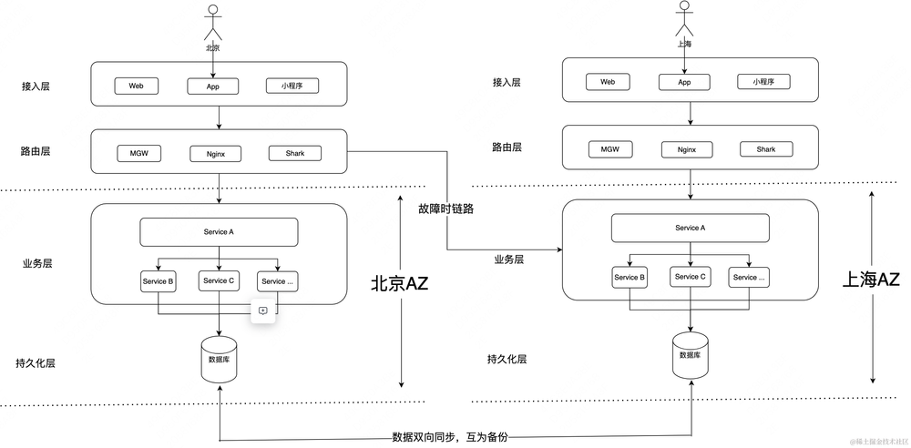

https://tech.meituan.com/2023/06/09/meituan-database-recovery-system.html
https://chenx.tech/yididuohuo/

## 容灾

我们通常会把故障分为三大类，一是主机故障，二是机房故障，三是地域故障。每类故障都有各自的诱发因素，而从主机到机房再到地域，故障发生概率依次越来越小，而故障的影响却越来越大。

## N+1架构

在业界也称散部或者多AZ部署?案，将容量为C的系统部署在N+1个机房，每个机房能提供至少C/N的容量，挂掉任何一个机房时，剩余系统仍能支撑C的容量。该方案的核心是把容灾能力下沉到PaaS组件来完成，在出现机房级或者地域级故障的时候，由各个PaaS组件独立完成容灾切换，实现业务恢复。整体架构如下图所示，业务上表现是多机房、多活形态，数据库采用这种主从架构，单机房处理写流量、多机房的负载均摊读流量。下面要讲“数据库容灾体系建设实践” 就是面向N+1架构的。

## 单元化架构

也叫SET化架构，这是一种偏应用层的容灾架构，它将应用，数据，基础组件按照统一的维度切分成多个单元，每个单元处理一部分闭环流量。业务以单元作为部署单位，通过单元互备方式实现同城容灾或者异地容灾。一般金融业务或者超大规模的业务会选择此类架构，它的好处就是流量可以闭环且资源隔离，具有很强的容灾能力和跨域扩展能力，不过SET化架构的落地需要业务系统做大量的改造，运维管理也较为复杂。简化示意图如下：

## 例子

2013年夏天，因为杭州40°高温酷暑持续，全城电力供应极度紧张，而某里的服务器机房又是耗电大户，险被拉闸限电，随后启动异地容灾项目：

2013年在杭州一个城市实现了同城两个SET双活
2014年在杭州、上海两个相距有一定距离的城市实现了异地双活，当年双十一两个城市分别承担了50%的用户流量
2015年在杭州、上海两地基础上，在距离超过1千公里外的华南部署了两个新的SET，成功实现三地四单元的异地多活

## 单数据中心(AZ)系统运行架构

现在流行的常规微服务系统架构大致如图所示，不同物理地域的用户通过Web端、App端、小程序等接入层访问系统，请求首先达到网关路由，网关再讲请求转发至指定的业务应用，请求进入业务应用后，各个服务互相在业务层内部进行交互，并在交互过程中进行数据库查询操作。需要注意的是，因为访问数据库是很常见的操作，出于性能考虑，业务层的业务服务与持久化层一般都会在同一个机房(即数据中心,简称AZ)，只是运行在不同的物理机上，甚至可能物理机都是同一个，只是不同的进程实例。

如果Service A是整个业务的核心服务，比如订单服务，认证服务等，某个时刻该AZ的Service A发生故障，则会导致整个业务完全不可用。同理，如果该AZ发生断电、火灾等则整个系统会完全崩溃，甚至数据可能完全无法恢复。本质原因是服务部署在单数据中心，且该数据中心不存在备份，即单机房部署便成了一个单点问题。

## 多数据中心系统运行架构

这里读者可能会想，我们可以再建设一个数据中心，部署完全一套相同的系统服务，甚至可以根据机房地域将用户请求进行分流，从而减小网络传输延迟，提高系统响应速度。当一个机房出现故障时，直接将流量切换到另一个机房，让另一个正常机房提供服务，如上图所示。看上去没啥问题，但是这里存在一个棘手的问题，大部分服务都需要与数据库这类有状态的服务进行交互，如果北京的用户只访问北京AZ，上海的只访问上海AZ，那也就意味着北京用户的数据也只会存在于北京AZ，同理上海用户数据只会存在于上海AZ，那么当北京AZ发生故障，即便是流量完全切换至上海AZ，由于上海并不存有任何北京AZ的任何用户的数据，对于北京的用户来说，上海AZ并不能作为其正确的副本继续提供服务(简单说：北京用户在北京刚下单完毕，订单数据存在于北京AZ，这时候北京AZ发生故障，流量切换至上海AZ，由于上海AZ不存在任何该北京用户的订单数据，用户再次查看订单会发现不存在任何订单数据，这显然是不可接受的)

## 多数据中心系统运行架构V2

这种解决方案也有一定意义，即运行架构变成上图，针对核心服务，我们在异地机房进行同样部署，针对有状态的服务，比如数据库、缓存、MQ等仍然采用单点部署(简化说明道理，图例只说明数据库)，即北京、上海AZ都连接的北京的同一个数据库，数据均存在北京AZ。假如北京AZ的Service A发生故障，流量则切换至上海AZ，由于数据库未改变，整个业务功能仍然是完整的，但是这种情况下服务是有损的，因为针对Service A的请求，均是从上海AZ访问到北京AZ，这是跨物理地域的网络请求，会引起网络请求耗时加长。但是这种解决方案确实能解决针对无状态的核心服务发生故障的问题，大部分对稳定性、可用性要求不高的系统，该运行架构已经可以满足需求。但是该架构仍然无法解决数据库发生故障或者机房完全被毁引起数据库被毁的问题，发生上述故障时，整个系统仍然会完全不可用。因为数据库这种有状态服务仍然是单点，不存在能完整替换的备份。

##  Set化架构

     

这里读者可能会说，将不同AZ的数据库数据进行同步，甚至可以针对核心数据的更新操作变更为保证多个AZ同时更新完毕才算更新完毕(突然想到分布式算法的CR算法)，这样在进行AZ切换时，保证备份的AZ上有相同的数据，这样就可以进行安全的切换，其运行架构变成上图。其实，Set化解决方案本质就是按照这个思路进行实现。从理论上看，如果我们能够实现这种架构，那么就可以实现，即便是北京AZ完全不可用，我们也可能采用上海AZ迅速提供服务。

## 存在的问题

从上述运行架构上可以看出，北京/上海AZ在业务功能上完全是独立的、且完整的，任何一个AZ理论上都可以对外提供完整的服务。但是会存在以下问题，如何保证北京AZ和上海AZ就是独立的，换言之，北京AZ如果需要读取上海AZ的数据时怎么处理。对于统计请求，由于数据库存了两个地方的数据，如何过滤其他AZ的数据；全国统计如何实现。数据库如何解决数据循环同步。   

### 跨AZ请求

理论上确实会有跨AZ请求的可能性，但从实际的业务场景的角度出发，任何数据都是存在关联关系的。比如，在北京AZ的用户A的任何订单，操作日志，信息等都是用户A的，在北京AZ的用户A的任何请求中，不会有查看处于上海AZ的用户B的数据的场景，而数据的切分采用的用户位置的城市ID，即该用户的所有数据一定会被路由到同一个Set中，不可能出现跨Set的请求。所以Set化要求在任何业务操作中不运行出现跨Set请求的情况发生。即：北京/上海AZ在数据上互相同步，互为主备，但是北京AZ存有上海AZ的数据，上海也存有北京AZ的数据。但是北京AZ永远不会有请求去读取上海AZ这部分数据，同步上海AZ也不会读取北京AZ的数据。各自冗余对方AZ的数据，用于灾备发生时Set切换时使用。

### 如何解决数据循环同步  

 

这个问题是最开始出现的问题，如果我们binlog的方式实现两个数据库进行同步，比如北京AZ将订单A的同步给上海AZ，上海AZ插入后该订单又生成了新的Binlog，这条Binlog又会同步至北京AZ，如果不做处理，北京AZ会认为这条Binlog是上海AZ的新数据，北京AZ需要进行存储。解决这个问题的方案也比较简单。在存储数据时，记录数据的来源，相当于对Binlog进行了打标，标记上来源Set，并且记录下来，再向其他AZ同步Bloglog时，只同步带有本AZ的Set化标签数据，或者在收到Binlog时只操作不是本Set标签的Binlog。

### 统计请求如何过滤其他Set的数据    

这个问题也可以用3.2回答，在执行count等命令默认加上where条件：Set-tag=本Set即可。但是现在大部分实际情况并不是按照这种方式实现，这里在明晰一个实际的场景：针对统计型需求，基本上所有统计都是面向于查看，分析类需求，即非事务型、非实时读、非强一致性型场景，这类需求我们完全可以采用CQRS架构，将读写进行分离，Set化隔离的数据可以简单理解为针对强一致、事务型、交易型的底层数据，因为Set要求操作单元化、要求强一致、数据与数据根据外键进行强关联(可以Set切分的本质原因)，所以针对所有的写入和更新操作都能在单个Set进行完整的闭环操作，单个Set的更新操作是有状态的。但是针对非事务型的读取请求，面向的是无状态数据，这类数据完全可以通过数据同步的方式，将其同步至某一个专门用于非实时查询的Set中即可。所以Set化实际上也常常会和读写分离绑定落地，所以实际的运行架构如下。Set主要针对核心业务进行高可用支持，其主要主要支持交易型业务、写入型业务、针对分析型，非实时读可以采用CQRS或者Set-tag=本Set进行解决。

### Set切换可以做到完全无损吗

对于Set化架构一般存在两种选择

保证RPO/RTO完全实时，具体做法也有两种：

对于更新操作必须满足至少一半以上AZ的完全更新完毕才算做更新完毕(类比Raft算法)，该做法会影响每一个更新操作，IO操作扩大为AZ数量倍，且跨多个物理地域，极大的影响性能，但银行的交易选择了这种方式，因为银行面向的业务和钱相关，几乎所有场景都要求绝对的强一致性，且不能接受任何一笔数据被丢失，为了这个强一致性和RPO/RTO完全实时选择牺牲性能，让用户等待网络的延时，这也是为什么每次转账慢等待数秒的一个主要原因。
还有一种方式，Set切换时禁止写入请求，等待切换的AZ数据完全同步至备份AZ，待同步完成后将流量进行切换，从开始到切换结束TP999一般在10s以内，即会造成大概10s的服务写入故障，这种方式仅支持对故障进行了预感知，比如某地方断电，机房靠备用电源、机房温度持续上升无法降温、或者故障演练等手动进行切换；如果机房发生瞬间故障，故障期间的数据仍然无法及时同步至备份AZ，这部分数据丢失只能采用最终一致性。
支持RPO/RTO近实时，这种相对比较简单，尽最大可能进行数据同步，但不保证在切换时完全进行了同步，切换时可能部分数据未同步，甚至无法同步(火灾烧毁等)，针对这部分数据采用最终一致性进行处理即可。
