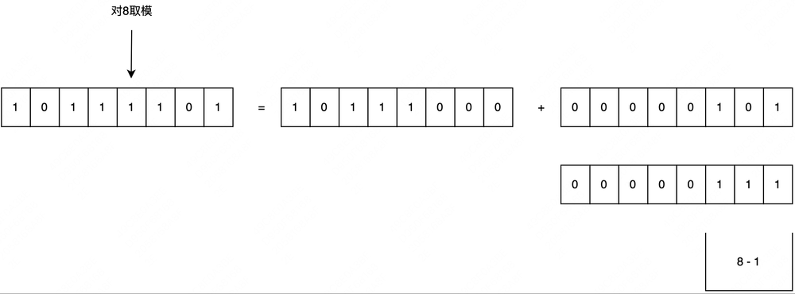

## 分库分表及平滑扩/缩容

## 系统扩容、缩容方案

### 分库数、分表数抉择   

分表、分库的总数、redis库的总数、HashMap容量都是2的N次方，为什么？

因为如果分表数量 M 是 2的N次方时，在定位数据所在表的取模运算可以变换为位预算： id % M = id & (M - 1)，位运算在计算机中非常迅速的。
在进行缩容扩容时，可以计算出影响的数据范围

### 常规方案

预估迁移耗时，发布停服公告；

停服(用户无法使用服务)，使用事先准备的迁移脚本，进行数据迁移；

修改为新的分片规则；

启动服务器

该方案在互联网企业中基本上不可接受的

### 平滑方案
采用双倍扩容策略，避免数据迁移。扩容前每个节点的数据，有一半要迁移至一个新增节点中，对应关系比较简单。具体操作如下(假设已有 2 个节点 A/B，要双倍扩容至 A/A2/B/B2 这 4 个节点)：

无需停止应用服务器；
新增两个数据库 A2/B2 作为从库，设置主从同步关系为：A=>A2、B=>B2，直至主从数据同步完毕，保持实时同步
调整分片规则并使之生效：原 ID%2=0 => A 改为 ID%4=0 => A, ID%4=2 => A2；原 ID%2=1 => B 改为 ID%4=1 => B, ID%4=3 => B2。
解除数据库实例的主从同步关系，并使之生效；
此时，四个节点的数据都已完整，只是有冗余(多存了和自己配对的节点的那部分数据)，择机清除即可(过后随时进行，不影响业务)。

扩容后，数据的索引变化。其次可以看出，每次扩容/缩容的数据变化是对取模范围值为1的部分才会发生数据迁移，这个特点在进行缩容时进行数据范围影响评估可以进行很好的应用。这也是选择2的N次方作为取模底数的一个原因，可以对数据的影响范围进行计算统计。

### 实际落地方案

   

## 停服务方案

在讨论平滑方案之前，先简要说明下“x库拆y库”停服务的方案：

(1)站点挂一个公告“为了为广大用户提供更好的服务，本站点/游戏将在今晚00:00-2:00之间升级，届时将不能登录，用户周知”

(2)停服务

(3)新建y个库，做好高可用

(4)数据迁移，重新分布，写一个数据迁移程序，从x个库里导入到y个库里，路由规则由%x升级为%y

(5)修改服务配置，原来x行配置升级为y行

(6)重启服务，连接新库重新对外提供服务

整个过程中，最耗时的是第四步数据迁移。

回滚方案：

如果数据迁移失败，或者迁移后测试失败，则将配置改回x库，恢复服务，改天再挂公告。

方案优点：简单

方案缺点：

(1)停服务，不高可用

(2)技术同学压力大，所有工作要在规定时间内做完，根据经验，压力越大约容易出错(这一点很致命)

(3)如果有问题***时间没检查出来，启动了服务，运行一段时间后再发现有问题，难以回滚，需要回档，可能会丢失一部分数据

https://www.51cto.com/article/530555.html?ref=chenx.tech

