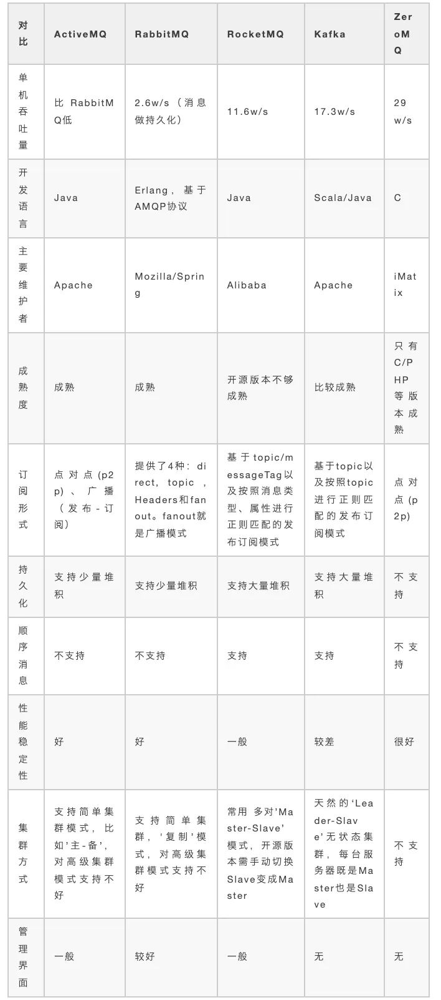
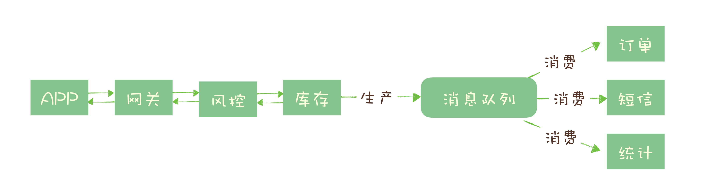
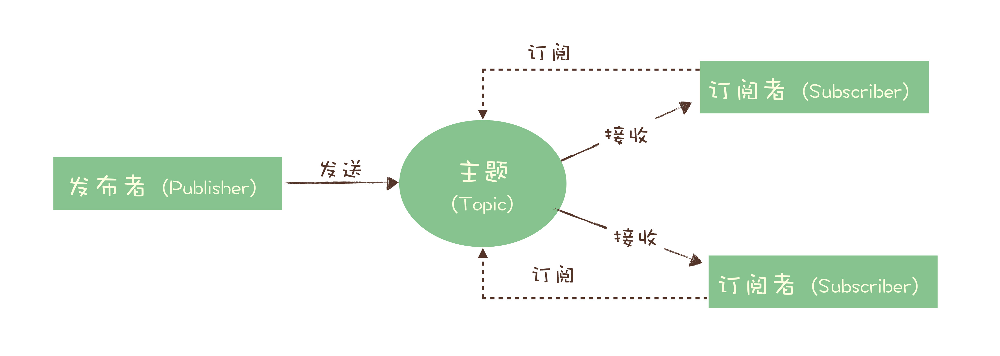
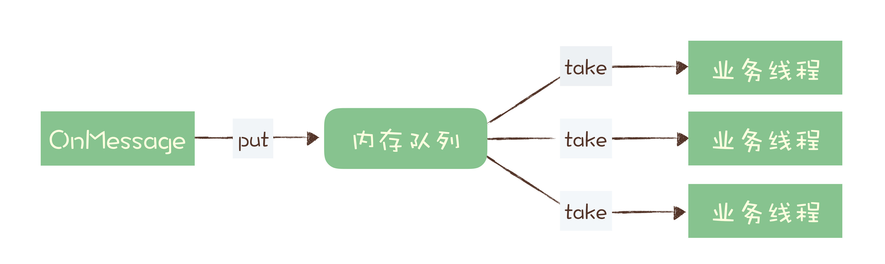
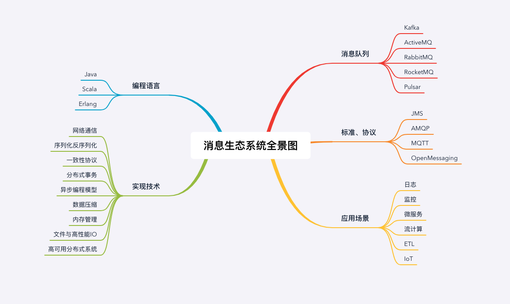

## 消息队列的优点和作用

消息队列有很多使?场景，?较常?的有3个：解耦、异步、削峰。

1. 解耦：传统的软件开发模式，各个模块之间相互调?，数据共享，每个模块都要时刻关注其他模块的是否更
   改或者是否挂掉等等，使?消息队列，可以避免模块之间直接调?，将所需共享的数据放在消息队列中，对
   于新增业务模块，只要对该类消息感兴趣，即可订阅该类消息，对原有系统和业务没有任何影响，降低了系
   统各个模块的耦合度，提?了系统的可扩展性。
2. 异步：消息队列提供了异步处理机制，在很多时候应?不想也不需要?即处理消息，允许应?把?些消息放
   ?消息中间件中，并不?即处理它，在之后需要的时候再慢慢处理。
3. 削峰：在访问量骤增的场景下，需要保证应?系统的平稳性，但是这样突发流量并不常?，如果以这类峰值
   的标准?投放资源的话，那?疑是巨?的浪费。使?消息队列能够使关键组件?撑突发访问压?，不会因为
   突发的超负荷请求?完全崩溃。消息队列的容量可以配置的很?，如果采?磁盘存储消息，则?乎等于“?
   限”容量，这样?来，?峰期的消息可以被积压起来，在随后的时间内进?平滑的处理完成，?不?于让系
   统短时间内?法承载?导致崩溃。在电商?站的秒杀抢购这种突发性流量很强的业务场景中，消息队列的强
   ?缓冲能?可以很好的起到削峰作?。

## 消息队列的缺点和不足

1. 系统可?性降低：引?第三?依赖则需考虑第三?的稳定性。

2. 系统复杂性增加：要多考虑很多??的问题，?如?致性问题、如何保证消息不被重复消费，
如何保证保证消息可靠传输。因此需要考虑的东?更多，系统复杂性增?。
## 常见的消息队列

消息中间件具有低耦合、可靠投递、?播、流量控制、最终?致性等?系列功能，成为异步RPC
的主要?段之?。当今市?上有很多主流的消息中间件，如?牌的 ActiveMQ、RabbitMQ、炙?
可热的 Kafka、阿?巴巴?主开发 RocketMQ 等。
1. ActiveMQ：?牌的消息中间件，但是不适合?并发互联?，适合传统企业。
2. RabbitMQ：?持?并发、?吞吐、性能好，还有完善的管理界?等。?持集群化，缺点是
Erlang 语?开发的。
3. RocketMQ：阿?出品，性能优越，Java 开发，?次改造。
4. Kafka：超?吞吐量实时?志采集，?般在?数据体系配合实时计算 Spark Streaming、
Flink 等使?。

## 哪些问题适合使用消息队列来解决

### 1. 异步处理

秒杀系统需要解决的核心问题是，如何利用有限的服务器资源，尽可能多地处理短时间内的
海量请求。我们知道，处理一个秒杀请求包含了很多步骤，例如：

风险控制；
库存锁定；
生成订单；
短信通知；
更新统计数据。

如果没有任何优化，正常的处理流程是：App 将请求发送给网关，依次调用上述 5 个流
程，然后将结果返回给 APP。

对于对于这 5 个步骤来说，能否决定秒杀成功，实际上只有风险控制和库存锁定这 2 个步
骤。只要用户的秒杀请求通过风险控制，并在服务端完成库存锁定，就可以给用户返回秒杀
结果了，对于后续的生成订单、短信通知和更新统计数据等步骤，并不一定要在秒杀请求中
处理完成。

所以当服务端完成前面 2 个步骤，确定本次请求的秒杀结果后，就可以马上给用户返回响
应，然后把请求的数据放入消息队列中，由消息队列异步地进行后续的操作

处理一个秒杀请求，从 5 个步骤减少为 2 个步骤，这样不仅响应速度更快，并且在秒杀期
间，我们可以把大量的服务器资源用来处理秒杀请求。秒杀结束后再把资源用于处理后面的
步骤，充分利用有限的服务器资源处理更多的秒杀请求。

可以看到，在这个场景中，消息队列被用于实现服务的异步处理。这样做的好处是：

可以更快地返回结果；

减少等待，自然实现了步骤之间的并发，提升系统总体的性能。

### 2. 流量控制

继续说我们的秒杀系统，我们已经使用消息队列实现了部分工作的异步处理，但我们还面临
一个问题：如何避免过多的请求压垮我们的秒杀系统？

一个设计健壮的程序有自我保护的能力，也就是说，它应该可以在海量的请求下，还能在自
身能力范围内尽可能多地处理请求，拒绝处理不了的请求并且保证自身运行正常。不幸的
是，现实中很多程序并没有那么“健壮”，而直接拒绝请求返回错误对于用户来说也是不怎
么好的体验。

因此，我们需要设计一套足够健壮的架构来将后端的服务保护起来。我们的设计思路是，使
用消息队列隔离网关和后端服务，以达到流量控制和保护后端服务的目的。

加入消息队列后，整个秒杀流程变为：
1. 网关在收到请求后，将请求放入请求消息队列；
2. 后端服务从请求消息队列中获取 APP 请求，完成后续秒杀处理过程，然后返回结果。

## 3. 服务解耦

## 选择消息队列产品的基本标准

1. 首先，必须是开源的产品，这个非常重要。开源意味着，如果有一天你使用的消息队列遇到
   了一个影响你系统业务的 Bug，你至少还有机会通过修改源代码来迅速修复或规避这个
   Bug，解决你的系统火烧眉毛的问题，而不是束手无策地等待开发者不一定什么时候发布的
   下一个版本来解决,还有一个优势就是，流行的产品与周边生态系统会有一个比较好的集成和兼容
2. 消息的可靠传递：确保不丢消息；
3. Cluster：支持集群，确保不会因为某个节点宕机导致服务不可用，当然也不能丢消息；
4. 性能：具备足够好的性能，能满足绝大多数场景的性能要求
## 消息模型

### 队列模型

如果有多个生产者往同一个队列里面发送消息，这个队列中可以消费到的消息，就是这些生
产者生产的所有消息的合集。消息的顺序就是这些生产者发送消息的自然顺序。如果有多个
消费者接收同一个队列的消息，这些消费者之间实际上是竞争的关系，每个消费者只能收到
队列中的一部分消息，也就是说任何一条消息只能被其中的一个消费者收到

如果需要将一份消息数据分发给多个消费者，要求每个消费者都能收到全量的消息，例如，
对于一份订单数据，风控系统、分析系统、支付系统等都需要接收消息。这个时候，单个队
列就满足不了需求，一个可行的解决方式是，为每个消费者创建一个单独的队列，让生产者
发送多份。

显然这是个比较蠢的做法，同样的一份消息数据被复制到多个队列中会浪费资源，更重要的
是，生产者必须知道有多少个消费者。为每个消费者单独发送一份消息，这实际上违背了消
息队列“解耦”这个设计初衷。

### 发布 - 订阅模型

在发布 - 订阅模型中，消息的发送方称为发布者（Publisher），消息的接收方称为订阅者
（Subscriber），服务端存放消息的容器称为主题（Topic）。发布者将消息发送到主题
中，订阅者在接收消息之前需要先“订阅主题”。“订阅”在这里既是一个动作，同时还可
以认为是主题在消费时的一个逻辑副本，每份订阅中，订阅者都可以接收到主题的所有消
息。

## 检测消息丢失的方法

我们说，用消息队列最尴尬的情况不是丢消息，而是消息丢了还不知道。一般而言，一个新
的系统刚刚上线，各方面都不太稳定，需要一个磨合期，这个时候，特别需要监控到你的系
统中是否有消息丢失的情况。

如果是 IT 基础设施比较完善的公司，一般都有分布式链路追踪系统，使用类似的追踪系统
可以很方便地追踪每一条消息。如果没有这样的追踪系统，这里我提供一个比较简单的方
法，来检查是否有消息丢失的情况。

我们可以利用消息队列的有序性来验证是否有消息丢失。原理非常简单，在 Producer 端，
我们给每个发出的消息附加一个连续递增的序号，然后在 Consumer 端来检查这个序号的
连续性。

如果没有消息丢失，Consumer 收到消息的序号必然是连续递增的，或者说收到的消息，
其中的序号必然是上一条消息的序号 +1。如果检测到序号不连续，那就是丢消息了。还可
以通过缺失的序号来确定丢失的是哪条消息，方便进一步排查原因。

大多数消息队列的客户端都支持拦截器机制，你可以利用这个拦截器机制，在 Producer 发
送消息之前的拦截器中将序号注入到消息中，在 Consumer 收到消息的拦截器中检测序号
的连续性，这样实现的好处是消息检测的代码不会侵入到你的业务代码中，待你的系统稳定
后，也方便将这部分检测的逻辑关闭或者删除。

如果是在一个分布式系统中实现这个检测方法，有几个问题需要你注意。
首先，像 Kafka 和 RocketMQ 这样的消息队列，它是不保证在 Topic 上的严格顺序的，
只能保证分区上的消息是有序的，所以我们在发消息的时候必须要指定分区，并且，在每个
分区单独检测消息序号的连续性。

如果你的系统中 Producer 是多实例的，由于并不好协调多个 Producer 之间的发送顺序，
所以也需要每个 Producer 分别生成各自的消息序号，并且需要附加上 Producer 的标识，
在 Consumer 端按照每个 Producer 分别来检测序号的连续性。

Consumer 实例的数量最好和分区数量一致，做到 Consumer 和分区一一对应，这样会比
较方便地在 Consumer 内检测消息序号的连续性。

## 服务质量标准

在 MQTT 协议中，给出了三种传递消息时能够提供的服务质量标准，这三种服务质量从低
到高依次是：

At most once: 至多一次。消息在传递时，最多会被送达一次。换一个说法就是，没什
么消息可靠性保证，允许丢消息。一般都是一些对消息可靠性要求不太高的监控场景使
用，比如每分钟上报一次机房温度数据，可以接受数据少量丢失。

At least once: 至少一次。消息在传递时，至少会被送达一次。也就是说，不允许丢消
息，但是允许有少量重复消息出现。

Exactly once：恰好一次。消息在传递时，只会被送达一次，不允许丢失也不允许重
复，这个是最高的等级。

## At least once + 幂等消费 = Exactly once

## 设计幂等操作的方法

1. 利用数据库的唯一约束实现幂等
   例如我们刚刚提到的那个不具备幂等特性的转账的例子：将账户 X 的余额加 100 元。在这
   个例子中，我们可以通过改造业务逻辑，让它具备幂等性。

   首先，我们可以限定，对于每个转账单每个账户只可以执行一次变更操作，在分布式系统
   中，这个限制实现的方法非常多，最简单的是我们在数据库中建一张转账流水表，这个表有
   三个字段：转账单 ID、账户 ID 和变更金额，然后给转账单 ID 和账户 ID 这两个字段联合
   起来创建一个唯一约束，这样对于相同的转账单 ID 和账户 ID，表里至多只能存在一条记
   录。

   这样，我们消费消息的逻辑可以变为：“在转账流水表中增加一条转账记录，然后再根据转
   账记录，异步操作更新用户余额即可。”在转账流水表增加一条转账记录这个操作中，由于
   我们在这个表中预先定义了“账户 ID 转账单 ID”的唯一约束，对于同一个转账单同一个账
   户只能插入一条记录，后续重复的插入操作都会失败，这样就实现了一个幂等的操作。我们
   只要写一个 SQL，正确地实现它就可以了。

   基于这个思路，不光是可以使用关系型数据库，只要是支持类似“INSERT IF NOT
   EXIST”语义的存储类系统都可以用于实现幂等，比如，你可以用 Redis 的 SETNX 命令来
   替代数据库中的唯一约束，来实现幂等消费。
2. 为更新的数据设置前置条件

另外一种实现幂等的思路是，给数据变更设置一个前置条件，如果满足条件就更新数据，否
则拒绝更新数据，在更新数据的时候，同时变更前置条件中需要判断的数据。这样，重复执
行这个操作时，由于第一次更新数据的时候已经变更了前置条件中需要判断的数据，不满足
前置条件，则不会重复执行更新数据操作。

比如，刚刚我们说过，“将账户 X 的余额增加 100 元”这个操作并不满足幂等性，我们可
以把这个操作加上一个前置条件，变为：“如果账户 X 当前的余额为 500 元，将余额加
100 元”，这个操作就具备了幂等性。对应到消息队列中的使用时，可以在发消息时在消
息体中带上当前的余额，在消费的时候进行判断数据库中，当前余额是否与消息中的余额相
等，只有相等才执行变更操作。

但是，如果我们要更新的数据不是数值，或者我们要做一个比较复杂的更新操作怎么办？用
什么作为前置判断条件呢？更加通用的方法是，给你的数据增加一个版本号属性，每次更数
据前，比较当前数据的版本号是否和消息中的版本号一致，如果不一致就拒绝更新数据，更
新数据的同时将版本号 +1，一样可以实现幂等更新。

3. 记录并检查操作

如果上面提到的两种实现幂等方法都不能适用于你的场景，我们还有一种通用性最强，适用
范围最广的实现幂等性方法：记录并检查操作，也称为“Token 机制或者 GUID（全局唯
一 ID）机制”，实现的思路特别简单：在执行数据更新操作之前，先检查一下是否执行过
这个更新操作。

具体的实现方法是，在发送消息时，给每条消息指定一个全局唯一的 ID，消费时，先根据
这个 ID 检查这条消息是否有被消费过，如果没有消费过，才更新数据，然后将消费状态置
为已消费。

原理和实现是不是很简单？其实一点儿都不简单，在分布式系统中，这个方法其实是非常难
实现的。首先，给每个消息指定一个全局唯一的 ID 就是一件不那么简单的事儿，方法有很
多，但都不太好同时满足简单、高可用和高性能，或多或少都要有些牺牲。更加麻烦的是，
在“检查消费状态，然后更新数据并且设置消费状态”中，三个操作必须作为一组操作保证
原子性，才能真正实现幂等，否则就会出现 Bug。

比如说，对于同一条消息：“全局 ID 为 8，操作为：给 ID 为 666 账户增加 100 元”，有
可能出现这样的情况：

t0 时刻：Consumer A 收到条消息，检查消息执行状态，发现消息未处理过，开始执
行“账户增加 100 元”；

t1 时刻：Consumer B 收到条消息，检查消息执行状态，发现消息未处理过，因为这个
时刻，Consumer A 还未来得及更新消息执行状态。

这样就会导致账户被错误地增加了两次 100 元，这是一个在分布式系统中非常容易犯的错
误，一定要引以为戒。

对于这个问题，当然我们可以用事务来实现，也可以用锁来实现，但是在分布式系统中，无
论是分布式事务还是分布式锁都是比较难解决问题。

## 消费端性能优化

使用消息队列的时候，大部分的性能问题都出现在消费端，如果消费的速度跟不上发送端生
产消息的速度，就会造成消息积压。如果这种性能倒挂的问题只是暂时的，那问题不大，只
要消费端的性能恢复之后，超过发送端的性能，那积压的消息是可以逐渐被消化掉的。

要是消费速度一直比生产速度慢，时间长了，整个系统就会出现问题，要么，消息队列的存
储被填满无法提供服务，要么消息丢失，这对于整个系统来说都是严重故障。

所以，我们在设计系统的时候，一定要保证消费端的消费性能要高于生产端的发送性能，这
样的系统才能健康的持续运行。

消费端的性能优化除了优化消费业务逻辑以外，也可以通过水平扩容，增加消费端的并发数
来提升总体的消费性能。特别需要注意的一点是，在扩容 Consumer 的实例数量的同时，
必须同步扩容主题中的分区（也叫队列）数量，确保 Consumer 的实例数和分区数量是相
等的。如果 Consumer 的实例数量超过分区数量，这样的扩容实际上是没有效果的。原因
我们之前讲过，因为对于消费者来说，在每个分区上实际上只能支持单线程消费

我见到过很多消费程序，他们是这样来解决消费慢的问题的：

它收消息处理的业务逻辑可能比较慢，也很难再优化了，为了避免消息积压，在收到消息的
OnMessage 方法中，不处理任何业务逻辑，把这个消息放到一个内存队列里面就返回了。
然后它可以启动很多的业务线程，这些业务线程里面是真正处理消息的业务逻辑，这些线程
从内存队列里取消息处理，这样它就解决了单个 Consumer 不能并行消费的问题。

这个方法是不是很完美地实现了并发消费？请注意，这是一个非常常见的错误方法！ 为什
么错误？因为会丢消息。如果收消息的节点发生宕机，在内存队列中还没来及处理的这些消
息就会丢失。

## 消息积压了该如何处理？

还有一种消息积压的情况是，日常系统正常运转的时候，没有积压或者只有少量积压很快就
消费掉了，但是某一个时刻，突然就开始积压消息并且积压持续上涨。这种情况下需要你在
短时间内找到消息积压的原因，迅速解决问题才不至于影响业务。

导致突然积压的原因肯定是多种多样的，不同的系统、不同的情况有不同的原因，不能一概
而论。但是，我们排查消息积压原因，是有一些相对固定而且比较有效的方法的。

能导致积压突然增加，最粗粒度的原因，只有两种：要么是发送变快了，要么是消费变慢
了。

大部分消息队列都内置了监控的功能，只要通过监控数据，很容易确定是哪种原因。如果是
单位时间发送的消息增多，比如说是赶上大促或者抢购，短时间内不太可能优化消费端的代
码来提升消费性能，唯一的方法是通过扩容消费端的实例数来提升总体的消费能力。

如果短时间内没有足够的服务器资源进行扩容，没办法的办法是，将系统降级，通过关闭一
些不重要的业务，减少发送方发送的数据量，最低限度让系统还能正常运转，服务一些重要
业务。

还有一种不太常见的情况，你通过监控发现，无论是发送消息的速度还是消费消息的速度和
原来都没什么变化，这时候你需要检查一下你的消费端，是不是消费失败导致的一条消息反
复消费这种情况比较多，这种情况也会拖慢整个系统的消费速度。

如果监控到消费变慢了，你需要检查你的消费实例，分析一下是什么原因导致消费变慢。优
先检查一下日志是否有大量的消费错误，如果没有错误的话，可以通过打印堆栈信息，看一
下你的消费线程是不是卡在什么地方不动了，比如触发了死锁或者卡在等待某些资源上了。

## 课后请你思考一下，在消费端是否可以通过批量消费的方式来提升消费性能？在什么样场景下，适合使用这种方法？或者说，这种方法有什么局限性？

批量消费有意义的场景要求：1.要么消费端对消息的处理支持批量处理，比如批量入库 2.
要么消费端支持多线程/协程并发处理，业务上也允许消息无序。3. 或者网络带宽在考虑因
素内，需要减少消息的overhead。

批量消费的局限性：1. 需要一个整体ack的机制，一旦一条靠前的消息消费失败，可能会引
起很多消息重试。2. 多线程下批量消费速度受限于最慢的那个线程。

1、要求消费端能够批量处理或者开启多线程进行单条处理
2、批量消费一旦某一条数据消费失败会导致整批数据重复消费
精选留言 (34) �� 写留言
3、对实时性要求不能太高，批量消费需要Broker积累到一定消费数据才会发送到Consum
er

## 1. 发送端性能优化

发送端业务代码的处理性能，实际上和消息队列的关系不大，因为一般发送端都是先执行自
己的业务逻辑，最后再发送消息。如果说，你的代码发送消息的性能上不去，你需要优先检
查一下，是不是发消息之前的业务逻辑耗时太多导致的。

对于发送消息的业务逻辑，只需要注意设置合适的并发和批量大小，就可以达到很好的发送
性能。为什么这么说呢？

我们之前的课程中讲过 Producer 发送消息的过程，Producer 发消息给 Broker，Broker
收到消息后返回确认响应，这是一次完整的交互。假设这一次交互的平均时延是 1ms，我
们把这 1ms 的时间分解开，它包括了下面这些步骤的耗时：

发送端准备数据、序列化消息、构造请求等逻辑的时间，也就是发送端在发送网络请求之
前的耗时；

发送消息和返回响应在网络传输中的耗时；

Broker 处理消息的时延。

如果是单线程发送，每次只发送 1 条消息，那么每秒只能发送 1000ms / 1ms * 1 条 /ms
= 1000 条 消息，这种情况下并不能发挥出消息队列的全部实力。

无论是增加每次发送消息的批量大小，还是增加并发，都能成倍地提升发送性能。至于到底
是选择批量发送还是增加并发，主要取决于发送端程序的业务性质。简单来说，只要能够满
足你的性能要求，怎么实现方便就怎么实现。

比如说，你的消息发送端是一个微服务，主要接受 RPC 请求处理在线业务。很自然的，微
服务在处理每次请求的时候，就在当前线程直接发送消息就可以了，因为所有 RPC 框架都
是多线程支持多并发的，自然也就实现了并行发送消息。并且在线业务比较在意的是请求响
应时延，选择批量发送必然会影响 RPC 服务的时延。这种情况，比较明智的方式就是通过
并发来提升发送性能。

如果你的系统是一个离线分析系统，离线系统在性能上的需求是什么呢？它不关心时延，更
注重整个系统的吞吐量。发送端的数据都是来自于数据库，这种情况就更适合批量发送，你
可以批量从数据库读取数据，然后批量来发送消息，同样用少量的并发就可以获得非常高的
吞吐量。

##  消息生态系统全景图

